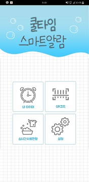
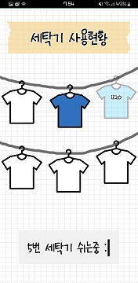
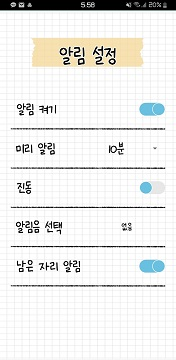

# CoolTime

## 소개

교내 기숙사에서 사용하고 있는 세탁기는 공용 세탁기이기 때문에 세탁기를 사용하기 위해 기다리는 일이 빈번했습니다.

이 기다림을 최소화 하고자 세탁기 알람을 만들었습니다.

[GitHub](https://github.com/aszd0708/CoolTime){:target="_blank"}

## 영상

<iframe width="560" height="315" src="https://www.youtube.com/embed/rt-ju-J1BGk" title="YouTube video player" frameborder="0" allow="accelerometer; autoplay; clipboard-write; encrypted-media; gyroscope; picture-in-picture" allowfullscreen></iframe>

## 설명

1. Application
   1. 메인 화면

    

    - 메인 화면

    1. 내 타이머
   
     - 

     - 현재 저장되어 있는 세탁기의 값이 없을경우 0시0분으로 고정 됩니다.
     - 현재 저장되어 있는 세탁기 값이 있을경우 실시간으로 시간 출력 됩니다.
     - 남은 시간에 따라 점점 물이 내려갑니다.
  
    2. QR 코드
    -  누르면 즉시 리더기가 작동 됩니다.
    -  QR코드를 읽으면 내 타이머로 자동으로 이동합니다.
    -  만약 이미 세탁기 값이 있을 경우 지우고 새로 할당받습니다.

    1. 실시간 사용 현황
   
    - 
      
    - 색이 있는 옷 이미지는 이미 사용중인 세탁기이며, 눌렀을 경우 누른 세탁기의 남은 시간 표기 됩니다.
    - 색이 없는 옷은 사용중이 아닌 세탁기이며, 눌렀을 경우 밑에 사용중이 아니라고 표기 됩니다.

    1. 설정
    
    - 

    - 각종 설정을 할 수 있습니다.
    - 미리 알림을 켜 놓은 경우 설정한 시간 전에 알람이 울립니다.
    - 남은 자리 알림은 현재 남은 세탁기가 1개 이상 존재할때 노티피케이션으로 알려줍니다.
    - 알림음 선택
      - 
      - 각종 알람을 터치하여 들어봄.
      - 이전에 터치한 알람과 같은 알람이면 선택이 됩니다.
      - 다른 알람일 경우에 다시 들어볼 수 있습니다.

## 사용한 서비스

[AndoidStudio](https://developer.android.com/studio?gclid=Cj0KCQjwsqmEBhDiARIsANV8H3YxYG8duUJj33uMteSyiUgjezs6i-E1J8vhvbZMpsYvl50JqGdzuOAaAiR3EALw_wcB&gclsrc=aw.ds){:target="_blank"} : 안드로이드 플랫폼 어플리케이션 제작 프로그램

[Firebase](https://firebase.google.com/?hl=ko){:target="_blank"} : 서버와 통신 할 클라우드

[RaspberryPI](http://www.raspberrypi.org/){:target="_blank"} : 하드웨어

## 제작 기간
2019년 10월 15일 ~ 2019년 11월 29일

## 개발 인원
- 메인 프로그래머 1명
- 어플리케이션 디자인 및 프로그래밍 1명
- 하드웨어 디자인 및 하드웨어 프로그래밍 1명

## 수행한 역할
1. 어플 내에 디자인 구현
2. 통신한 데이터를 사용하여 실시간 타이머 구현
3. 노티피케이션 구현
4. 알람 기능 구현