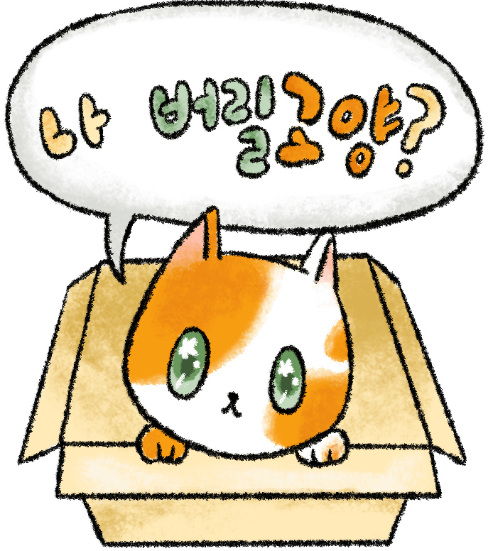

# 집사가 돼 줄 고양?(가제)

## 소개
평화로운 마을에 귀여운 동물들이 있어요

구석 구석 숨겨져있는 동물들을 찾아서 편안한 집에 데려다 줄까요?

[Bitbucket](https://bitbucket.org/aszd0708/meow-_versionup){:target="_blank"}

## 플레이 영상

<iframe width="560" height="315" src="https://www.youtube.com/embed/vdve4aJZDgg" title="YouTube video player" frameborder="0" allow="accelerometer; autoplay; clipboard-write; encrypted-media; gyroscope; picture-in-picture" allowfullscreen></iframe>

## 다운로드

[~~apk 다운로드~~](https://play.google.com/store/apps/details?id=com.MatZip.findanimal)

## 게임 방법

<iframe width="560" height="315" src="https://www.youtube.com/embed/xKOjjsiz298" title="YouTube video player" frameborder="0" allow="accelerometer; autoplay; clipboard-write; encrypted-media; gyroscope; picture-in-picture" allowfullscreen></iframe>

## 사용한 라이브러리
[DoTween](http://dotween.demigiant.com/){:target="_blank"} : 움직임을 간단하게 구현 할 때 사용

[GoogleGamePlayService](https://developers.google.com/games/services/integration){:target="_blank"} : 구글플레이와 연동

[Newtonsoft.Json](https://github.com/JamesNK/Newtonsoft.Json/releases){:target="_blank"} : Json 연동

[MobileTouchCamera](https://assetstore.unity.com/packages/tools/camera/mobile-touch-camera-43960){:target="_blank"} : 카메라 이동 

## 직접 제작한 유틸리티
[UnityManagers](https://github.com/aszd0708/UnityGameManagers){:target="_blank"} : 저장, 풀링, 팝업등 사용

## 상세 설명
- 플레이어
    - 플레이어는 화면을 터치해서 터치하고 땠을 경우 시간 차에 따라 터치인지 카메라 이동인지 판단.
    - 터치 횟수는 광고를 보고 채우거나 일정시간 후 채워짐
    - 터치하고 일정 터치 후 코인을 얻어 이 코인으로 뽑기방에서 동물을 뽑을 수 있음
    - 터치한 오브젝트에 따라 터치 횟수를 조정함
    - 오브젝트를 제외한 빈 공간을 터치 시 터치 횟수 -1
- 오브젝트
    - 터치 한 후, 횟수를 조정할지 냅둘지에 따른 상태를 넘겨주기 위한 인터페이스를 갖고있음
    - 동물
        - 모든 동물들은 Json및 수집 상태를 갖고있는 클래스를 상속받음
        - 세이브 파일에서 수집 상태인지 아닌지 확인
        - Json파일에서 각 동물들의 Infomation을 갖고옴
        - 터치 시, 수집 상태이면 아무일 안생김
        - 수집상태가 아닐 경우 사진 찍는 이펙트 후, 수집상태로 변경 및 세이브
        - 수집상태에 때라 UI의 색 변경
        - 광고양이
            - 일정 시간 후 출현
            - 터치 시 동전을 뱉고 동전 카운트 +1
    - 아이템
        - 모든 아이템은 Json및 수집 상태를 갖고있는 클래스를 상속받음
        - 씬 시작 시 수집 상태를 갖고옴
        - 수집 상태일 경우 플레이어 가방에 넣어줌
        - 아닐 경우  Infomation을 Json에서 갖고옴
    - 아이템 UI
        - 드래그 시 커서의 위치에 오브젝트 생성
        - 놓았을 시 Infomation에 저장된 동물과 거리 계산 후 동물 터치 가능한지 아닌지 변경
    - 일반 오브젝트
        - 모션이 있는 경우와 없는 경우로 나눠 함수 실행
        - 터치 상호작용이 있으면 터치 시 상호작용 실행
- 동물 집
    - 현재 세이브 데이터에서 동물 수집 유무에 따라 정렬
    - 원하는 동물 터치 시 방 내부로 변경되고, 각 동물에 따른 모션 재생
- 뽑기방
    - 수집 가능한 동물 및 동물 인형을 뽑을 수 있음
    - 뽑기방 안에 있는 동물들은 스테이지 마다 수집할 수 있는 동물들의 모양을 하고 있음
    - 스테이지마다 수집 가능한 고양이가 다름
    - 동물 마다 뽑을 수 있는 확률이 다름

## 제작

### 기간

2020년 2월 ~ 2022년 9월

### 인원
기획 1명

디자인 1명

프로그래머 1명