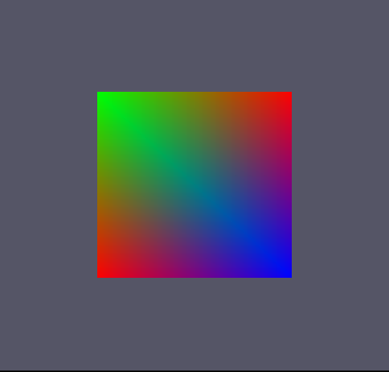
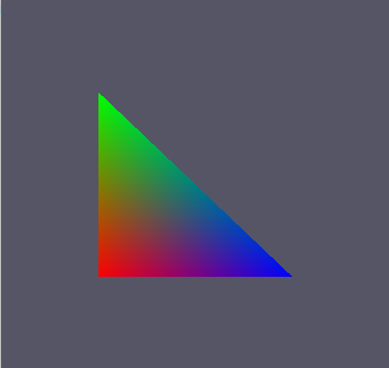

# 배운것
1. Index Buffer

## Index Buffer
전의 포스트에서 삼각형 두개로 사각형을 만들었는데 모델링이 커지게 되면 메모리 낭비가 심해진다. (위치값 (float 3개의 크기)이 같은곳에서도 사용되기 때문)

그래서 각 정점을 이어 4개의 정점으로 사각형을 만들 수 있다


### Execute.h (추가요소)

```
uint* indices = nullptr;
ID3D11Buffer* index_buffer = nullptr;
```
indices : 어디 정점을 잇는지에 관한 정보가 담긴 배열(포인터로 선언함)

index_buffer : 값을 넘기기 위한 버퍼

### Execute.cpp (추가요소)

```
Execute::Execute()
{
	'
	'
	'
	// Vertex Data
	{
		vertices = new VertexColor[4];
		vertices[0].position = D3DXVECTOR3(-0.5f, -0.5f, 0.0f);
		vertices[0].color = D3DXCOLOR(1.0f, 0.0f, 0.0f, 1.0f);

		vertices[1].position = D3DXVECTOR3(-0.5f, 0.5f, 0.0f);
		vertices[1].color = D3DXCOLOR(0.0f, 1.0f, 0.0f, 1.0f);

		vertices[2].position = D3DXVECTOR3(0.5f, -0.5f, 0.0f);
		vertices[2].color = D3DXCOLOR(0.0f, 0.0f, 1.0f, 1.0f);

		vertices[3].position = D3DXVECTOR3(0.5f, 0.5f, 0.0f);
		vertices[3].color = D3DXCOLOR(1.0f, 0.0f, 0.0f, 1.0f);
	}
}
```
정점 4개로 변경

```
	// IndexData
	{
		indices = new uint[6] {0, 1, 2, 2, 1, 3};
	}

	// IndexBuffer
	{
		D3D11_BUFFER_DESC desc;
		ZeroMemory(&desc, sizeof(D3D11_BUFFER_DESC));
		desc.Usage = D3D11_USAGE_IMMUTABLE;
		desc.BindFlags = D3D11_BIND_VERTEX_BUFFER;
		desc.ByteWidth = sizeof(uint) * 6;

		D3D11_SUBRESOURCE_DATA sub_data;
		ZeroMemory(&sub_data, sizeof(D3D11_SUBRESOURCE_DATA));
		sub_data.pSysMem = indices;

		HRESULT hr = graphics->GetDevice()->CreateBuffer(&desc, &sub_data, &index_buffer);
		assert(SUCCEEDED(hr));
	}
```
indices : 각 정점을 어떻게 이을지
나머지는 이 indicse의 값을 index_buffer에 넣음

```
Render()
{
	'
	'
	'	
		// IA
		graphics->GetDeviceContext()->IASetVertexBuffers(0, 1, &vertex_buffer, &stride, &offset);
		graphics->GetDeviceContext()->IASetIndexBuffer(index_buffer, DXGI_FORMAT_R32_UINT, 0);
		graphics->GetDeviceContext()->IASetInputLayout(input_layout);
		graphics->GetDeviceContext()->IASetPrimitiveTopology(D3D11_PRIMITIVE_TOPOLOGY_TRIANGLELIST);
		.
		.
		.
		graphics->GetDeviceContext()->DrawIndexed(6, 0, 0);
	
	'
	'
	'
}
```
이 Index Buffer는 IA 부분에서 처리 해야 하며 값을 넣어준 뒤

Draw 함수가 아닌 DrawIndexwd로 (indices의 갯수, 시작 점, 정점의 베이스 점) 을 넣어야 작동

이렇게 해도



와! 무지개 사각형!

을 만들 수 있음!!

## Pixel Shader
Pixel Shader : 렌더링 될 각각의 픽셀들의 색을 계산. 최종적으로 픽셀이 어떻게 보일지를 결정

### Color.hlsl (추가요소)

```
float4 PS(PixelInput input) : SV_Target
{
    return input.color;
}
```
SV_Target을 사용하여 현재 세팅된 메인 렌더 타겟을 사용하라고 알려줌

Pixel Shader 의 색을 계산하기 위해 색을 반환

### Execute.h (추가요소)

```
	ID3D11PixelShader* pixel_shader = nullptr;
	ID3DBlob* ps_blob = nullptr;
```
ID3D11PixelShader : 픽셀 쉐이더 단계를 저아하는 실행 가능한 프로그램을 관리

### Execute.cpp (추가요소)

생성자
```
{
	HRESULT hr = D3DX11CompileFromFileA
	(
		"Color.hlsl",
		nullptr,
		nullptr,
		"PS",
		"ps_5_0",
		0,
		0,
		nullptr,
		&ps_blob,
		nullptr,
		nullptr
	)
	assert(SUCCEEDED(hr));

	hr = graphics->GetDevice()->CreatePixelShader(ps_blob->GetBufferPointer(, ps_blob->GetBufferSize(), nullptr, &pixel_shader);
	assert(SUCCEEDED(hr));
}
```

Vertex Shader와 비슷하겜 사용

대신 CreatePixelShader를 사용

```
Render()
{
	'
	'
	'
	// PS
		graphics->GetDeviceContext()->PSSetShader(pixel_shader, nullptr, 0);

		graphics->GetDeviceContext()->Draw(3, 0);
	'
	'
	'
}
```
PSSetShader를 사용하여 픽셀 쉐이더를 세팅해주고

Draw로 그려줌
Draw(정점의 갯수, 시작 위치)



어예 무지개 삼각형 와!

아 색이 왜 저렇게 나오냐하면 GPU는 병렬 처리 되기 때문에 동시에 랜더링 해서 그렇다고 수업에서 그랬다.

좀더 찾아보니, 각 정점의 색을 주게 되면 나머지 색은 정점으로 가면 갈수록 정점의 색으로 보간이 되서 값이 들어가게 된다고 한다. (학교 OpenGL수업이 생각났다.)

## 사각형

그래픽스의 모든 물체는 삼각형으로 이루어져있음

왜?

[포프TV](https://www.youtube.com/user/KimPopeTV)에서 봤는지 어디서 주워들었는지 기억이 안나는데 각 도형의 축에 변형을 줘도 도형의 변형이 없기 때문에 사용한다고 들었다. 

오피셜 아니니까 믿지 마시고 수업에서는 가장 다양한 도형을 만들 수 있기 때문이라고 한다.

그래서 지금까지의 기본적인 내용으로 사각형을 만들고 싶으면 삼각형 두개를 사용하여 만들어야 한다.

Execute의 생성자에서 정점의 갯수를 6개로 늘린다.
```
vertices = new VertexColor[6];
vertices[0].position = D3DXVECTOR3(-0.5f, -0.5f, 0.0f);
vertices[0].color = D3DXCOLOR(1.0f, 0.0f, 0.0f, 1.0f);

vertices[1].position = D3DXVECTOR3(-0.5f, 0.5f, 0.0f);
vertices[1].color = D3DXCOLOR(0.0f, 1.0f, 0.0f, 1.0f);

vertices[2].position = D3DXVECTOR3(0.5f, -0.5f, 0.0f);
vertices[2].color = D3DXCOLOR(0.0f, 0.0f, 1.0f, 1.0f);

vertices[3].position = D3DXVECTOR3(0.5f, -0.5f, 0.0f);
vertices[3].color = D3DXCOLOR(0.0f, 0.0f, 1.0f, 1.0f);

vertices[4].position = D3DXVECTOR3(-0.5f, 0.5f, 0.0f);
vertices[4].color = D3DXCOLOR(0.0f, 1.0f, 0.0f, 1.0f);

vertices[5].position = D3DXVECTOR3(0.5f, 0.5f, 0.0f);
vertices[5].color = D3DXCOLOR(1.0f, 0.0f, 0.0f, 1.0f);
```
색은 그냥 무지개로 만들었다

그리고 난 뒤 버텍스 버퍼에서 리소스 설정할때 바이트 크기를 정점의 갯수만큼 늘린다.

```
D3D11_BUFFER_DESC desc;
ZeroMemory(&desc, sizeof(D3D11_BUFFER_DESC));
desc.Usage = D3D11_USAGE_IMMUTABLE;						
desc.BindFlags = D3D11_BIND_VERTEX_BUFFER;
desc.ByteWidth = sizeof(VertexColor) * 6;				// 요기요기
```

마지막으로 Draw할때 정점의 갯수를 총 갯수로 늘린다.
```
graphics->GetDeviceContext()->Draw(6, 0);
```

그렇게 하면


와! 무지개 사각형!

이쁘장하게 만들 수 있다

## 후기
슬슬 재밌어 진다. 하다 보면 어려워서 다시 노잼 되겠지 ㅋㅋ