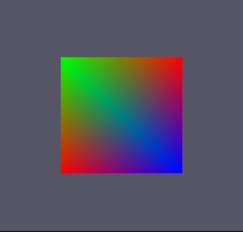

# 배운것
1. 공간 변환
2. Constant Buffer

## DirectX Transform Pipeline


다이렉트 X의 Transform Pipeline이다. 

저 중에 World부터 Clip까지는 VS에서 처리함

그림에는 없지만

NDC

Viewport

이 두개의 처리는 RS에서 처리한다.


### Execute.h (추가요소)

```
D3DXMATRIX world;	// 4x4
D3DXMATRIX view;
D3DXMATRIX projection;
```
World, View, Projection의 행렬 변수 선언!

### Execute.cpp (추가요소)

```
Execute::Execute()
{
	'
	'
	'
	{
		D3DXMatrixIdentity(&world);
		D3DXMatrixIdentity(&view);
		D3DXMatrixIdentity(&projection);

		D3DXVECTOR3 eye = D3DXVECTOR3(0, 0, 0);
		D3DXVECTOR3 at = D3DXVECTOR3(0, 0, 1);
		D3DXVECTOR3 up = D3DXVECTOR3(0, 1, 0);
		// View
		D3DXMatrixLookAtLH(&view, &eye, &at, &up);
		D3DXMatrixOrthoLH(&projection, Settings::Get().GetWidth(), Settings::Get().GetHeight(), 0, 1);

		std::cout << "View Matrix" << std::endl;
		for (int i = 0; i < 4; i++)
		{
			for (int j = 0; j < 4; j++)
			{
				std::cout << view.m[i][j] << " ";
			}

			std::cout << "\n";
		}

		std::cout << "Projection Matrix" << std::endl;
		for (int i = 0; i < 4; i++)
		{
			for (int j = 0; j < 4; j++)
			{
				std::cout << projection.m[i][j] << " ";
			}

			std::cout << "\n";
		}
	}
	.
	.
	.
}
```

일단 처음에 World, View, Projection행렬을 단위 행렬로 변경후

eye : 눈의 위치

at : 어딜 볼것인지

up : 위의 좌표

를 설정한 뒤

D3DXMatrixLookAtLH 를 사용하여 View행렬 생성

그리고 D3DXMatrixOrthoLH 를 사용하여 Projection행렬 생성

// 왜 Ortho냐? 일단 2D 만들고 3D 만들거라

// Ortho와 Perspective의 차이 : 원근감
// Ortho 니어 레플리칸트에서 에밀의 집 지하에 들어갔을때 연출 기법
// Perspective 원근감이 있어서 멀리서 본것은 작게 보임

저렇게 한 뒤 출력을 해보면

```
View Matrix
1 0 0 0
0 1 0 0
0 0 1 0
-0 -0 -0 1
Projection Matrix
0.00413223 0 0 0
0 0.00433839 0 0
0 0 1 0
0 0 -0 1
```
이렇게 출력
와!


정점 4개로 변경

```
	// IndexData
	{
		indices = new uint[6] {0, 1, 2, 2, 1, 3};
	}

	// IndexBuffer
	{
		D3D11_BUFFER_DESC desc;
		ZeroMemory(&desc, sizeof(D3D11_BUFFER_DESC));
		desc.Usage = D3D11_USAGE_IMMUTABLE;
		desc.BindFlags = D3D11_BIND_VERTEX_BUFFER;
		desc.ByteWidth = sizeof(uint) * 6;

		D3D11_SUBRESOURCE_DATA sub_data;
		ZeroMemory(&sub_data, sizeof(D3D11_SUBRESOURCE_DATA));
		sub_data.pSysMem = indices;

		HRESULT hr = graphics->GetDevice()->CreateBuffer(&desc, &sub_data, &index_buffer);
		assert(SUCCEEDED(hr));
	}
```
indices : 각 정점을 어떻게 이을지
나머지는 이 indicse의 값을 index_buffer에 넣음

```
Render()
{
	'
	'
	'	
		// IA
		graphics->GetDeviceContext()->IASetVertexBuffers(0, 1, &vertex_buffer, &stride, &offset);
		graphics->GetDeviceContext()->IASetIndexBuffer(index_buffer, DXGI_FORMAT_R32_UINT, 0);
		graphics->GetDeviceContext()->IASetInputLayout(input_layout);
		graphics->GetDeviceContext()->IASetPrimitiveTopology(D3D11_PRIMITIVE_TOPOLOGY_TRIANGLELIST);
		.
		.
		.
		graphics->GetDeviceContext()->DrawIndexed(6, 0, 0);
	
	'
	'
	'
}
```
이 Index Buffer는 IA 부분에서 처리 해야 하며 값을 넣어준 뒤

Draw 함수가 아닌 DrawIndexwd로 (indices의 갯수, 시작 점, 정점의 베이스 점) 을 넣어야 작동

이렇게 해도



와! 무지개 사각형!

을 만들 수 있음!!

## Constant Buffer
Constant Buffer : 정점 및 픽셀 쉐이더에서 사용될 상수를 모아 놓은 버퍼.

상수 버퍼(constant buffer)는 앞에 두 버퍼와는 달리 프로그램 가능 셰이더 단계의 HLSL 코드 안에서 직접 접근할 수 있는 종류의 자원다. 상수 버퍼는 파이프라인 안에서 실행되는 프로그램 가능 셰이더 프로그램에 상수(고정) 정보를 제공하는 데 쓰인다. 상수라는 이름이 붙은 것은, 이 상수 버퍼 안의 자료가 한 번의 그리기 호출이나 배분(dispath) 호출이 실행되는 동안에는 결코 변하지 않기 때문인다. 이를테면 세계 변환 행렬, 뷰 행렬, 투영 행렬이나 물체의 색상 같은 것을 이 상수 버퍼에 담아서 셰이더 프로그램에 제공한다. 

"이러한 매커니즘은 호스트(CPU 쪽) 응용 프로그램에서 각 프로그램 가능 셰이더 단계들 각각에 자료를 공급하는 주된 수단이다."

### Color.hlsl (추가 및 변경 요소)

```
cbuffer TransformBuffer : register(b0) // b : 버퍼형 자원, 숫자 -> 0 ~ 13 할당 가능 , 16byte 배수로 맞춰줘야 한다
{
    // row_major 행우선으로 변경 ex) row_major matrix world; 
    matrix world; // == float4 world
    matrix view;
    matrix proj; // ClipSpace 포함
};
```
cbuffer : 상수버퍼 선언!
[register](https://docs.microsoft.com/ko-kr/windows/win32/direct3dhlsl/dx-graphics-hlsl-variable-register) 설명 참조

```
PixelInput VS(vertexInput input)
{	
    PixelInput output;
    
	// 위치 벡터를 다른  공간으로 이동하기 위해 곱해줌	
    output.position = mul(input.position, world);
    output.position = mul(output.position, view);
    output.position = mul(output.position, proj);
    
	output.color = input.color;
	
	return output;
}
```
위치 벡터를 다른 공간 (World, View, projection)으로 이동하기 위해 곱함.
왜 곱해야 하는지는 [참고](https://docs.microsoft.com/ko-kr/windows/win32/dxtecharts/the-direct3d-transformation-pipeline)

### Execute.h (추가요소)

```
struct TRANSFORM_DATA
{
	D3DXMATRIX world;	// 4x4
	D3DXMATRIX view;
	D3DXMATRIX projection;
};
'
'
'
	D3DXMATRIX world;	
	D3DXMATRIX view;
	D3DXMATRIX projection;

	TRANSFORM_DATA cpu_buffer;
	ID3D11Buffer* gpu_buffer = nullptr;		// Constant Buffer
```
각각 공간에 관한 행렬을 저장한 구조체와 그 구조체를 담고있는 cpu_buffer를 선언,

그리고 값을 구하기 위한 행렬인 world, view, projection 선언,

그리고 gpu에 값을 넘기기 위한 gpu_buffer를 선언

### Execute.cpp (추가요소)

```
생성자
// Create Constant Buffer
{
	D3D11_BUFFER_DESC desc;
	ZeroMemory(&desc, sizeof(D3D11_BUFFER_DESC));
	desc.Usage = D3D11_USAGE_DYNAMIC;	// CPU - Write / GPU - Read
	desc.BindFlags = D3D11_BIND_CONSTANT_BUFFER;
	desc.ByteWidth = sizeof(TRANSFORM_DATA);
	desc.CPUAccessFlags = D3D11_CPU_ACCESS_WRITE;	// Usage 때문에 사용해야함

		// 매 프레임마다 갱신되기 때문에 D3D11_SUBRESOURCE_DATA 사용X

	HRESULT hr = graphics->GetDevice()->CreateBuffer(&desc, nullptr, &gpu_buffer);
	assert(SUCCEEDED(hr));
	}
```
gpu버퍼를 생성해야 하기 때문에 생성

위에 상수 버퍼의 설명 대로 Usage를 CPU가 쓸 수 있도록 변경 후 CPUAccessFlags 을 변경

바이트 크기는 16배수가 되어야 한다.

그런 후 바로 버퍼 생성

```
Render()
{
	'
	'
	'
	graphics->GetDeviceContext()->VSSetConstantBuffers(0, 1, &gpu_buffer);		// StartSlot - hlsl코드에서 buffer를 등록할 때 입력했던 버퍼 번호를 나타낸다.
	'
	'
	'
}
```

이 상수 버퍼는 VS 단계에서 이뤄지기 때문에 VS에서 버퍼 셋

```
void Execute::Update()
{
	cpu_buffer.world = world;
	cpu_buffer.view = view;
	cpu_buffer.projection = projection;


	// gpu_buffer 에 cpu값을 넣어준다
	D3D11_MAPPED_SUBRESOURCE mapped_subresource;
	graphics->GetDeviceContext()->Map
	(
		gpu_buffer,
		0,
		D3D11_MAP_WRITE_DISCARD,
		0,
		&mapped_subresource
	);

	memcpy(mapped_subresource.pData, &cpu_buffer, sizeof(TRANSFORM_DATA));

	graphics->GetDeviceContext()->Unmap(gpu_buffer, 0);
}
```

위에 생성자에서 설정한 World, View, Projection을 cpu_buffer에 넣어준 뒤,
gpu로 전달하기 위해 gpu_buffer에 값 전달

DeviceContext :: Map : subresource에 포함 된 데이터에 대한 포인터를 가져 오고 해당 하위 리소스에 대한 GPU 액세스를 거부함. ([공식 자료](https://docs.microsoft.com/en-us/windows/win32/api/d3d11/nf-d3d11-id3d11devicecontext-map)인데 거부한다는 말이 뭔지 아직까지 모르겟음)

서브리소스를 만들고 서브 리소스에 값을 할당

그리고 cpu_buffer에 있는 메모리를 복사한 뒤 맵 해제!

이렇게 하면 


이런 화면이 나온다.... 일부러 크게 보여드리겠다.

있다 자세히 보면 이쁜 사각형이 아주 작은 점으로 있다.(착한 사람만 보인다. 물론 난 보인다.)

왜 이런 현상이 나타나냐면, 월드 공간으로 변환해주는 과정에서 원래 있던 사각형은 정규화 된 곳에서 1만큼인 사각형이어서 매우 컷지만, 지금은 월드를 1 그러니까 화면 크기 만큼 늘렸기 때문에 1이었던 사각형은 1픽셀의 사각형이 되었다..... ㅠㅠ

이제 이 사각형을 다시 키워야 한다!!

가장 원시적인 방법으로는 Update문에서 크기를 변경해주면 된다.
```
	// 크기 변경
	world._11 = 50;
	world._22 = 50;
```


이제 나만의 작은 사각형이 적당한 사각형으로 커졌다!!

여기서 위치를 이동하고싶어서 이동을 하려 한다.
행렬의 W 의 x,y축을 변경하면 옮겨진다.

```
	// 위치 변경
	world._41 = 100;
	world._42 = 100;
```
위치를 변경하면...?


뭔가 이상하다. 더이상 사각형이 아니다. 색도 내가 알던 색이 아니다.

왜 이런 문제가 발생했을까??

CPU와 GPU의 연산 순서때문이다

CPU는 행렬의 행부터 넣어서 계산하지만, GPU는 열부터 넣어서 계산한다.

이렇게 되면 둘중에 하나를 맞춰주면 된다.

만약 GPU를 CPU처럼 계산하게 하려면

Color.hlsl 에서
```
cbuffer TransformBuffer : register(b0)
{
    row_major matrix world; // == float4 world
    row_major matrix view;
    row_major matrix proj; // ClipSpace 포함
};
```
앞에 row_major를 추가 하면 된다.

하지만, 이 방법은 CPU를 GPU처럼 계산하는것 보다 약 20%느리다고 한다.

그러면 CPU를 GPU처럼 계산하는 방법은 무엇일까

```
	D3DXMatrixTranspose(&cpu_buffer.world, &world);
	D3DXMatrixTranspose(&cpu_buffer.view, &view);
	D3DXMatrixTranspose(&cpu_buffer.projection, &projection);
```
값을 하나하나 넣지 않고 따로 마련된 함수가 있다. 이렇게 뒤집어 주는 함수를 사용하면


이동했다. 다시 나의 사각형으로 돌아왔다.

## 후기
슬슬 재밌어 진다2.