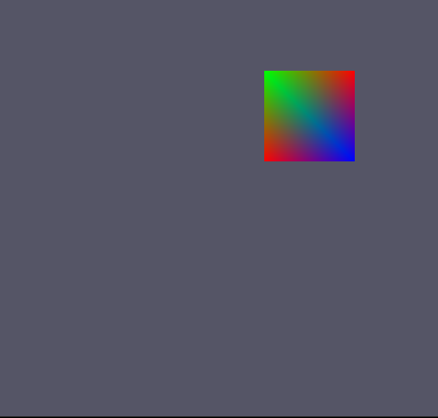
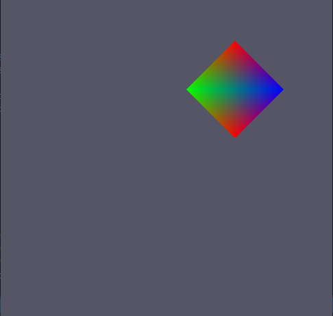
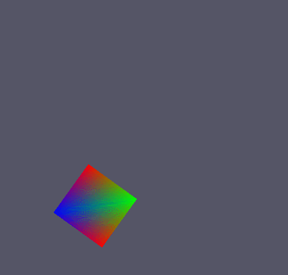

# 배운것
1. 공간 결합

## 공간 결합

월드 공간에서 크기나 위치 회전 등을 변경하기 위해 사용됨.

다이렉트X에서는 공간을 결합할 때 밑에 순서로 곱하여 결합함

스(스케일)	* 자(자전회전)		* 이(이동)			  * 공(공전회전)	* 부(부모)

Sclae	    * Rotation		  * Transform			* Rotation		 * Parent

순으로 곱하여 결합

### Execute.cpp (추가요소)
```
// 크기 변경
world._11 = 50;
world._22 = 50;

// 위치 변경
world._41 = 100;
world._42 = 100;

```
이렇게 변경한 것은 지워주고(나도 이렇게 변경하는건 원치 않음)

```
Execute::Execute()
{
	'
	'
	'
	{		
		D3DXMatrixScaling(&world, 100, 100, 1);
		D3DXMatrixTranslation(&world, 100, 100, 0);
	}
	.
	.
	.
}
```
을 생성자 부분에 추가해주자
이렇게 하면 


이젠 아무것도 안보인다... 착한사람도 안보인다... ㅠㅠ

어떻게 된 일이냐하면,

크기 변경, 이동, 회전 등은 모두 다른것을 무시하고 사용되기 때문에 하나의 월드에서 사용할 시 에러가 난다.(정확하게는 원하지 않는 결과물이 나온다.)

이것을 해결하는 방법은 각각 행렬을 구한 뒤, 곱해주면 된다.

```
D3DXMATRIX S;
D3DXMatrixScaling(&S, 100, 100, 1);

D3DXMATRIX T;
D3DXMatrixTranslation(&T, 100, 100, 0);

world = S * T;
```
이런식으로



잘 움직였다.

만약 위에 설명한 순서가 아닌 다른 순서로 하면 어떻게 될까??

```
world = T * S;
```


역시 원하는 결과가 안나온다.

여기서 회전을 하기 위해서는 

```
D3DXMATRIX R;
D3DXMatrixRotationZ(&R, static_cast<float>(D3DXToRadian(45)));

world = S * R * T;
```
위에 회전을 보면 일반 값이 아닌 D3DXToRadian 이라는 매크로를 사용하고 있다. 이유는 Degree(각도) 가 아닌 Radian(라디안)을 사용하고 있기 때문이다(유니티 각도 생각하면 편함)

위에 소스를 실행해 보면



잘 돈다.

각 행렬 값은

```
Scaling Matrix
100 0 0 0
0 100 0 0
0 0 1 0
0 0 0 1
Translation Matrix
1 0 0 0
0 1 0 0
0 0 1 0
100 100 0 1
Rotation Matrix
0.707107 0.707107 0 0
-0.707107 0.707107 0 0
0 0 1 0
0 0 0 1
```

이렇게 나오고 각자 따로 계산하여 곱해진다.

이렇게 만든 뒤 Update()문에서 회전을 주게 되면
```
static float radian = 0.0f;
radian += 0.01f;
	
D3DXMATRIX P;
D3DXMatrixRotationZ(&P, radian);
```


잘 돈다...

## 중요

스(스케일)	* 자(자전회전)		* 이(이동)			  * 공(공전회전)	* 부(부모)

Sclae	    * Rotation		  * Transform			* Rotation		 * Parent

스자이공부 외우자

다르게 곱하면 이상한 결과물이 나온다.(근데 모델 파일 넣을 수 있으면 해보고싶다. ㅋㅋ)

## 후기
슬슬 재밌어 진다3.