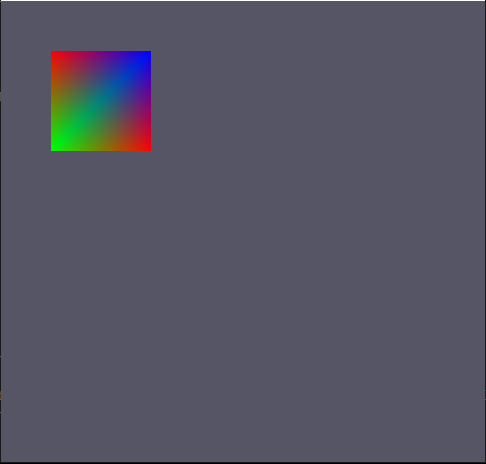

# 배운것
1. Rasterizer

## Rasterizer

뷰에 없는 기본 요소를 잘라내고, PS(픽셀 셰이더) 단계에 대해 기본 요소를 준비하고, 픽셀 셰이더를 호출하는 방법을 결정

쉽게 정점 쉐이더가 출력하는 정점의 위치를 차례대로 3개씩 모아 삼격형을 만든 뒤, 그 안에 들어갈 픽셀튿을 찾아내는 것.

레스터라이저가 하는일은 크게 5개로 나눠진다

* Clipping
* Perspective Division
* Back-Face Culling
* Viewprot Transform
* Scan Conversion

추후 이 하는일에 대해서는 정리해서 올리겠습니다.

### Execute.h (추가요소)
```
ID3D11RasterizerState* rasterizer_state = nullptr;
```
레스터라이저를 위한 상태 인터페이스 선언

### Execute.cpp (추가요소)
생성자
```
// Create Rasterizer State
{
	D3D11_RASTERIZER_DESC desc;
	ZeroMemory(&desc, sizeof(D3D11_RASTERIZER_DESC));
	desc.FillMode = D3D11_FILL_SOLID;
	desc.CullMode = D3D11_CULL_BACK;
	desc.FrontCounterClockwise = false;		// 정점이 그려지는 순서대로 앞면과 뒷면을 정해주는 값

	HRESULT hr = graphics->GetDevice()->CreateRasterizerState(&desc, &rasterizer_state);
	assert(SUCCEEDED(hr));
}
```

레스터라이저 상태값 설정

FillMode : 채울지, 아니면 안채우고 선만 남길지

CullMode : 어떤 컬링 방법을 설정할지
* D3D11_CULL_NONE : 모든 삼각형을 그림
* D3D11_CULL_FRONT : 정면을 향하는 삼각형을 그리지 않음.
* D3D11_CULL_BACK : 뒷면을 향하는 삼각형을 그리지 않음.

FrontCounterClockwise : 삼각형이 앞면인지 뒷면인지 확인
* TRUE : 삼각형의 정점이 렌더 대상에서 시계 반대 방향이면 앞쪽을 향하는 걸로 간주, 시계방향이면 뒷면을 향하는 것으로 간주
* FALSE : TRUE의 역

```
Render()
// RS
graphics->GetDeviceContext()->RSSetState(rasterizer_state);
```

VS를 세팅한 뒤 RS를 세팅해줌.
이렇게 하면 결과는!?


뭐 크게 달라진건 없다.

안을 채우고 앞면을 향하고 시계 반대방향으로 그리고 앞면을 향했으니까.

그러면 SOLID가 아니고 D3D11_FILL_WIREFRAME으로 바꾸면?


채우지 않고 이었던 선만 나온다. 

다시 SOLID로 바꾼뒤 Cull을 좀 건드려보자!!

```
desc.CullMode = D3D11_CULL_FRONT;
```


역시 위에 설명대로 안나온다. 하지만, 이것을 나오게 하는 방법은 있다.

시계 반대방향이 아닌 시계방향으로 바꾸면!?

```
// World View Projection Setting
D3DXMatrixOrthoOffCenterLH(&view, 0, Settings::Get().GetWidth(), Settings::Get().GetHeight(), 0, 0, 1);
```
월드뷰 프로젝션 생성 부분에서 기준점을 바꿨다.
뷰 기준으로 왼쪽에서 오른쪽 X축 위에서 아래 Y축으로 바꾸면



나오는데 위에 그림과 뱡향이 다르다. 

이제 시계 방향으로 바꿨기 때문에 위치가 다르게 보인다.

이렇게 해서 프로그래머가 축을 원하는 곳으로 바꿀 수 있기 때문에 만약 벨트스크롤 게임이나 횡스크롤 게임을 만들고 싶으면,

```
D3DXMatrixOrthoOffCenterLH(&view, 0, Settings::Get().GetWidth(), 0, Settings::Get().GetHeight(), 0, 1);

desc.CullMode = D3D11_CULL_BACK;
```

이케 바꾸면 된다. 그렇게 하면 


우리에게 익숙한 축으로 만들 수 있다.

## 후기
슬슬 재밌어 진다4.