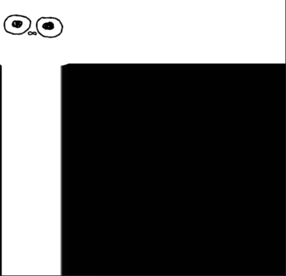

# 배운것
1. Texture

## Texture

3차원 물체의 표면에 2차원 이미지를 입혀서 적은 삼각형으로도 높은 디테일을 표현할 수 있게 해 주는 랜더링 관련 요소

도형에 바르는 포장지 생각하면 편함

### Execute.h (추가요소)
```
ID3D11ShaderResourceView* shader_resource = nullptr;
```
쉐이더 리소스 뷰를 만든다.

ID3D11Texture2D은 용도가 명확하지 않음
* RTV (Render Target View) :  렌더링 파이프 라인의 출력을 받을 자우너을 연결하는 데 쓰인다. (DSV와의 차이 색상값들을 담는 버퍼)
* DSV (Depth Stencil View) : 렌더링 파이프 라인의 출력을 받을 자우너을 연결하는 데 쓰인다. (RTV와의 차이 : 깊이와 스텐실값들을 담는 버퍼)
* SRV (Shader Resource View) : 파이프라인의 프로그램 가능 셰이더 단계가 자원을 읽을 수 있게 한다.
* UAV (Undered Access View) : 파이프라인의 프로그램 가능 셰이더 단계가 자원을 읽고 쓸 수 있게 한다.

위에 이유로 원래의 정석적인 방법은 ID3D11Texture2D 사용 -> SRV로 만들어야 한다.

### Execute.cpp (추가요소)
생성자
```
// Create Shader Resource View
{
	HRESULT hr = D3DX11CreateShaderResourceViewFromFileA
	(
		graphics->GetDevice(),
		"texture_img.png",
		nullptr,
		nullptr,
		&shader_resource,
		nullptr
	);
	assert(SUCCEEDED(hr));
}
```
셰이더 파일을 읽어온다. 일단 내부의 값들은 잠시 넘어가도록 하자 추후 설명하겠다.

```
Redner()
{
	// PS
	graphics->GetDeviceContext()->PSSetShaderResources(0, 1, &shader_resource);
}
```
PS  단계에서 셰이더를 적용 시킨다.

이제 화면에 띄어줘야 한다.

#### Texture.hlsl
```
Texture.hlsl

struct vertexInput
{
	float4 position : POSITION0;
    float2 uv : TEXCOORD0;
};

struct PixelInput
{
    float4 position : SV_POSITION0;
    float2 uv : TEXCOORD0;
};

cbuffer TransformBuffer : register(b0) // b : 버퍼형 자원, 숫자 -> 0 ~ 13 할당 가능 , 16byte 배수로 맞춰줘야 한다
{
    // row_major 행우선으로 변경 ex) row_major matrix world; 
    matrix world; // == float4 world
    matrix view;
    matrix proj; // ClipSpace 포함
};

PixelInput VS(vertexInput input)
{	
    PixelInput output;
    
	// 위치 벡터를 다른  공간으로 이동하기 위해 곱해줌	
    output.position = mul(input.position, world);
    output.position = mul(output.position, view);
    output.position = mul(output.position, proj);
    
	output.uv = input.uv;
	
	return output;
}

Texture2D source_texture    : register(t0);     // 원본의 픽셀 정보가 있음
SamplerState samp           : register(s0);     // 

float4 PS(PixelInput input) : SV_Target		// SV_Target 현제 세팅된 메인 렌더 타렛을 사용하라고 알려줌
{
    return source_texture.Sample(samp, input.uv);
}
```
텍스쳐를 넣을 셰이더를 작성한다.

두개의 구조체에 Color가 아닌 UV가 들어갔다.

* UV : 3D 그래픽에서 모델링에 대한 좌표를 우리의 XYZ처럼 UVW로 정의해서 쓴다.
  
```
Texture2D source_texture    : register(t0);
SamplerState samp           : register(s0);
```

이 부분에서 CPU에서 전달할 수 있게 레지스터를 정의 해준뒤,

```
float4 PS(PixelInput input) : SV_Target
{
    return source_texture.Sample(samp, input.uv);
}
```
Sample해서 값을 넘겨준다.

이렇게 한 뒤,

### Execute.h

```
struct VertexTexture
{
	D3DXVECTOR3 position;
	D3DXVECTOR2 uv; // texcood 항상 정규화 되어있음 (0~1)
};
```
구조체를 만들고 
```
VertexTexture* vertices = nullptr;
```
바꿔준다.

그 뒤, 

```
// Vertex Data
{
	vertices = new VertexTexture[4];
	vertices[0].position = D3DXVECTOR3(-0.5f, -0.5f, 0.0f);
	vertices[0].uv = D3DXVECTOR2(0.0f, 1.0f);

	vertices[1].position = D3DXVECTOR3(-0.5f, 0.5f, 0.0f);
	vertices[1].uv = D3DXVECTOR2(0.0f, 0.0f);

	vertices[2].position = D3DXVECTOR3(0.5f, -0.5f, 0.0f);
	vertices[2].uv = D3DXVECTOR2(1.0f, 1.0f);

	vertices[3].position = D3DXVECTOR3(0.5f, 0.5f, 0.0f);
	vertices[3].uv = D3DXVECTOR2(1.0f, 0.0f);
}
```
데이터를 수정해준다.

자세피 보면 uv의 좌표와 Position의 좌표가 다르다 왜냐 하면

uv는 왼쪽 위가 (0,0), 오른쪽 아래가 (1,1)이기 때문에 그거에 맞춰서 좌표를 설정해준다.

그 뒤, Vertex Shader 와 Input Shader의 셰이더 파일 이름을 바꿔준뒤, 
```
D3D11_INPUT_ELEMENT_DESC layout_desc[]
{
	{ "POSITION", 0, DXGI_FORMAT_R32G32B32_FLOAT, 0, 0, D3D11_INPUT_PER_VERTEX_DATA, 0 },
	{ "TEXCOORD", 0, DXGI_FORMAT_R32G32_FLOAT, 0, 12, D3D11_INPUT_PER_VERTEX_DATA, 0 }
};
```
COLOR의 이름을 셰이더 변수 탑으로 바꿔준뒤, float2이기 때문에 2개의 값을 넣어준다.

이 상태로 컴파일을 하면,


원래 사각형의 크기 만큼 나온다.

그런데 분명 투명 이미지를 넣었는데 뭔가 이상하다.

이것을 고치려면,

셰이더 PS에서

```
float4 color = source_texture.Sample(samp, input.uv);
clip(color.a - 0.9f);
return color;
```
이렇게 하면 알파 부분에 0.9 이하의 값들을 0으로 만들어


뒤에 배경이 사라진다.(크기와 위치는 가운데와 크게 늘렸다.)

아니면 
```
float4 color = source_texture.Sample(samp, input.uv);
if(color.a < 0.1f)
{
    discard;
}
return color;
```	
0.1 이하인 경우에 삭제한다.
이렇게 해도


잘 나온다.

그럼 이제 이 그림 말고 다른 그림도 넣어보자!

Execute.h 
```
ID3D11ShaderResourceView* shader_resource[2];
```
다른 리소스를 배열로 선언

```
// Vertex Data
{
	vertices = new VertexTexture[4];
	vertices[0].position = D3DXVECTOR3(-0.5f, -0.5f, 0.0f);
	vertices[0].uv = D3DXVECTOR2(0.0f, 1.0f);

	vertices[1].position = D3DXVECTOR3(-0.5f, 0.5f, 0.0f);
	vertices[1].uv = D3DXVECTOR2(0.0f, 0.0f);

	vertices[2].position = D3DXVECTOR3(0.5f, -0.5f, 0.0f);
	vertices[2].uv = D3DXVECTOR2(2.0f, 1.0f);

	vertices[3].position = D3DXVECTOR3(0.5f, 0.5f, 0.0f);
	vertices[3].uv = D3DXVECTOR2(2.0f, 0.0f);
}
```
그리고 UV의 값을 조금만 변형해주자

2개를 넣어야 하기 때문에 X축을 두배를 해놓자

```
HRESULT hr = D3DX11CreateShaderResourceViewFromFileA
(
	graphics->GetDevice(),
	"texture_img.png",
	nullptr,
	nullptr,
	&shader_resource[0],
	nullptr
);
assert(SUCCEEDED(hr));

hr = D3DX11CreateShaderResourceViewFromFileA
(
	graphics->GetDevice(),
	"texture_2.png",
	nullptr,
	nullptr,
	&shader_resource[1],
	nullptr
);
assert(SUCCEEDED(hr));
```

위에것처럼 하는 대신 리소스를  배열로 2개 넣고

Render()
```
graphics->GetDeviceContext()->PSSetShaderResources(0, 2, shader_resource);
```
이 부분을 수정하고

```
float4 color = 0.0f;
    
if (input.uv.x < 1.0f)
{
    color = source_texture1.Sample(samp, input.uv);
}
else
{
    color = source_texture2.Sample(samp, float2(input.uv.x - 1.0f, input.uv.y));
}
    
clip(color.a - 0.9f);
  
if (color.a < 0.1f)
{
    discard;
}
```
셰이더를 두개에 반응하게 바꾸면 


이렇게 두개가 나온다

뭔가 길죽하다

그러면 하나를 넣고 uv값을 변경해보자

다시 그림을 하나 넣는걸로 하고
```
// Vertex Data
{
	vertices = new VertexTexture[4];
	vertices[0].position = D3DXVECTOR3(-0.5f, -0.5f, 0.0f);
	vertices[0].uv = D3DXVECTOR2(0.0f, 2.0f);

	vertices[1].position = D3DXVECTOR3(-0.5f, 0.5f, 0.0f);
	vertices[1].uv = D3DXVECTOR2(0.0f, 0.0f);

	vertices[2].position = D3DXVECTOR3(0.5f, -0.5f, 0.0f);
	vertices[2].uv = D3DXVECTOR2(2.0f, 2.0f);

	vertices[3].position = D3DXVECTOR3(0.5f, 0.5f, 0.0f);
	vertices[3].uv = D3DXVECTOR2(2.0f, 0.0f);
}
```

이렇게 다 2배로 하면


이렇게 쭈욱 당겨진다(어디서 많이 본 그림같다)

밑에만 늘어난게 아니고 옆도 늘어났찌만 투명값이라 안보이는거 뿐이다.

이제 Sampler State를 만들어보자
```
// Create Sampler State
{
	D3D11_SAMPLER_DESC desc;
	ZeroMemory(&desc, sizeof(D3D11_SAMPLER_DESC));
	desc.AddressU = D3D11_TEXTURE_ADDRESS_CLAMP;
	desc.AddressV = D3D11_TEXTURE_ADDRESS_CLAMP;
	desc.AddressW = D3D11_TEXTURE_ADDRESS_CLAMP;

	desc.BorderColor[0] = 1;
	desc.BorderColor[1] = 1;
	desc.BorderColor[2] = 1;
	desc.BorderColor[3] = 1;

	desc.ComparisonFunc = D3D11_COMPARISON_ALWAYS;			// 이전 데이터와 현재 데이터 비교
	desc.Filter = D3D11_FILTER_MIN_MAG_MIP_LINEAR;
	desc.MaxAnisotropy = 16;
	desc.MaxLOD = std::numeric_limits<float>::max();
	desc.MinLOD = std::numeric_limits<float>::min();
	desc.MipLODBias = 0.0f;

	HRESULT hr = graphics->GetDevice()->CreateSamplerState(&desc, &sampler_state);
	assert(SUCCEEDED(hr));
}
```
(뭐가 많다....)

Address : UVW에 어떤 방식을 입힐지
(UVW에 같은 것을 줬을때 이미지이며, 각 축에 다른 값을 넣을 수 있다.) (확인을 위해 uv 값은 0~4로 설정했다.)
* WRAP


* MIRROR


* CLAMP	



(이해를 돕기 위해 다른 그림을 사용했다.)

* BORDER


* MIRROR_ONCE


border는 밑에 BorderColor의 값을 따라간다

[Filter](https://docs.microsoft.com/en-us/windows/win32/api/d3d11/ne-d3d11-d3d11_filter) : 필터링 옵션 (너무 많아서 링크로 대체) 일단 2개 먼저 알아보겠다.

* D3D11_FILTER_MIN_MAG_MIP_POINT :


뭔가 외각선이 따로 노는 느낌이다.

* D3D11_FILTER_MIN_MAG_MIP_LINEAR : 


외각선이 부드러운 느낌이다.

주면에 선의 색을 보간해서 넣어줌

MaxAnisotropy : 필터에 D3D11_FILTER_ANISOTROPIC 또는 D3D11_FILTER_COMPARISON_ANISOTROPIC이 지정된 경우 사용되는 클램핑 값

MaxMinLOD(Level Of Detail) : 입앱의 범위상 한계치 무조건 MaxLOD >= MinLOD여야 한다.

MipLODBias : 계산된 MipMap수준에서 오프셋

마지막으로 
Render()
```
// PS
graphics->GetDeviceContext()->PSSetSamplers(0, 1, &sampler_state);
```
이케 해주면 위에 그림처럼 많이 나온다.
## 후기
슬슬 재밌어 진다5.