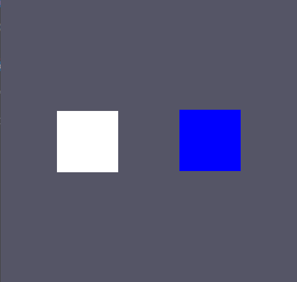

# Player
이번에는 대부분 알고있는 내용이라 금방 이해 됐다.

키 입력을 받고 움직이는 것 까지 구현

// 강의에서는 Move 함수를 가상함수로 만들어서 사용했는데 Update를 가상함수로 만들고 따로 움직임을 구현해주는게 더 좋을 것 같다. 움직임 말고 다른것 들을 넣을 수 있으니까

## Player.h
```
class Player final : public Rect
{
public:
	Player(class Graphics* graphics, const D3DXCOLOR& color);
	~Player();

	void Update() override;

	void Intersetc();

protected:
	void Move() override;
};
```

## Player.cpp

```
#include "stdafx.h"
#include "Player.h"

Player::Player(Graphics* graphics, const D3DXCOLOR& color)
	: Rect(graphics, color)
{
}

Player::~Player()
{
}

void Player::Update()
{
	Rect::Update();
}

void Player::Move()
{
	if (GetAsyncKeyState('W') & 0x8000) { position.y++; }
	else if (GetAsyncKeyState('S') & 0x8000) { position.y--; }
	if (GetAsyncKeyState('D') & 0x8000) { position.x++; }
	else if (GetAsyncKeyState('A') & 0x8000) { position.x--; }
}
```
뭐 지금은 DeltaTime이 아직 없는 관계로 속도를 대충 계산했다.

# Monster
이 부분도 거의 다 알고 있는 부분이지만, 

타이머 클래스와 Random클래스를 만들어 사용했다.

## Math.h
```
#pragma once

class Math final
{
public:
	static constexpr float PI = 3.14159265359f;
	static constexpr float PI_2 = 6.28318530718f;
	static constexpr float PI_DIV_2 = 1.57079632679f;
	static constexpr float PI_DIV_4 = 0.78539816339f;
	static constexpr float TO_DEG = 180.0f / PI;
	static constexpr float TO_RAD = PI / 180.0f;

public:
	static const int Random(const int& min, const int& max);
	static const float Random(const float& min, const float& max);
};
```
## Math.cpp
```
#include "stdafx.h"
#include "Math.h"

static std::random_device rd;
static std::mt19937 mt(rd());

const int Math::Random(const int& min, const int& max)
{
	return std::uniform_int_distribution<int>{min, max} (mt);
}

const float Math::Random(const float& min, const float& max)
{
	return std::uniform_real_distribution<float>{min, max} (mt);
}
```
뭔가 처음 보는 함수다. 

* mt19937 - 2^19937 의 난수를 생성
* uniform_int_distribution - 균등한 정수값
* uniform_real_distribution - 균등한 실수값

정수와 실수 생성하는 부분이다.

## Timer.h
```
#pragma once
class Timer final
{
public:


private:

};

class Stopwatch final	
{
public:
	Stopwatch();
	~Stopwatch() = default;
	
	void Start();

	const float GetElapsedTimeSec();
	const float GetElapsedTimeMs();

private:
	std::chrono::time_point<std::chrono::high_resolution_clock> start_time;
};
```
 ## Timer.cpp
 ```
 #include "stdafx.h"
#include "Timer.h"

Stopwatch::Stopwatch()
{
	Start();
}

void Stopwatch::Start()
{
	start_time = std::chrono::high_resolution_clock::now();
}

const float Stopwatch::GetElapsedTimeSec()
{
	std::chrono::duration<double, std::milli> ms = std::chrono::high_resolution_clock::now() - start_time;

	return static_cast<float>(ms.count() / 1000.0);
}

const float Stopwatch::GetElapsedTimeMs()
{
	std::chrono::duration<double, std::milli> ms = std::chrono::high_resolution_clock::now() - start_time;

	return static_cast<float>(ms.count());
}
```
여기도 처음보는 함수가 있다.

chrono 는 나노초 단위로 정밀한 연산이 가능하다.

## Monster.h
```
#pragma once
#include "Rect.h"

enum class Direction
{
	Up,
	Right,
	Down,
	Left
};

class Monster final : public Rect
{
public:
	Monster(class Graphics* graphics, const D3DXCOLOR& color);
	~Monster();

protected:
	void Move() override;


private:
	Stopwatch stopwatch;
	Direction dir = Direction::Right;
};
```

## Monster.cpp
```
#include "stdafx.h"
#include "Monster.h"

Monster::Monster(class Graphics* graphics, const D3DXCOLOR& color)
	: Rect(graphics, color)
{

}

Monster::~Monster()
{

}

void Monster::Move()
{
	switch (dir)
	{
	case Direction::Up:
		position.y++;
		break;
	case Direction::Right:
		position.x++;
		break;
	case Direction::Down:
		position.y--;
		break;
	case Direction::Left:
		position.x--;
		break;
	}

	if (stopwatch.GetElapsedTimeSec() >= 3.0f)
	{
		Direction random_dir = static_cast<Direction>(Math::Random(0,3));
		if (random_dir == dir)
		{
			int dir_num = static_cast<int>(random_dir);
			dir_num = (dir_num <= 1) ? dir_num + 2 : dir_num - 2;

			dir = static_cast<Direction>(dir_num);
		}
		else
		{
			dir = random_dir;
		}
		stopwatch.Start();
	}
}
```
 여기 랜덤으로 값을 받아서 전에 위치와 같은 위치를 받는다면 반대 방향으로 바꿔주는 행동을 한다.

 3초에 한번씩은 너무 느려서 그냥 0.1초에 한번씩으로 바꿔서 해보자




하얀색은 Monster고 파란색은 플레이어다
잘 움직인다.