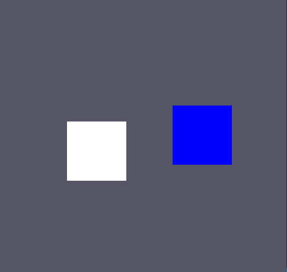

# Intersect
충돌 감지다.

물체 A와 B가 있을때 각 물체의 왼쪽 아래, 오른쪽 아래의 위치를 position과 scale로 구해서 체크한다.


## Intersect.cpp
static 함수로 하나밖에 안만들어서 head파일은 추가 안하겠다.

```
#include "stdafx.h"
#include "Intersect.h"
#include "Scene/Rendering/Rect.h"

bool Intersect::IsIntersect(Rect* const lhs, Rect* const rhs)
{
	if (!lhs->IsActive() || !rhs->IsActive())
	{
		return false;
	}
	D3DXVECTOR3 lhs_min = lhs->GetPosition() - (lhs->GetScale() * 0.5f);
	D3DXVECTOR3 lhs_max = lhs->GetPosition() + (lhs->GetScale() * 0.5f);

	D3DXVECTOR3 rhs_min = rhs->GetPosition() - (rhs->GetScale() * 0.5f);
	D3DXVECTOR3 rhs_max = rhs->GetPosition() + (rhs->GetScale() * 0.5f);

	if (
		lhs_max.x < rhs_min.x || lhs_min.x > rhs_max.x ||
		lhs_max.y < rhs_min.y || lhs_min.y > rhs_max.y
		)
	{
		return false;
	}
	else
	{
		return true;
	}
}
```

만약 Rect lhs, rhs가 둘다 활성화 되어있을 경우만 이 함수를 실행시킨다.

각 왼쪽 아래 오른쪽 위의 부분을 구하고 접촉할 시 true를 반환한다.

## 충돌 실행
Update()
```
if (Intersect::IsIntersect(player, monster))
{
	player->Event();
	monster->Event();
}
```

이 함수를 Update에 추가하고,

### 색 변경


Rect.h
```

struct COLOR_DATA
{
	D3DXCOLOR color;
};
.
.
.
virtual void Event() = 0;
```

이벤트 함수를 가상함수로 만들고 각각 정의해주자

충돌시 Player의 색을 바꾸고 Monster는 IsActive를 꺼준다.

Rect.cpp에 있는 Update에 이 함수를 추가해서 실시간으로 색이 바뀔 수 있도록 한다.
```
COLOR_DATA* color_data = color_buffer->Map<COLOR_DATA>();
{
	color_data->color = intersect_color;
}
color_buffer->UnMap();	
```
Render()부분에 이것도 추가한다. 그 뒤,
```
pipeline->SetConstantBuffer(2, ShaderScope_PS, color_buffer);
```
셰이더에
```
cbuffer ColorBuffer : register(b2)
{
    float4 color;
};

float4 PS(PixelInput input) : SV_Target		// SV_Target 현제 세팅된 메인 렌더 타렛을 사용하라고 알려줌
{
    return input.color * color;
}
```

PS 부분에 바꾸고 컬러버퍼를 새로 만들어준다.

이렇게 하면,



잘 먹는다.

# 잡생각
그러면 렌더링을 안한다고 해도 업데이트에서 계속해서 버퍼에 데이터를 쌓아두는데 괜찮은가??

이건 하면서 고쳐보자