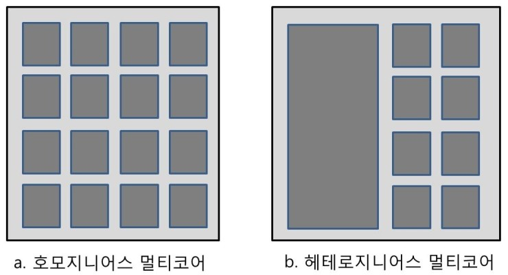

# Data Race 최소화
이 Data Race는 멀티스레드에서 무조건 발생하는 문제다.

아예 이런 문제가 없어지면 프로그래머는 원하는 값을 받지 못한다.

그럼 최소화 하는 방법은 무엇일까?

## 해결법

* 처음부터 Data Race가 적도록 프로그램을 작성

이게 해결법인데 알자마자 어이가 없었지만 아무리 생각해도 이 방법이 최선인듯 하다.

그럼 처음에 사용했던 멀티스레드의 속도를 높히는 방법은 무엇일까?

```
void TreadFunc(int threadid)
{
	for (int i = 0; i < 10000000; i++)
	{
		mt.lock();
		num += 2;
		mt.unlock();
	}
}
```
이 부분을 전역변수를 사용하되 전역변수에 적은 연산을 하면 lock을 최소화 할 수 있다.

```
void TreadFunc(int threadid)
{
	int temp = 0;
	for (int i = 0; i < 10000000; i++)
	{
		temp += 2;
	}
	mt.lock();
	num += temp;
	mt.unlock();
}
```

이렇게 바꾸면

```
20000000
Result : 19
```
처음보다 확실히 빨라졌다!!

# Multi Thread Programing의 종류

* Heterogeneous
  * 스레드마다 맡은 역할이 다르다.
  * 다른 Code Part를 진행
  * 스레드 간의 Load Balaceing이 힘들다
  * 병렬성이 제한된다.

* Homogeneous 멀티스레딩
  * Data/Event Driven 프로그래밍
  * 모든 스레드는 Symmetric 하다.
  * avaliable 한 순서대로 input을 처리한다
  * 자동적인 load balancing, 제한 없는 병렬성
  * 작업분배 Queue를 비롯한 일반적인 병렬 자료구조



(코어는 하드웨어적 스레드는 소프트웨어적 명칭이다. 신경쓰지 말자)

이런 형식이다.

현재 GPU의 일반 연산 처리는 Heterogeneous를 사용하고 있다.

헤테로지니어스(Heterogeneous)는 스레드마다 역할이 다르다. 따라서 스레드 마다 시작 함수가 다 다르다. (게임 사이클 스레드 따로, 사운드 스레드 따로)

변환이 쉬워서 초창기에 나온 게임엔진들은 헤테로지니어스 멀티스레드 프로그래밍 방식을 많이 사용한다. 각자 lock을 걸고 하기 때문에 성능이 엄청 많이 오르지 않는다.


이러한 한계를 극복하기 위해 호모지니어스(Homogeneous) 가 나왔다. 스레드가 할일이 생기면 특수한 목적이 있는 스레드가 아닌 그냥 아무 스레드를 실행한다. 스레드 들이 노는 일이 적어지기 때문에 엄청난 성능 향상이 된다.

따라서 이제부터 멀티스레드를 사용할 일이 있으면 호모지니어스 방식으로 짜야 좋다.