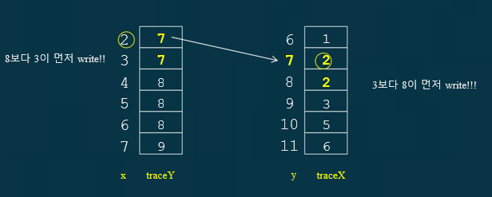

# 문제
이 전에 피터슨 알고리즘, 데커 알고리즘, 그리고 빵집 알고리즘을 사용했는데 결과값이 예상한 값과 많이 다른 결과를 보여줬다.

## 원인
1. C언어가 멀티스레드에서 사용하라고 만든 언어가 아니다.
2. X86 cpu도 멀티코어용 CPU가 아니다.

C++11로 넘어오면서 CPU마다 다른 명령어를 써야 하는 번거로움을 없애고자
```
#include <atomic> 
atomic_thread_fence(std::memory_order_seq_cst);
```
명령어가 나왔다.

animic은 멀티스레드로 실행하는데 이 앞뒤로 메모리를 읽고 쓰는 순서는 절대로 침범하지 말라는 명령어이다.

실제로 이 명령어를 쓰면

```
void TreadFuncA()
{
	for (int i = 0; i < 10000000; i++)
	{
		flag[A] = true;
		turn = B;
		atomic_thread_fence(std::memory_order_seq_cst);
		while (flag[B] && turn == B);
		num += 2;
		flag[A] = false;
	}
}
```
```
40000000
Result : 684
```
확실히 잘 나오지만, 아직 성능에 차이가 많이나지 않는다.왤까? 

이 Atomic에 들어가면서 파이프라인이 스톨되고, 당연히 느려진다.

아쉽게도 멀티 스레드는 순서대로 값을 읽고 쓰지 않는다.

```
#include <thread>
#include <iostream>
#include <atomic>

using namespace std;

#define MAX 50000000

volatile int a, b;
volatile int trace_a[MAX], trace_b[MAX];

void thread_a()
{
	for (int i = 0; i < MAX; i++)
	{
		a = i;
		trace_b[a] = b;
	}
}

void thread_b()
{
	for (int i = 0; i < MAX; i++)
	{
		b = i;
		trace_a[b] = a;
	}
}

int main()
{
	int count = 0;

	thread t1{ thread_a };
	thread t2{ thread_b };

	t1.join();
	t2.join();

	for (int i = 0; i < MAX - 1; i++)
	{
		if (trace_a[i] != trace_a[i + 1]) continue;
		int a = trace_a[i];
		if (trace_b[a] != trace_b[a + 1]) continue;
		if (trace_b[a] == i)
		{
			count++;
		}
	}

	cout << "Error Num : " << count << endl;
}
```
이 소스코드는 순서대로 값이 들어가는것이 아닌 



이런식으로 a가 2일때 trace_b가 7이 나왔다. 그럼 a스레드에서 b값을 봤는데 7이 읽혔다 이말이다.

이러한 과정을 보면 둘이 다른 순서로 업데이트가 되는것이다.

이 결과는
```
Error Num : 727793
```
굉장히 많은 오류를 범했다. 여기서 아까 fence를 사용하면 

```
Error Num : 0
```
확실히 정확해졌다.

[출처](https://popcorntree.tistory.com/15?category=813523)