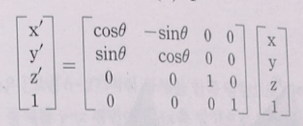

# Transform
Transform 컴포넌트이다.

다른 컴포넌트들과 달리 부모와 자식, 그리고 좌표계를 갖고있다.

## Transform.h
```
#pragma once
#include "IComponent.h"

class Transform  final : public IComponent
{
public:
	Transform(class Actor* actor, class Transform* transform);
	~Transform();

	void Initialize() override;
	void Update() override;
	void Destroy() override;

	/*
	* local
	*/
	const D3DXVECTOR3& GetLocalScale() { return local_scale; }
	void SetLocalScale(const D3DXVECTOR3& local_scale);

	const D3DXVECTOR3& GetLocalPosition() { return local_position; }
	void SetLocalPosition(const D3DXVECTOR3& local_position);

	const D3DXVECTOR3& GetLocalRotation() { return local_rotation; }
	void SetLocalRotation(const D3DXVECTOR3& local_rotation);

	const D3DXMATRIX& GetLocalMatrix() const { return local; }

	/*
	* world
	*/
	const D3DXVECTOR3 GetScale();
	void SetScale(const D3DXVECTOR3& scale);

	const D3DXVECTOR3 GetPosition();
	void SetPosition(const D3DXVECTOR3& position);

	const D3DXVECTOR3 GetRotation();
	void SetRotation(const D3DXVECTOR3& rotation);

	const D3DXMATRIX GetWorldRotationMatrix() const;
	const D3DXMATRIX& GetWorldMatrix() const { return world; }

	const D3DXVECTOR3 GetRight();
	const D3DXVECTOR3 GetUp();
	const D3DXVECTOR3 GetForward();

	/*
	* transform
	*/
	bool HasParent() const { return parent != nullptr; };
	bool HasChilds() const { return !childs.empty(); }
	Transform* GetRoot() { return HasParent() ? parent->GetRoot() : this; }

	Transform* GetParent() const { return parent; }
	void SetParent(Transform* const new_parent);

	const std::vector<Transform*>& GetChilds() const { return childs; }
	Transform* GetChildFromIndex(const uint& undex) const;
	const uint GetChildCount() const { return static_cast<uint>(childs.size()); }
	void AddChild(Transform* const child);


	void UpdateTransform();

private:
	D3DXVECTOR3 local_scale = D3DXVECTOR3(1, 1, 1);
	D3DXVECTOR3 local_position = D3DXVECTOR3(0, 0, 0);
	D3DXVECTOR3 local_rotation = D3DXVECTOR3(0, 0, 0);

	D3DXMATRIX local;	// local s * r *t
	D3DXMATRIX world;	// local * parent

	Transform* parent = nullptr;
	std::vector<Transform*> childs;
};
```
갖고있는 변수로는 좌표와 부모, 자식 Transform들이다.

## Scale 
```
void Transform::SetScale(const D3DXVECTOR3& world_scale)
{
	if (GetScale() == world_scale)
	{
		return;
	}

	D3DXVECTOR3 scale;

	if (HasParent())
	{
		D3DXVECTOR3 scale;
		D3DXVECTOR3 parent_scale = parent->GetScale();
		scale.x = world_scale.x / parent_scale.x;
		scale.y = world_scale.y / parent_scale.y;
		scale.z = world_scale.z / parent_scale.z;
	}

	SetLocalScale(world_scale);
}
```

갖고있는 크기에 부모의 크기를 나눠서 넣어준다.

크기 부분은 조금만 생각하면 알 수 있다.

월드 크기가 10인 오브젝트에 월드 크기가 5인 오브젝트를 자식으로 넣으면

자식 오브젝트는 크기가 부모의 절반이기 때문에 0.5가 된다.

## Position

```
void Transform::SetPosition(const D3DXVECTOR3& world_position)
{
	if (GetPosition() == world_position)
	{
		return;
	}

	if (HasParent())
	{
		D3DXMATRIX inverse;
		D3DXMatrixInverse(&inverse, nullptr, &parent->GetWorldMatrix());

		D3DXVECTOR3 position;
		D3DXVec3TransformCoord(&position, &world_position, &inverse);

		SetLocalPosition(position);
	}
	else
	{
		SetLocalPosition(world_position);
	}
}
```
자식으로 있는 오브젝트의 좌표는 부모 기준의 좌표에서 갖고있는 값만큼 움직인 상태이다.
이 상태에서 만약 100을 이동하면, 부모의 기준에서 100만큼을 이동하게 된다. 그래서 부모의 좌표값을 뺀 다음 100을 이동시킨다.

따라서 D3DXMatrixInverse을 하는 이유는 월드 좌표에서 부모 좌표의 역을 곱하고,

D3DXVec3TransformCoord으로 움직인다.

* D3DXVec3TransformCoord
  * 위치 반환
* D3DXVec3TransformNormal
  * 벡터 반환
  
## Rotation
가장 까다롭다.

```
void Transform::SetRotation(const D3DXVECTOR3& world_rotation)
{
	if (GetRotation() == world_rotation)
	{
		return;
	}

	if (HasParent())
	{
		D3DXMATRIX inverse;
		D3DXMatrixInverse(&inverse, nullptr, &GetWorldRotationMatrix());

		D3DXVECTOR3 rotation;
		D3DXVec3TransformNormal(&rotation, &world_rotation, &inverse);

		SetLocalRotation(rotation);
	}

	else
	{
		SetLocalRotation(world_rotation);
	}
}
```
여기선 Position과 진행 하고 마지막에 벡터를 변환한다. 하지만, GetRotation을 보자

```
const D3DXVECTOR3 Transform::GetRotation()
{
	D3DXQUATERNION world_rotation;
	D3DXMatrixDecompose(&D3DXVECTOR3(), &world_rotation, &D3DXVECTOR3(), &world);
	
	D3DXMATRIX rotation;
	D3DXMatrixRotationQuaternion(&rotation, &world_rotation);

	return D3DXVECTOR3 // Y - X - Z 순
	(
		atan2(rotation._31, rotation._32),
		atan2(-rotation._32, sqrt(pow(rotation._12,2) + pow(rotation._22, 2))),
		atan2(rotation._12, rotation._22 )
	);
}
```
반환값이 복잡하다.

저건 Y - X - Z 순으로 변환할때 계산식이다. 

지금은 2D 기준으로 회전시켜서 한번만 변환 했지만, 3D환경에서 회전은 좀 다르다



Z축 기준 회전


X축 기준 회전


Y축 기준 회전

이런 기준으로 회전한다.

나머지 함수들은 딱히 특별한게 없어서 적지 않았다.