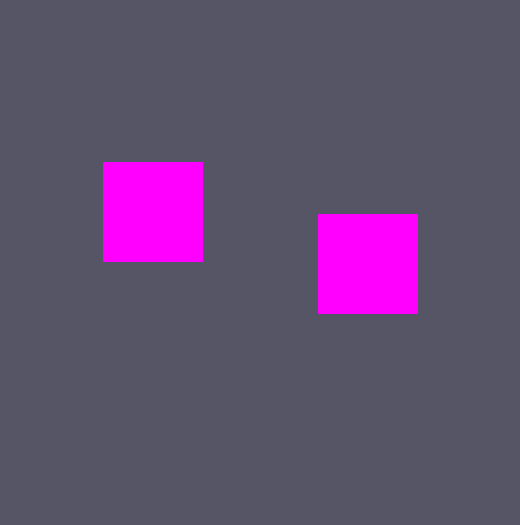

어예 10일!

# Script Language
보통은 엔진이나 툴을 만든 뒤, 내부에 있는 개발은 스크립트 언어를 만들거나 기존에 있던 API를 활용해서 한다.(ex UnrealScript, Unity)

하지만, 지금은 사용 안하고 C++로 작성할것이다.

# ScriptComponent
보통은 위에 스크립트 언어로 컴포넌트를 만들지만 지금은 안만들고 C++로 작성할것이다.

기본적으로 IComponent를 상속받고 작성하는 형태이다.

보통 게임 엔진에서 코딩하는것 처럼 하면 된다.

## MoveScriptComponent.h
```
#pragma once
#include "Scene/Component/IComponent.h"

class MoveScriptComponent final : public IComponent
{
public:
	MoveScriptComponent(class Actor* const actor, class Transform* const transform);
	~MoveScriptComponent() = default;

	void Initialize() override;
	void Update() override;
	void Destroy() override;
};
```

## MoveScriptComponent.cpp
```
#include "stdafx.h"
#include "MoveScriptComponent.h"
#include "Transform.h"

MoveScriptComponent::MoveScriptComponent(Actor* const actor, Transform* const transform)
	: IComponent(actor, transform)
{
}

void MoveScriptComponent::Initialize()
{
}

void MoveScriptComponent::Update()
{
	D3DXVECTOR3 position = transform->GetPosition();

	if (GetAsyncKeyState('W') & 0x8000) { position.y++; }
	else if (GetAsyncKeyState('S') & 0x8000) { position.y--; }
	if (GetAsyncKeyState('D') & 0x8000) { position.x++; }
	else if (GetAsyncKeyState('A') & 0x8000) { position.x--; }

	transform->SetPosition(position);
}

void MoveScriptComponent::Destroy()
{
}

```
움직임을 담당하는 컴포넌트이다. 따로 AI나 다른 컴포넌트 제작은 설명 안하겠다.

AI와 Move 컴포넌트를 제작하고 붙인뒤 실행하면,



잘 된다.