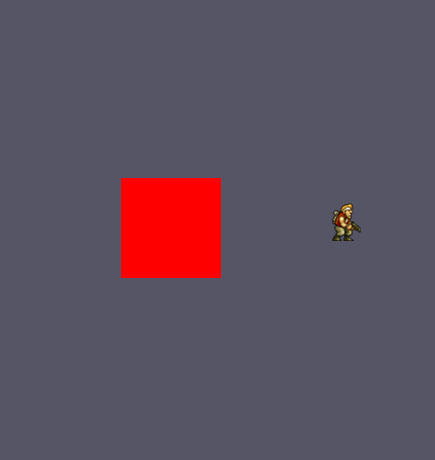

# AnimatorComponent
이제 렌더링 부분이다.

## RendererConstantBuffers.h
```
struct ANIMATION_DATA
{
	D3DXVECTOR2 sprite_offset;
	D3DXVECTOR2 sprite_size;
	D3DXVECTOR2 texture_size;
	// 16바이트 맞추기 위한 패딩
	float padding[2];
};
```
인풋 레이아웃 추가 해주자 마지막 2바이트는 총 24바이트니까 16배수 바이트로 맞추기 위해 값을 추가했다.

## Renderer.h
```
ANIMATION_DATA cpu_animation_buffer;
std::shared_ptr<class D3D11_ConstantBuffer> gpu_animation_buffer;
```
애니메이션이 들어갈 수 있게 버퍼를 추가

## Renderer.cpp
```
void Renderer::UpdateAnimationBuffer()
{
	ANIMATION_DATA* buffer = gpu_animation_buffer->Map<ANIMATION_DATA>();
	*buffer = cpu_animation_buffer;
	gpu_animation_buffer->UnMap();
}
```
버퍼 초기화 해주는 부분 추가

## MeshRendererComponent.h
강좌에서는 따로 나누지 않았지만, 나누지 않으니 문제가 많이 생긴다. 그래서 따로 나눠서 관리했다.

```
enum class ShaderType : uint
{
	Color,
	Texture,
	Animation
};
```
이 타입 추가한뒤
## MeshRendererComponent.cpp
```
MeshRendererComponent::MeshRendererComponent(Context* const context, Actor* const actor, Transform* const transform, const ShaderType shader_type)
	: IComponent(context, actor, transform)
{
	graphics = context->GetSubsystem<Graphics>();
	this->shader_type = shader_type;
}
```
생성자를 오버로딩해서 하나 더 만들어 주자
그리고 
```
SetStandardMesh();
SetStandardMaterial();
```
이 부분에서 Color,Texture,Animation에 따라 Vertex를 나눠서 넣어준다.

저렇게 생성자를 하니 문제가 하나 발생했다. AddComponent에서 생성자를 호출하는데 매개변수를 못넣는다. 그래서

## Actor.h
```
template<typename T, typename U>
inline const std::shared_ptr<T> Actor::AddComponent(const U value)
{
	static_assert(std::is_base_of<IComponent, T>::value, "Provider type dose not implement IComponent");

	ComponentType type = IComponent::DeduceComponenetType<T>();

	if (HasComponent(type))
	{
		return GetComponent<T>();
	}

	components.emplace_back(std::make_shared<T>(context, this, transform.get(), value));

	std::shared_ptr<T> new_component = std::static_pointer_cast<T>(components.back());
	new_component->Initialize();
	new_component->SetComponentType(type);

	if constexpr (std::is_same<T, class Transform>::value)
	{
		transform = new_component;
	}

	return new_component;
}
```
템플릿을 하나 더 사용해서 값을 넣어준다.

그 후에

## RendererPasses.cpp
PassMain()
```
if (std::shared_ptr<AnimatorComponent> animator = actor->GetComponent<AnimatorComponent>())
{
	const Keyframe* current_keyframe = animator->GetCurrentKeyframe();
	cpu_animation_buffer.sprite_offset = current_keyframe->offset;
	cpu_animation_buffer.sprite_size = current_keyframe->size;
	cpu_animation_buffer.texture_size = animator->GetCurrentAnimation()->GetSpriteTextureSize();
	UpdateAnimationBuffer();

	pipeline->SetConstantBuffer(2, ShaderScope_VS, gpu_animation_buffer.get());
	pipeline->SetShaderResource(0, ShaderScope_PS, animator->GetCurrentAnimation()->GetSpriteTexture().get());
}
else
{
	pipeline->SetConstantBuffer_nullptr(2, ShaderScope_VS);
	pipeline->SetShaderResource_nullptr(0, ShaderScope_PS);
}
```
애니메이션이 있는지를 판단해서 넣는걸로 바꾼다.

여기서 이 상태면 현재 설정해준 크기(100,100) 그대로 이 이미지가 들어간다. 그리고 인풋레이어 설정한 값이 안들어간다.

쉐이더 부분을 수정해야 한다.

## Animation.hlsl
따로 애니메이션을 위한 쉐이더를 만들고
```
cbuffer AnimationBuffer : register(b2)
{
    float2 sprite_offset;
    float2 sprite_size;
    float2 texture_size;
};
```
이 버퍼채널을 2로 만들고
```
PixelInput VS(vertexInput input)
{	
    PixelInput output;
    
    output.position = float4(input.position.xy * sprite_size, 0.0f, 1.0f);    
    
    output.position = mul(output.position, world);
    output.position = mul(output.position, view);
    output.position = mul(output.position, proj);
    
	output.uv = input.uv;	
    output.uv *= sprite_size / texture_size;
    output.uv += sprite_offset / texture_size;
    
	return output;
}
```
VertexShader에서 읽어오는 값을 저렇게 바꾼다.
```
output.position = float4(input.position.xy * sprite_size, 0.0f, 1.0f); 
```
이렇게 바꾸면 Sprite 크기 대로 이미지가 나온다.

그리고 임시로 애니메이션을 만들어 주자

## Scene.cpp
임시이다. 이렇게 사용 절대 안할거다 일단 예시로 만든거다 진짜다 바꿀거다

```
std::shared_ptr<Animation> idle_animation = std::make_shared<Animation>(context);
idle_animation->AddKeyframe(D3DXVECTOR2(4.0f, 2.0f), D3DXVECTOR2(29.0f, 38.0f), 200);
idle_animation->AddKeyframe(D3DXVECTOR2(35.0f, 2.0f), D3DXVECTOR2(29.0f, 38.0f), 200);
idle_animation->AddKeyframe(D3DXVECTOR2(64.0f, 2.0f), D3DXVECTOR2(29.0f, 38.0f), 200);
idle_animation->SetRepeatType(RepeatType::Loop);
idle_animation->SetSpriteTexture("_Assets/Texture/metalslug_marco.png");
idle_animation->SetSpriteTextureSize(D3DXVECTOR2(400.0f, 600.0f));
```
이렇게 애니메이션을 만든 뒤,
```
std::shared_ptr<AnimatorComponent> animator = player->GetComponent<AnimatorComponent>();
animator->AddAniamtion("Idle", idle_animation);
animator->SetAnimationMode(AnimationMode::Play);
animator->SetCurrentAnimation("Idle");
```

넣어주고 실행시키면

그리고 이 상태로 실행을 하면

두부두부두부두부두부두부두



메탈슬러그의 마르코가 잘 들어간다.