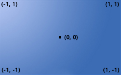

# Direct3D 11
드디어 3D로 넘어갔다. 일단 2D와 크게 다른 점은 없지만, 그래도 축이 하나 추가된것 그리고 좀더 이론적인게 많다.

일단 Vertex와 NDC 좌표계부터 알아보자

* Vertex - 정점(선이나 삼각형을 그리기 위한 기준점)
	- 공간상에 위치를 찍기 위해 존재.
	- 정점 하나로 그림을 그리는 것은 못함.

* NDC 좌표계(정규좌표계)
	- 화면의 위치를 -1~+1로 표현.

NDC를 찾아보면 Normalized Device Coordinates 라고 하는데 일단 Normalize는 유니티나 언리얼을 만져봤을때 봤던 단어이다.

벡터를 1로 변환시킨 값이다. 따라서 NDC는 




출처 : (http://www.directxtutorial.com/Lesson.aspx?lessonid=111-4-1)

이런 좌표계를 갖고있다.

따라서 점을 찍고 선을 그리거나 삼각형을 그리려면, 저기에 있는 좌표에 점을 찍어 그려야 한다.

## LINE (선)

이번 강좌에선 Framework를 따로 받아서 사용했다.

그리고 이번엔 쉐이더를 hlsl이 아닌 fx로 사용했다

### Vertex.fx
```
struct VertexInput
{
	float4 Position : Position;
};

struct VertexOutput
{
	float4 Position : SV_Position;
};

VertexOutput VS(VertexInput input)
{
	VertexOutput output;
	output.Position = input.Position;
	
	return output;
}

float4 PS(VertexOutput input) : SV_Target
{
	return float4(1, 0, 0, 1);
}

float4 PS1(VertexOutput input) : SV_Target
{
    return float4(0, 1, 0, 1);
}

float4 PS2(VertexOutput input) : SV_Target
{
    return float4(0, 0, 1, 1);
}

technique11 T0
{
	pass P0
	{
		SetVertexShader(CompileShader(vs_5_0, VS()));
		SetPixelShader(CompileShader(ps_5_0, PS()));
	}

    pass P1
    {
        SetVertexShader(CompileShader(vs_5_0, VS()));
        SetPixelShader(CompileShader(ps_5_0, PS1()));
    }
}

technique11 T1
{
    pass P0
    {
        SetVertexShader(CompileShader(vs_5_0, VS()));
        SetPixelShader(CompileShader(ps_5_0, PS2()));
    }
}
```
2D때 했던것과 크게 다르지 않지만, 이번에는 register의 채널을 따로 만들지 않고 타겟만 설정했다.

이런 뒤 맨 마지막에 technique11 에 채널과 pass에 채널과 버텍스와 픽셀 쉐이더를 실행한다.

### VertexLine
이번 프레임 워크에 Excute의 인터페이스를 받고 VertexLine이라는 클래스를 만들었다

저번에 했던것과 크게 다르지 않기 때문에 세부적인 것들은 넘어가겠다

```
void VertexLine::Initialize()
{
	shader = new Shader(L"01_Vertex.fx");

	vertices[0].Position = Vector3(0.0f, 0.0f, 0.0f);
	vertices[1].Position = Vector3(1.0f, 0.0f, 0.0f);

	D3D11_BUFFER_DESC desc;
	ZeroMemory(&desc, sizeof(D3D11_BUFFER_DESC));
	desc.ByteWidth = sizeof(Vertex) * 2;
	desc.BindFlags = D3D11_BIND_VERTEX_BUFFER;
	
	D3D11_SUBRESOURCE_DATA subResource = { 0 };
	subResource.pSysMem = vertices;

	Check(D3D::GetDevice()->CreateBuffer(&desc, &subResource, &vertexBuffer));
}
```
처음에 쉐이더를 불러오고 각 점의 좌표를 찍어준다 그리고 버퍼에 담고 

```
void VertexLine::Render()
{
	UINT stride = sizeof(Vertex);
	UINT offset = 0;

	D3D::GetDC()->IASetVertexBuffers(0, 1, &vertexBuffer, &stride, &offset);
	D3D::GetDC()->IASetPrimitiveTopology(D3D11_PRIMITIVE_TOPOLOGY_LINELIST);

	shader->Draw(0, 0, 2);
	//shader->Draw(1, 0, 2);
}
```
그려준다. 

마지막에 draw함수는 첫번째가 technique11의 채널 그리고 두번째가 pass의 채널 그리고 세번째가 몇개의 점을 그릴것인지에 대한 값이다.

이렇게 선언한 뒤 실행을 시키면,


이렇게 0,0 좌표에서 1,0좌표까지 선을 그어준다.

물론 저기서 technique11의 채널이나 pass의 채널을 바꾸면 쉐이더에 입력한 색으로 색이 바뀐다.

그리고 PrimitiveTopology는 어떤 식으로 그릴지에 대한 값이다. 여기서 LINELIST가 아닌 LINESRTIP으로 바꾸고
```
vertices[0].Position = Vector3(0.0f, 0.0f, 0.0f);
vertices[1].Position = Vector3(1.0f, 0.0f, 0.0f);
vertices[2].Position = Vector3(0.0f, 0.5f, 0.0f);
vertices[3].Position = Vector3(1.0f, 0.5f, 0.0f);
vertices[4].Position = Vector3(0.0f, -0.5f, 0.0f);
vertices[5].Position = Vector3(1.0f, -0.5f, 0.0f);
```
선을 이만치 추가를 하면


이런식으로 선을 안 끊기고 연결할 수 있다.

