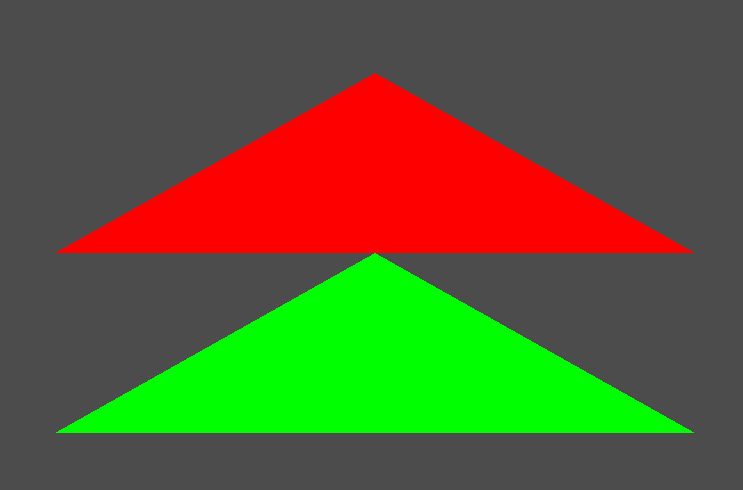
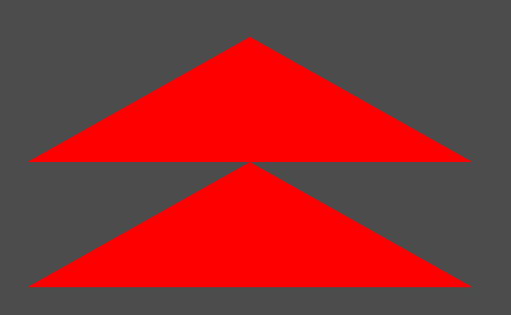
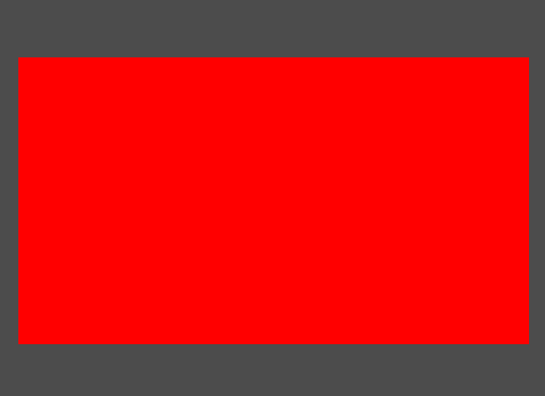

# D3DX Device, Device Context 뭐가 다를까
DirectX10 까지는 Device 이 하나가 Device, Device Context 이 둘을 담당했지만, DirectX11 부터는 멀티스레드 호환이 강화되어 두개로 나눠졌다. 

* CPU - Device
* GPU - DeviceContext

쉽게 나누면 이렇게 둘로 나눌 수 있다.

Device 는 기능 지원 점검과 자원 할당에 사용된다

DeviceContext 는 렌더 대상을 설정하고, 자원을 그래픽 파이프라인에 묶고 GPU가 렌더링 명령들을 지시하는데 사용된다.

따라서 DeviceContext는 Render하는 부분에서 사용된다.

# Triangle
저번에는 선을 출력하는 것까지 했다.

이젠 렌더링의 가장 기본적인 도형인 삼각형을 출력해보겠다.

선을 출력한것과 크게 다른것은 없다. 하지만, 렌더링 하는 순서가 있다.

일단 간단한 삼각형부터 만들어보자

```
vertices[0].Position = Vector3(-0.5f, 0.0f, 0.0f);
vertices[1].Position = Vector3(0.0f, 0.5f, 0.0f);
vertices[2].Position = Vector3(0.5f, 0.0f, 0.0f);
```
```
D3D::GetDC()->IASetPrimitiveTopology(D3D11_PRIMITIVE_TOPOLOGY_TRIANGLELIST);

shader->Draw(0, 0, 3);
```
이런 식으로 선언하면,


이런 식으로 간단한 삼각형이 나온다.

이제 그럼 삼각형 2개를 만들어보자

```
// VertexBuffer
{
	vertices[0].Position = Vector3(-0.5f, 0.0f, 0.0f);
	vertices[1].Position = Vector3(0.0f, 0.5f, 0.0f);
	vertices[2].Position = Vector3(0.5f, 0.0f, 0.0f);

	D3D11_BUFFER_DESC desc;
	ZeroMemory(&desc, sizeof(D3D11_BUFFER_DESC));
	desc.ByteWidth = sizeof(Vertex) * 3;
	desc.BindFlags = D3D11_BIND_VERTEX_BUFFER;

	// GPU 복사 부분
	D3D11_SUBRESOURCE_DATA subResource = { 0 };
	subResource.pSysMem = vertices;

	Check(D3D::GetDevice()->CreateBuffer(&desc, &subResource, &vertexBuffer));
}

// VertexBuffer2
{
	vertices2[0].Position = Vector3(-0.5f, -0.5f, 0.0f);
	vertices2[1].Position = Vector3(0.0f, 0.0f, 0.0f);
	vertices2[2].Position = Vector3(0.5f, -0.5f, 0.0f);

	D3D11_BUFFER_DESC desc;
	ZeroMemory(&desc, sizeof(D3D11_BUFFER_DESC));
	desc.ByteWidth = sizeof(Vertex) * 3;
	desc.BindFlags = D3D11_BIND_VERTEX_BUFFER;

	// GPU 복사 부분
	D3D11_SUBRESOURCE_DATA subResource = { 0 };
	subResource.pSysMem = vertices2;

	Check(D3D::GetDevice()->CreateBuffer(&desc, &subResource, &vertexBuffer2));
}
```
간단하게 점 3개를 갖고있는 배열을 2개 만든뒤, 
```
D3D::GetDC()->IASetVertexBuffers(0, 1, &vertexBuffer, &stride, &offset);
D3D::GetDC()->IASetPrimitiveTopology(D3D11_PRIMITIVE_TOPOLOGY_TRIANGLELIST);
shader->Draw(0, 0, 3);

	D3D::GetDC()->IASetVertexBuffers(0, 1, &vertexBuffer2, &stride, &offset);
D3D::GetDC()->IASetPrimitiveTopology(D3D11_PRIMITIVE_TOPOLOGY_TRIANGLELIST);
shader->Draw(0, 1, 3);
```
이렇게 두개를 그려주면, 



이렇게 두개가 각 좌표에 나오게 된다.

그럼 이렇게 배열 2개를 할당하지 않고 배열 한개에 점 6개를 넣어서 만들 수 있을까? 한번 해보자

```
vertices[0].Position = Vector3(-0.5f, 0.0f, 0.0f);
vertices[1].Position = Vector3(0.0f, 0.5f, 0.0f);
vertices[2].Position = Vector3(0.5f, 0.0f, 0.0f);
vertices[3].Position = Vector3(-0.5f, -0.5f, 0.0f);
vertices[4].Position = Vector3(0.0f, 0.0f, 0.0f);
vertices[5].Position = Vector3(0.5f, -0.5f, 0.0f);
```


이런 식으로 짜면 잘 나온다.

하지만 아까 말한 렌더링 순서가 있다.

```
vertices[0].Position = Vector3(-0.5f, 0.0f, 0.0f);
vertices[1].Position = Vector3(0.0f, 0.5f, 0.0f);
vertices[2].Position = Vector3(-0.5f, -0.5f, 0.0f);
vertices[3].Position = Vector3(0.5f, 0.0f, 0.0f);
vertices[4].Position = Vector3(0.0f, 0.0f, 0.0f);
vertices[5].Position = Vector3(0.5f, -0.5f, 0.0f);
```
이렇게 아까 있던 좌표에서 2와 3을 바꿨다.

이렇게 하면,


예상한것과 엄청 동떨어진 그런 그림이 나온다.


이렇게 감각형의 정점을 지정하는 순서는 매우 중요하며, 이를 두르기 순서(winding order)라고 부른다.

DirectX는 왼손 좌표계를 사용하기 때문에 무조건 이 두르기 순서로 정점을 찍어야 원하는 모양이 나온다.

## Primitive Topology
렌더링 되는 방식을 지정하는 방법이다.

이 방법을 사용하면 점 4개로 삼각형 2개를 만들 수 있다.

```
vertices[0].Position = Vector3(-0.5f, -0.5f, 0.0f);
vertices[1].Position = Vector3(-0.5f, 0.5f, 0.0f);
vertices[2].Position = Vector3(0.5f, -0.5f, 0.0f);
vertices[3].Position = Vector3(0.5f, 0.5f, 0.0f);
```

이렇게 점4개를 만들고

```
D3D::GetDC()->IASetVertexBuffers(0, 1, &vertexBuffer, &stride, &offset);
D3D::GetDC()->IASetPrimitiveTopology(D3D11_PRIMITIVE_TOPOLOGY_TRIANGLESTRIP);
```
이번에는 Primitive Topology의 방식을 TRIANGLESTRIP으로 할것이다.

이렇게 선언하면



2개가 붙어있는 경우로 나온다.

Line에서처럼 연결되서 나온다.

