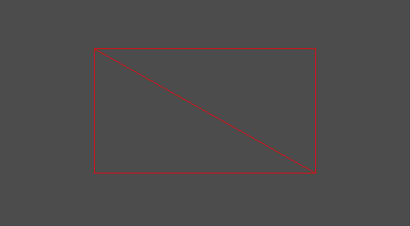

전에 삼각형 2개로 사각형을 만들었는데 누가 봐도 삼각형 두개가 아닌 그냥 사각형으로 보인다.

이번엔 속이 비어있는 도형으로 만들어 보겠다.

# Rectangle


어제 봤던 그 좌표계다

사각형을 그려야 하면 삼각형 2개를 붙여야 한다.

삼각형 1 - v0 -> v1 -> v3 순서로,

삼각형 2 - v1 -> v2 -> v3 순서로 그리면

```
vertices[0].Position = Vector3(0.0f, 0.0f, 0.0f);
vertices[1].Position = Vector3(0.0f, 0.5f, 0.0f);
vertices[2].Position = Vector3(0.5f, 0.0f, 0.0f);

vertices[3].Position = Vector3(0.5f, 0.0f, 0.0f);
vertices[4].Position = Vector3(0.0f, 0.5f, 0.0f);
vertices[5].Position = Vector3(0.5f, 0.5f, 0.0f);
```
점을 이케 찍으면 된다.

그리고 PrimitiveTopology는 TRIANGLELIST로 하고, 이제 쉐이더를 수정해야 한다.

FillMode를 기본이 아닌 Wireframe으로 설정해야 한다.

```
RasterizerState FillMode_Wireframe
{
    FillMode = Wireframe;
};

technique11 T0
{
	pass P0
	{
		SetVertexShader(CompileShader(vs_5_0, VS()));
        SetPixelShader(CompileShader(ps_5_0, PS_R()));
    }

    pass P1
    {
        SetRasterizerState(FillMode_Wireframe);

        SetVertexShader(CompileShader(vs_5_0, VS()));
        SetPixelShader(CompileShader(ps_5_0, PS_R()));
    }
}
```
이렇게 선언을 하고 밑에 RanserizerState를 설정해준다.

이런뒤 그리게 되면



이렇게 삼각형 두개로 이제 잘 보인다.
