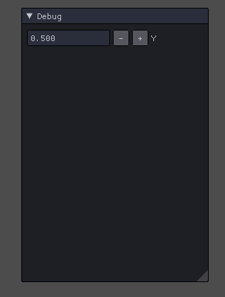
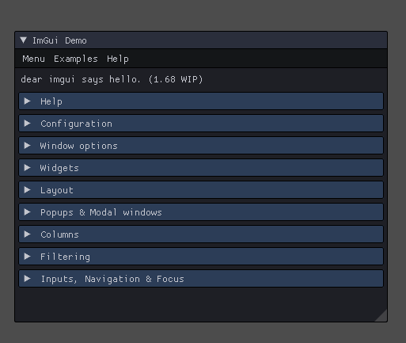

# Keyboard Input
키보드 입력이다.

키보드 입력받고 첫번째 정점의 위치를 옮겨보자

```
if (Keyboard::Get()->Press(VK_RIGHT))
{
	vertices[0].Position.x += 1.0f * Time::Delta();
}
else if (Keyboard::Get()->Press(VK_LEFT))
{
	vertices[0].Position.x -= 1.0f * Time::Delta();
}	
```
Time::Delta() 는 각 프레임마다 걸린 시간을 알려준다. 컴퓨터마다 사양이 다르기 때문에 각 프레임마다 속도를 곱해주면 각 컴퓨터에서 일정한 속도가 나온다. 

하지만, 이 상태로 만들어도 실행하면 아무런 일도 일어나지 않는다.

왜냐하면, 메모리에 있는 vertices[0]의 값은 변했지만, VRam에 있는 값은 변하지 않았다. 따라서 따로 전달을 해줘야 한다.

이 전에는 Map을 사용했지만, 일단 데모 테스트니 Subresource만 보내자
```
D3D::GetDC()->UpdateSubresource(vertexBuffer, 0, nullptr, vertices, sizeof(Vertex) * 6, 0);
```
이렇게 보내놓으면


움직이긴 하는데 오른쪽으로 가면 저번에 말한 두르기 순서로 인해 그려지지 않는다.

# User Interface
이번엔 UI다. 게임 엔진으로 테스트할때와 일반 코딩만으로 테스트할때 차이점이 무엇인가 하면, 실시간으로 게임 내부의 값을 변경 못한다는 것이다.

하지만 UI 툴을 직접 제작하면 해결되긴 하지만, 솔직히 너무 오래걸리는 작업이라 하지 않게 된다. 하지만, 정말 나에게 맞는 UI가 필요하면 제작해야 한다.

이를 좀 편하게 하기 위한 [ImGUI](https://github.com/ocornut/imgui)라는 툴이 존재한다.

각종 그래픽과 로그 그리고 GUI를 제공한다. 들어가면 엄청난게 많다.

```
static float y = 0.5f;
ImGui::InputFloat("Y", &y, 0.01f);
vertices[1].Position.y = y;
```
일단 대충 이런식으로 사용하면



이렇게 실시간으로 값을 참조해서 변경하던가

```
Gui::Get()->RenderText(10, 60, 1, 0, 0, text);
```
이런식으로 사용하면 로그를 보여주던가 할 수 있다.

```
ImGui::ShowDemoWindow(nullptr);
```



이걸 사용하면 데모 윈도우가 나오는데 각종 기능들을 설명해준다. 진짜 진짜 갓갓이다. 벌써 여러가지 어떤걸 만들 수 있을지 생각할 수 있을 정도로 무궁무진한 툴이다.