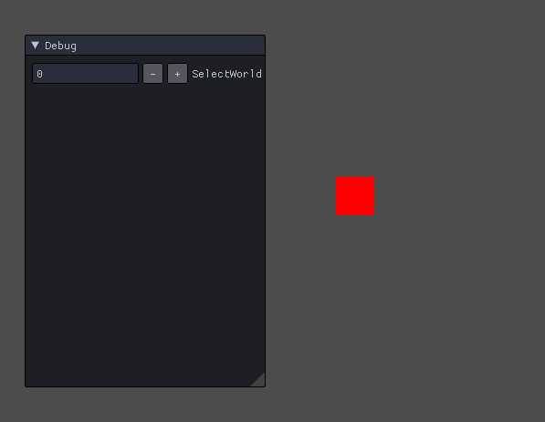

Vertex Shader 단계에서 World View Projection 변환이 일어난다.

# World
World 행렬은


이런 식으로 되어있다.(잘 그렸다)

그래서 이 월드를 변형시키면 월드 안에 있는 오브젝트도 같이 변형이 된다.

```
typedef D3DXMATRIX Matrix;
```
따로 typedef 를 해서 만들기 쉽게 했다.

```
Matrix world;
```
월드 행렬을 만들어 주고

```
D3DXMatrixIdentity(&world);
```
단위행렬로 만들어준다.

그런뒤 만약 이동하고 싶다면 위에 그림에서 위치 부분을 변형해주고

크기를 변형하고 싶다면 크기 부분을 변형해주면 된다.

그런데 회전은 좀 다른 방법을 사용해야 한다. 그건 나중에 따로 작성하겠다.

그런 뒤 Update()에서
```
if (Keyboard::Get()->Press(VK_RIGHT))
{
	world._11 += 1.0f * Time::Delta();
	world._22 += 1.0f * Time::Delta();
}
else if (Keyboard::Get()->Press(VK_LEFT))
{
	world._11 -= 1.0f * Time::Delta();
	world._22 -= 1.0f * Time::Delta();
}
else if (Keyboard::Get()->Press(VK_UP))
{
	world._42 += 1.0f * Time::Delta();
}
else if (Keyboard::Get()->Press(VK_DOWN))
{
	world._42 -= 1.0f * Time::Delta();
}
```

이렇게 확인 할수 있게 키보드 입력을 받고

Render부분에서
```
shader->AsMatrix("World")->SetMatrix(world);
shader->AsMatrix("View")->SetMatrix(Context::Get()->View());
shader->AsMatrix("Projection")->SetMatrix(Context::Get()->Projection());
```
이렇게 그려주는데 하나 빼먹은게 있다.

```
VertexOutput VS(VertexInput input)
{
	VertexOutput output;
    output.Position = mul(input.Position, World);
    output.Position = mul(output.Position, View);
    output.Position = mul(output.Position, Projection);
	
	return output;
}
```
쉐이더 부분에 VertexShader부분을 바꿔주자.

각 포지션을 월드 행렬에 맞게 곱해준다.
이렇게 작성하면 위에 World, View, Projection과 맞게 들어간다.


지금 보면 이동 및 크기를 변경할 때 사각형의 중점이 아닌 왼쪽 아래를 위치하고 있다. 이걸 중심으로 맞춰야 사각형이 아닌 다른 복잡한 물체를 다룰때 편하다.

맞추는 방법음 저번에 만든 사각형을 0.0,0.0 기준으로 만들어야 한다.

# World 여러개
이번엔 월드를 여려개를 만들어 보자

```
UINT selectWorld;
Matrix world[3];
```
월드를 배열로 만들고 selectWorld 라는 변수를 만들어서 어떤 월드를 움직이게 할지 배열을 만들자 크게 뭐는 없다
```
shader->AsScalar("SelectWorld")->SetInt(0);
shader->AsMatrix("World")->SetMatrix(world[0]);
shader->Draw(0, 0, 6);

shader->AsScalar("SelectWorld")->SetInt(1);
shader->AsMatrix("World")->SetMatrix(world[1]);
shader->Draw(0, 0, 6);

shader->AsScalar("SelectWorld")->SetInt(2);
shader->AsMatrix("World")->SetMatrix(world[2]);
shader->Draw(0, 0, 6);
```
Render부분에서 이렇게 만들면 모든 월드가 동시에 만들어진다.

그리고 구분할 수 있게 쉐이더 PS 단계에서 색을 다르게 입혔다.



그리고 이제 하나하나 행렬을 움직이게 하는것은 비효율적이다. 왜냐하면 나중에 게임을 만들때 오브젝트를 이동시키는 명령어를 계속 저렇게 행렬하나를 건들이면 문제가 발생할 가능성이 있기 때문이다.

그러면 이제 하나하나 따로 만들어서 바꿔보자

```
Vector3 position2 = Vector3(0,0,0);
Vector3 scale2 = Vector3(1,1,1);
```
이동과 크기를 받을 두개의 구조체 변수를 만들고
```
Matrix S, T;
D3DXMatrixScaling(&S, scale.x, scale.y, scale.z);
D3DXMatrixTranslation(&T, position.x, position.y, position.z);

world1 = S * T;
```

이렇게 만들어 곱해진다.

여기서 중요한게 있다. 곱해지는 순서는 저 순서로 따라가야 한다.

행렬이기 때문에 곱하는 순서가 중요하기 때문이다.

순서는 저번에 말한 스 자 이 공 부 이다.
스(스케일) Scale -> 자(자전) LocalRotation -> 이(이동) Translate -> 공(공전) Rotation -> 부(부모) Parent