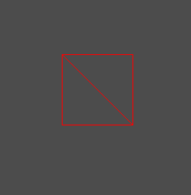

# Index Buffer
저번에 2D 할때 했던것 이지만 한번 더 복습할 겸사겸사 정리한다.

VertexShader에서 각 정점들이 넘어가고, 정점들에 대한 그리기 요청을 할 때,

* 한 정점이 여러번 계산 되는것
* 중복되는 정점이 많이 메모리 낭비가 있는것

때문에 Index Buffer를 사용한다.

생각해보면 그려야할 다각형이 적으면 적을수록 Vertex Buffer만 쓸때 메모리가 적게 들지만 늘면 늘수록 Index Buffer를 같이 써 주는게 메모리가 절약된다.

실제로 224바이트가 2번 중복이 일어나면 Vertex Buffer에는 448바이트의 정점 내용이 들어있어야 한다. 하지만 하나의 정점과 uint의 index를 사용하면 226바이트로 처리 할 수 있다.

이것도 두르기 순서로 찍어줘야 한다.

이 두개를 추가해주면
```
UINT indices[6];
ID3D11Buffer* indexBuffer;
```

```
indices[0] = 0;
indices[1] = 1;
indices[2] = 2;

indices[3] = 2;
indices[4] = 1;
indices[5] = 3;
// Create Index Buffer
{
	D3D11_BUFFER_DESC desc;
	ZeroMemory(&desc, sizeof(D3D11_BUFFER_DESC));
	desc.ByteWidth = sizeof(UINT) * 6;
	desc.BindFlags = D3D11_BIND_INDEX_BUFFER;

	// GPU 복사 부분
	D3D11_SUBRESOURCE_DATA subResource = { 0 };
	subResource.pSysMem = indices;

	Check(D3D::GetDevice()->CreateBuffer(&desc, &subResource, &indexBuffer));
}
```
Vertex Buffer의 크기가 4일때 잘 그려진다.
```
vertices[0].Position = Vector3(-0.5f, -0.5f, 0.0f);
vertices[1].Position = Vector3(-0.5f, 0.5f, 0.0f);
vertices[2].Position = Vector3(0.5f, -0.5f, 0.0f);
vertices[3].Position = Vector3(0.5f, 0.5f, 0.0f);
```



그리고 이것을 조금만 활용하면 그리드를 만들 수 있다.

거의 코딩테스트 문제 마냥 조금씩 생각해서 수식을 만들면 된다.

구하는 방법은 자세하게 안적겠다.

```
vertexCount = (width + 1) * (height + 1);
vertices = new Vertex[vertexCount];

for (UINT y = 0; y <= height; y++)
{
	for (UINT x = 0; x <= width; x++)
	{
		UINT i = (width + 1) * y + x;
		vertices[i].Position.x = (float)x;
		vertices[i].Position.y = (float)y;
		vertices[i].Position.z = 0.0f;
	}
}
indexCount = width * height * 6;
indices = new UINT[indexCount];

UINT index = 0;
for (UINT y = 0; y < height; y++)
{
	for (UINT x = 0; x < width; x++)
	{
		indices[index + 0] = (width + 1) * y + x;
		indices[index + 1] = (width + 1) * (y + 1) + x;
		indices[index + 2] = (width + 1) * y + (x + 1);
		indices[index + 3] = (width + 1) * y + (x + 1);
		indices[index + 4] = (width + 1) *  (y + 1) + x;
		indices[index + 5] = (width + 1) * (y + 1) + (x + 1);

		index += 6;
	}
}
```
이런 식으로 적으면 


잘 나온다.