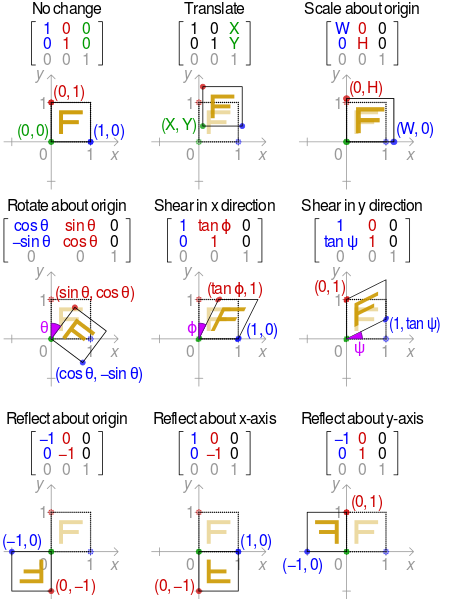

# Camera
무엇을 바라볼때 카메라가 있어야 한다. 그렇다... (계산식을 보면 없으면 좋을 것 같ㄷ....)

일단 카메라에 필요한 것들은 회전 그리고 위치이다. (크기는 필요 없다)

일단 함수 소개 먼저 해야겠다. 

```
D3DXMATRIX *D3DXMatrixLookAtLH
(     
    D3DXMATRIX *pOut,
    CONST D3DXVECTOR3 *pEye,
    CONST D3DXVECTOR3 *pAt,
    CONST D3DXVECTOR3 *pUp
);
```
왼손 좌표계(DX에서 많이 사용하는)에서 사용하는 바라보는 행렬 함수이다.

중요한건 이 함수 사용법이 아니고 안에 있는 내부가 어떻게 작동되는지 이다.

일단 안에 행렬 계산을 먼저 보자

```
zaxis = normal(At - Eye)
xaxis = normal(cross(Up, zaxis))
yaxis = cross(zaxis, xaxis)

 xaxis.x           yaxis.x           zaxis.x          0
 xaxis.y           yaxis.y           zaxis.y          0
 xaxis.z           yaxis.z           zaxis.z          0
-dot(xaxis, eye)  -dot(yaxis, eye)  -dot(zaxis, eye)  1
```
하나하나 차근차근 생각해보자

* Zaxis 
	* 벡터의 차는 뒤의 벡터가 앞의 벡터를 바라보는 방향이다.
	* 따라서 카메라에서 보고 있는 방향으로 정규화 한 벡터이다.
* Xaxis
	* Up벡터(0,1,0) 과 zaxis의 외적을 정규화 한 벡터이다.
	* 보는 방향인 벡터와 위로 가는 벡터의 외적의 정규화한 벡터이다.
* Yaxis
	* 지금까지 구한 Z,Xaxis의 외적이다.

이 부분은 조금만 생각하면 알 수 있다.

현재의 Rotation은 구했다. 이제 위치를 구해야 한다.

(1,0,0)의 값을 가진 forward 방향 벡터가 있을때 카메라의 위치가 (5,1,1)이란느 벡터값을 갖고있고 이 둘값을 내적 하면 5라는 값이 나온다. 이 값은 x방향으로 5만큼 이동한 것이다.

그런데 왜 음수이냐 그것은 카메라가 이동할때 카메라 입장에서 물체들은 반대로 움직이기 때문이다.

그러면 이동할때는 별로 문제 없이 현재 위치에 xyz축 값만 더해주면 된다.

하지만 문제는 회전이다. 이 회전에는 삼각 항등식이 필요하다.



이런 방식으로 회전을 하면 된다... 아직 이해 할만한 레벨이 아닌거 같다..... ㅠㅠ 일단 외우자
