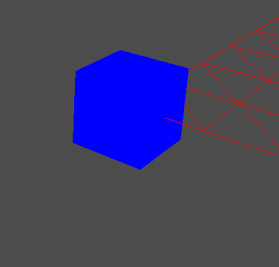
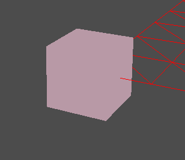
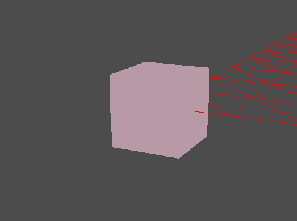

# Cube
큐브다.


이런 큐브를 갖고싶지만, 아직 텍스쳐를 모르기 때문에 그냥 색만 입힌 큐브를 만들어보자

별거 없다. 진짜 그냥 만들었던 정점 4개인 면을 6개 만들고 이어 붙이면 그게 큐브다.

## Cube.cpp
```
vertexCount = 24;
vertices = new Vertex[vertexCount];

//Front
vertices[0].Position = Vector3(-w, -h, -d);
vertices[1].Position = Vector3(-w, +h, -d);
vertices[2].Position = Vector3(+w, -h, -d);
vertices[3].Position = Vector3(+w, +h, -d);

//Back
vertices[4].Position = Vector3(-w, -h, +d);
vertices[5].Position = Vector3(+w, -h, +d);
vertices[6].Position = Vector3(-w, +h, +d);
vertices[7].Position = Vector3(+w, +h, +d);

//Top
vertices[8].Position = Vector3(-w, +h, -d);
vertices[9].Position = Vector3(-w, +h, +d);
vertices[10].Position = Vector3(+w, +h, -d);
vertices[11].Position = Vector3(+w, +h, +d);

//Bottom
vertices[12].Position = Vector3(-w, -h, -d);
vertices[13].Position = Vector3(+w, -h, -d);
vertices[14].Position = Vector3(-w, -h, +d);
vertices[15].Position = Vector3(+w, -h, +d);

//Left
vertices[16].Position = Vector3(-w, -h, +d);
vertices[17].Position = Vector3(-w, +h, +d);
vertices[18].Position = Vector3(-w, -h, -d);
vertices[19].Position = Vector3(-w, +h, -d);

//Right
vertices[20].Position = Vector3(+w, -h, -d);
vertices[21].Position = Vector3(+w, +h, -d);
vertices[22].Position = Vector3(+w, -h, +d);
vertices[23].Position = Vector3(+w, +h, +d);

indexCount = 36;
indices = new UINT[indexCount]
{
	0, 1, 2, 2, 1, 3,
	4, 5, 6, 6, 5, 7,
	8, 9, 10, 10, 9, 11,
	12, 13, 14, 14, 13, 15,
	16, 17, 18, 18, 17, 19,
	20, 21, 22, 22, 21, 23
};
```	
대신 그릴때 서로 반대되는 면은 대칭으로 그려야 두르기 순서에 의해 잘 나온다.



기본색이 파랑색이라 동행큐브와 비슷한 색을 내기 위해 색을 바꿨다.



(아... 칙칙하다...ㅠㅠ)

쨌든 이렇게 만든다.

그럼 위치와 회전을 시킬 수 있을까??

```
void CubeDemo::Update()
{
	static float movementSpeed = 10.0f;
	ImGui::SliderFloat("MovementSpeed", &movementSpeed, 5, 20);

	static float rotationSpeed = 10.0f;
	ImGui::SliderFloat("RotationSpeed", &rotationSpeed, 5, 20);

	if (Keyboard::Get()->Press(VK_SHIFT))
	{
		if (Keyboard::Get()->Press(VK_RIGHT))
		{
			position.x += movementSpeed * Time::Delta();
		}

		else if (Keyboard::Get()->Press(VK_LEFT))
		{
			position.x -= movementSpeed * Time::Delta();
		}

		if (Keyboard::Get()->Press(VK_UP))
		{
			position.z += movementSpeed * Time::Delta();
		}

		else if (Keyboard::Get()->Press(VK_DOWN))
		{
			position.z -= movementSpeed * Time::Delta();
		}
	}

	else
	{
		if (Keyboard::Get()->Press(VK_RIGHT))
		{
			rotation.x += rotationSpeed * Time::Delta();
		}

		else if (Keyboard::Get()->Press(VK_LEFT))
		{
			rotation.x -= rotationSpeed * Time::Delta();
		}

		if (Keyboard::Get()->Press(VK_UP))
		{
			rotation.z += rotationSpeed * Time::Delta();
		}

		else if (Keyboard::Get()->Press(VK_DOWN))
		{
			rotation.z -= rotationSpeed * Time::Delta();
		}
	}

	Matrix R, T;
	D3DXMatrixRotationYawPitchRoll(&R, rotation.x, rotation.y, rotation.z);
	D3DXMatrixTranslation(&T, position.x, position.y, position.z);

	world = R * T;
}
```

따로 키입력을 받에 했다.

중요한건 이동만 할땐 상관이 없지만, 회전까지 하려면 회전 -> 이동 순으로 곱해야 하기 때문에 따로 받아서 곱해줘야 한다.

이렇게 하고 실행시키면



잘 돌고 잘 움직인다.

그런데 왜 이동할때 바라보는 방향으로 안갈까??

절대적인 위치에서 앞으로 보냈기 때문이다. 만약 그러고 싶으면 이 오브젝트의 forward로 보내면 된다.
