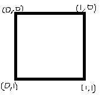

# Texture
텍스쳐다 모델링에 이미지를 입히는 것이다. 즉 질감을 입히는 것이다.

## UV
텍스처를 생성할 때 모델링의 각 꼭짓점에 대한 좌표를 UV라고 부른다.(U-X, V-Y) 



각 축에 대한 좌표이다. 이 좌표대로 매핑을 해야 생각 한 대로 매핑이 된다.


## TextureDemo.h
```
VertexTexture vertices[6];
ID3D11ShaderResourceView* srv;
```
갖고있던 Vertex변수를 VetexTexture변수로 바꾼다.
```
struct VertexTexture
{
	VertexTexture()
		: Position(0, 0, 0)
		, Uv(0, 0) {}

	Vector3	Position;
	Vector2	Uv;
};
```
이 변수에는 Position만이 아닌 Uv도 같이 갖고있다.

리소스를 불러올 수 있는 리소스 뷰어를 추가한다.

## TextureDemo.cpp
그리고 VertexTexture에 있는 UV도 세팅을 해준다.
```
vertices[0].Uv = Vector2(0, 1);
vertices[1].Uv = Vector2(0, 0);
vertices[2].Uv = Vector2(1, 1);
vertices[3].Uv = Vector2(1, 0);
```
UV좌표에 맞게 세팅을 해준다.

그리고 UV리소스를 불러와야 한다.
```
Check(D3DX11CreateShaderResourceViewFromFile
(
	D3D::GetDevice(), L"../../_Textures/Box.png", nullptr, nullptr, &srv, nullptr
));
```
생성할때 이 CreateShaderResourceViewFromFile을 사용해서 불러온다.

## Texture.fx
이젠 지금까지 사용한 Color를 사용할 필요가 없기 때문에 Color대신 Texture2D를 넣는다.

```
Texture2D Map;

struct VertexInput
{
	float4 Position : Position;
    float2 Uv : Uv;
};

struct VertexOutput
{
	float4 Position : SV_Position;
    float2 Uv : Uv;
};
```
이런식으로 Vertex에 UV를 추가해준다.

```
VertexOutput VS(VertexInput input)
{
	VertexOutput output;
    output.Position = mul(input.Position, World);
    output.Position = mul(output.Position, View);
    output.Position = mul(output.Position, Projection);
    
    output.Uv = input.Uv;
	
	return output;
}
```
그리고 VertexShader에 UV를 받아온다. 텍스처를 수정할 게 없기 때문에 수정은 안한다.

그리고 PixelShader부분에
```
float4 PS(VertexOutput input) : SV_Target
{
    return Map.Sample(sample, input.Uv);
}
```
반환값을 변경해준다.

이렇게 변경해주고 Texture를 넘겨주고 실행시키면, 


텍스쳐가 잘 입혀져 나온다.