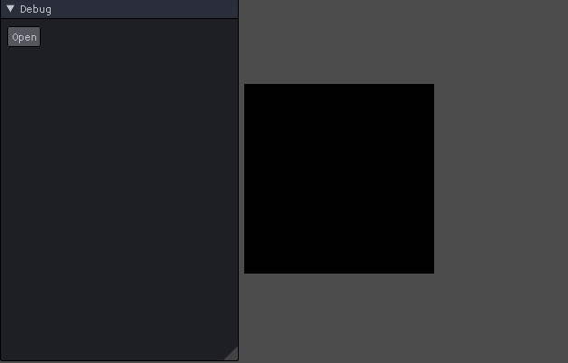

# Texture Load
이번에는 DirectX 기능이긴 하지만, 설명은 C++에 관한 설명이 더 많다.

## std::function
일단 function 에 관한 설명이다.

C언어 배울때 배우기만 했지 한번도 써본적은 없다.

모든 함수는 선언한 후 변수와 마친가지로 메모리에 공간이 할당되며, 그 위치를 표현하는 주소가 생겨난다.

이렇게 사용하면 CallBack을 사용할 수 있기 때문에 사용한다.

```
typedef bool(*Cmp)(int, int);
bool Up(int x, int y) { return (x > y ? true : false); }
bool Down(int x, int y) { return (x < y ? true : false); }

void simple_sort(int *arr, int n, Cmp cmp) 
{
    for (int i = 0; i < n - 1; i++)
	{
        for (int j = i + 1; j < 5; j++) 
		{
            if (cmp(arr[i], arr[j])) 
			{
                arr[i] ^= arr[j] ^= arr[i] ^= arr[j];
            }
        }
    }
```
이렇게 사용하면 좀더 유연하게 할 수 있다.

하지만, 가독성이 떨어지고 inline을 사용할 수 없다.

C++에서는 이렇게 선언을 대신할 std::function이라는 자료형이 있다.

```
void addAndPrint(int a, int b)
{
	int sum = a + b;
	std::cout << sum << "\n";
}

std::function<void(int, int)> func1 = addAndPrint;

// 아래 두 줄은 똑같이 작동한다
addAndPrint(10, 20);
func1(10, 20);
```
이렇게 사용한다.

## bind
저 function과 짝마냥 같이 붙어다니는 자료형이 있다

bind라고 각각 변수를 미리 집어넣어 클래스 내부에서 bind 시켜준다.

```
class A
{
    public:
    void addAndPrint(int a, int b)
    {
        int sum = a + b;
        std::cout << "sum: " << sum << "\n";
    }

    void bindFunction(std::function<void(int, int)>& dest)
    {
        dest = std::bind(&A::addAndPrint, this, std::placeholders::_1, std::placeholders::_2);
    }
};

A test;
std::function<void(int, int)> func4;
test.bindFunction(func4);
func4(100, 200);
```
이렇게 하면 func4와 bindFunction과 같은 동작을 한다.

이제 directX로 돌아가면

## TextureLoadDemo.cpp
```
void TextureLoadDemo::LoadTexture(wstring file)
{
	SafeDelete(texture);
	texture = new Texture(file);
}
```
이렇게 함수를 바꿔주면 매개변수에 따라 텍스쳐가 바뀐다.

그리고 Update에
```
void TextureLoadDemo::Update()
{
	if (ImGui::Button("Open") == true)
	{
		function<void(wstring)> f = bind(&TextureLoadDemo::LoadTexture, this, placeholders::_1);
		auto a = bind(&TextureLoadDemo::LoadTexture, this, placeholders::_1);
		function<void(wstring)> b = a;
		
		D3DDesc desc = D3D::GetDesc();
		Path::OpenFileDialog(L"", Path::ImageFilter, L"../../_Textures/", a, desc.Handle);
	}
}
```
이렇게 ImGui를 사용해서 버튼을 누를때마다 파일을 열어 함수에 파일 경로를 써 주게 된다.



이렇게 편리하게 바꿀 수 있게 된다.

조금만 수정하면 버튼을 누르면 텍스쳐가 바뀐다던가 실시간으로 바꿀 수 있게 할수 있다.