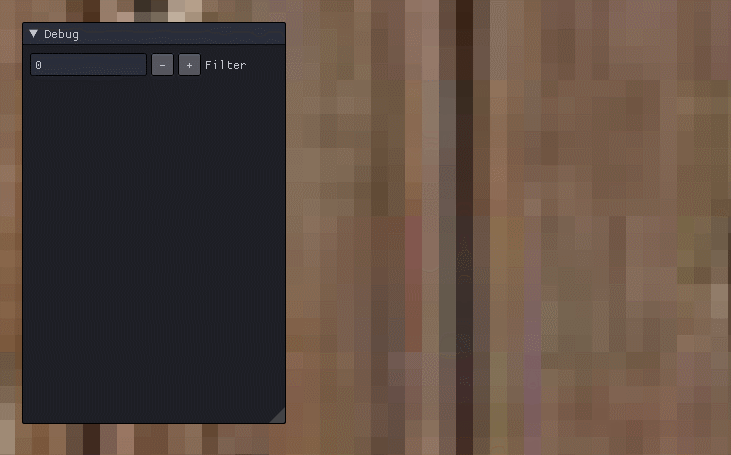

# Sampler State
Sample - 랜덤한 입력에 대해서 Regular한 출력을 하는 과정. 값이 많을수록 결과 표현이 더 정확해짐

그러니까 SaplerState에서는 유한한 픽셀 크기를 가질 수 밖에 없는 텍스처의 각 픽셀 사이를 어떻게 처리할 것인지 결정하는 State다...

그냥 소스를 보고 결과를 보는게 더 이해가 잘 될거 같다.

## TextureSamplerDemo.cpp
헤더 파일은 변한게 없다.

일단 필터 먼저 살펴보다
```
enum D3D11_FILTER
    {
        D3D11_FILTER_MIN_MAG_MIP_POINT	= 0,
        D3D11_FILTER_MIN_MAG_POINT_MIP_LINEAR	= 0x1,
        D3D11_FILTER_MIN_POINT_MAG_LINEAR_MIP_POINT	= 0x4,
        D3D11_FILTER_MIN_POINT_MAG_MIP_LINEAR	= 0x5,
        D3D11_FILTER_MIN_LINEAR_MAG_MIP_POINT	= 0x10,
        D3D11_FILTER_MIN_LINEAR_MAG_POINT_MIP_LINEAR	= 0x11,
        D3D11_FILTER_MIN_MAG_LINEAR_MIP_POINT	= 0x14,
        D3D11_FILTER_MIN_MAG_MIP_LINEAR	= 0x15,
        D3D11_FILTER_ANISOTROPIC	= 0x55,
        D3D11_FILTER_COMPARISON_MIN_MAG_MIP_POINT	= 0x80,
        D3D11_FILTER_COMPARISON_MIN_MAG_POINT_MIP_LINEAR	= 0x81,
        D3D11_FILTER_COMPARISON_MIN_POINT_MAG_LINEAR_MIP_POINT	= 0x84,
        D3D11_FILTER_COMPARISON_MIN_POINT_MAG_MIP_LINEAR	= 0x85,
        D3D11_FILTER_COMPARISON_MIN_LINEAR_MAG_MIP_POINT	= 0x90,
        D3D11_FILTER_COMPARISON_MIN_LINEAR_MAG_POINT_MIP_LINEAR	= 0x91,
        D3D11_FILTER_COMPARISON_MIN_MAG_LINEAR_MIP_POINT	= 0x94,
        D3D11_FILTER_COMPARISON_MIN_MAG_MIP_LINEAR	= 0x95,
        D3D11_FILTER_COMPARISON_ANISOTROPIC	= 0xd5,
        D3D11_FILTER_MINIMUM_MIN_MAG_MIP_POINT	= 0x100,
        D3D11_FILTER_MINIMUM_MIN_MAG_POINT_MIP_LINEAR	= 0x101,
        D3D11_FILTER_MINIMUM_MIN_POINT_MAG_LINEAR_MIP_POINT	= 0x104,
        D3D11_FILTER_MINIMUM_MIN_POINT_MAG_MIP_LINEAR	= 0x105,
        D3D11_FILTER_MINIMUM_MIN_LINEAR_MAG_MIP_POINT	= 0x110,
        D3D11_FILTER_MINIMUM_MIN_LINEAR_MAG_POINT_MIP_LINEAR	= 0x111,
        D3D11_FILTER_MINIMUM_MIN_MAG_LINEAR_MIP_POINT	= 0x114,
        D3D11_FILTER_MINIMUM_MIN_MAG_MIP_LINEAR	= 0x115,
        D3D11_FILTER_MINIMUM_ANISOTROPIC	= 0x155,
        D3D11_FILTER_MAXIMUM_MIN_MAG_MIP_POINT	= 0x180,
        D3D11_FILTER_MAXIMUM_MIN_MAG_POINT_MIP_LINEAR	= 0x181,
        D3D11_FILTER_MAXIMUM_MIN_POINT_MAG_LINEAR_MIP_POINT	= 0x184,
        D3D11_FILTER_MAXIMUM_MIN_POINT_MAG_MIP_LINEAR	= 0x185,
        D3D11_FILTER_MAXIMUM_MIN_LINEAR_MAG_MIP_POINT	= 0x190,
        D3D11_FILTER_MAXIMUM_MIN_LINEAR_MAG_POINT_MIP_LINEAR	= 0x191,
        D3D11_FILTER_MAXIMUM_MIN_MAG_LINEAR_MIP_POINT	= 0x194,
        D3D11_FILTER_MAXIMUM_MIN_MAG_MIP_LINEAR	= 0x195,
        D3D11_FILTER_MAXIMUM_ANISOTROPIC	= 0x1d5
    } 	D3D11_FILTER;
```
많다... 이걸 하나씩 설명하긴 힘들고 일단 Linear와 Point먼저 살펴보자

Point는 그냥 점을 찍듯이 각 uv를 펴주는것이고 Linear는 보간을 해준다.

이건 보면 금방 이해가 된다.

## TextureSample.fx
```
uint Filter;

SamplerState Sampler_Filter_Point
{
    Filter = MIN_MAG_MIP_POINT;
};

SamplerState Sampler_Filter_Linear
{
    Filter = MIN_MAG_MIP_LINEAR;
};

float4 PS_Filter(VertexOutput input) : SV_Target
{
    if (Filter == 0)
    {
        return Map.Sample(Sampler_Filter_Point, input.Uv);
    }

    if(Filter == 1)
    {
        return Map.Sample(Sampler_Filter_Linear, input.Uv);
    }
    
    return Map.Sample(sample, input.Uv);
}
```
이런식으로 필터를 받게 해주고, 
```
pass P1
{
    SetVertexShader(CompileShader(vs_5_0, VS()));
    SetPixelShader(CompileShader(ps_5_0, PS_Filter()));
}
```
1번에다가 설정을 해준다.

그리고 Update문에 
```
static UINT filter = 0;
ImGui::InputInt("Filter", (int*)(&filter));
filter %= 2;
shader->AsScalar("Filter")->SetInt(filter);
```
필터 부분을 실시간으로 바꿀 수 있게 만들어준다.



0번이 Point 1번이 Linear이다.

# Address
이번에는 어떻게 그려줄지이다.

```
enum D3D11_TEXTURE_ADDRESS_MODE
    {
        D3D11_TEXTURE_ADDRESS_WRAP	= 1,
        D3D11_TEXTURE_ADDRESS_MIRROR	= 2,
        D3D11_TEXTURE_ADDRESS_CLAMP	= 3,
        D3D11_TEXTURE_ADDRESS_BORDER	= 4,
        D3D11_TEXTURE_ADDRESS_MIRROR_ONCE	= 5
    } 	D3D11_TEXTURE_ADDRESS_MODE;
```
```
D3D11_TEXTURE_ADDRESS_MODE AddressU;
D3D11_TEXTURE_ADDRESS_MODE AddressV;
D3D11_TEXTURE_ADDRESS_MODE AddressW;
```
각 부분을 따로따로 설정 해줄 수 있다.

```
uint Address;

SamplerState Sampler_Address_Wrap
{
    AddressU = Wrap;
    AddressV = Wrap;
};

SamplerState Sampler_Address_Mirror
{
    AddressU = Mirror;
    AddressV = Mirror;
};

SamplerState Sampler_Address_Clamp
{
    AddressU = Clamp;
    AddressV = Clamp;
};

SamplerState Sampler_Address_Border
{
    AddressU = Border;
    AddressV = Border;

    BorderColor = float4(0, 0, 1, 1);
};

float4 PS_Address(VertexOutput input) : SV_Target
{
    if (Address == 0)
    {
        return Map.Sample(Sampler_Address_Wrap, input.Uv);
    }

    if (Address == 1)
    {
        return Map.Sample(Sampler_Address_Mirror, input.Uv);
    }
    
    if (Address == 2)
    {
        return Map.Sample(Sampler_Address_Clamp, input.Uv);
    }
    
    if (Address == 3)
    {
        return Map.Sample(Sampler_Address_Border, input.Uv);
    }
    
    return Map.Sample(sample, input.Uv);
}
```
각 UV를 설정 해준뒤,
```
    pass P2
    {
        SetVertexShader(CompileShader(vs_5_0, VS()));
        SetPixelShader(CompileShader(ps_5_0, PS_Address()));
    }
```
2번에 넣어줬다.
```
static UINT address = 0;
ImGui::InputInt("Address", (int*)&address);
address %= 4;
	
shader->AsScalar("Address")->SetInt(address);
```
이것도 마찬가지로 실시간으로 볼 수 있게 ImGui를 사용해서 만들었다
```
vertices[0].Uv = Vector2(0, 2);
vertices[1].Uv = Vector2(0, 0);
vertices[2].Uv = Vector2(2, 2);
vertices[3].Uv = Vector2(2, 0);
```
각 효과를 볼 수 있게 UV를 잘게 보여주게 만들었다.


Wrap->Mirror->Clamp->Boder 순이다.


Wrap 그냥 하나하나씩 넣는다.


Mirror 뒤집고 Wrap으로 만든다.


Clamp 쭉 늘린다.


Border 빈 곳을 원하는 색으로 칠한다.
