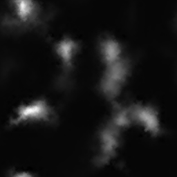

# HeightMap
지형에서 사용되는 높낮이를 표현하는 Map이다.

일반적으로



이런 텍스쳐를 갖고 작동하는데 처음엔 이게 뭔 높낮이 인가 싶다.

작동하는 방법은 하얀색으로 갈수록 높이 그려준다.


## Terrian.h
```
#pragma once

class Terrain
{
public:
	typedef Vertex TerrainVertex;

public:
	Terrain(Shader* shader, wstring heightFile);
	~Terrain();

	void Update();
	void Render();

	void Pass(UINT val) { pass = val; }

private:
	void CreateVertexData();
	void CreateIndexData();
	void CreateBuffer();

private:
	UINT pass = 1;
	Shader* shader;

	Texture* heightMap;

	UINT width;
	UINT height;

	UINT vertexCount;
	TerrainVertex* vertices;
	ID3D11Buffer* vertexBuffer;

	UINT indexCount;
	UINT* indices;
	ID3D11Buffer* indexBuffer;
};
```
지형을 만들 헤더다 Framework에 만들었다.

방법은 삼각형 2개로 사각형을 만들고, 그것들을 많이 만들어 넓게 만드는 것이다.

## Terrian.cpp
```
Terrain::Terrain(Shader * shader, wstring heightFile)
	: shader(shader)
{
	heightMap = new Texture(heightFile);

	CreateVertexData();
	CreateIndexData();
	CreateBuffer();
}
```
생성자에선 텍스쳐 파일을 받아오고 Vertex, Index, Buffer를 만들어준다.

```
void Terrain::CreateVertexData()
{
	vector<Color> heights;
	heightMap->ReadPixel(DXGI_FORMAT_R8G8B8A8_UNORM, &heights);

	width = heightMap->GetWidth();
	height = heightMap->GetHeight();

	vertexCount = width * height;
	vertices = new TerrainVertex[vertexCount];
	for (UINT z = 0; z < height; z++)
	{
		for (UINT x = 0; x < width; x++)
		{
			UINT index = width * z + x;

			vertices[index].Position.x = (float)x;
			vertices[index].Position.y = heights[index].r * 255.0f / 10.0f;
			vertices[index].Position.z = (float)z;
		}
	}
}
```
텍스쳐의 가로 세로를 받아오고 그 넓이만큼 VertexCount를 세팅해준다.

그리고 Vertex를 VectexCount만큼 만들어준다.

그리고 그 만큼 만들어 준다. 높이는 현재 rgb중 r만큼 높게 만들어 준다.

```
void Terrain::CreateIndexData()
{
	indexCount = (width - 1) * (height - 1) * 6;
	indices = new UINT[indexCount];

	UINT index = 0;
	for (UINT y = 0; y < height - 1; y++)
	{
		for (UINT x = 0; x < width - 1; x++)
		{
			indices[index + 0] = width * y + x;
			indices[index + 1] = width * (y + 1) + x;
			indices[index + 2] = width * y + (x + 1);
			indices[index + 3] = width * y + (x + 1);
			indices[index + 4] = width *  (y + 1) + x;
			indices[index + 5] = width * (y + 1) + (x + 1);

			index += 6;
		}
	}
}
```
Index도 사각형 찍듯이 만들어 준다.

쉐이더 경우에는 일반적으로 면을 생성하는 쉐이더에 PixelShader부분의 색을 원하는 색(지금은 흰색)으로 반환해준다.

## HeightMapDemp.cpp
```
#include "stdafx.h"
#include "HeightMapDemo.h"

void HeightMapDemo::Initialize()
{	
	Context::Get()->GetCamera()->RotationDegree(12, 0, 0);
	Context::Get()->GetCamera()->Position(35, 10, -55);

	shader = new Shader(L"19_Terrain.fx");

	terrain = new Terrain(shader, L"Terrain/Gray256.png");
	terrain->Pass(1);
}

void HeightMapDemo::Destroy()
{
	SafeDelete(shader);
	SafeDelete(terrain);
}

void HeightMapDemo::Update()
{
	terrain->Update();
}

void HeightMapDemo::Render()
{
	terrain->Render();
}
```
그리고 실행을 해주면


Map


Texture

잘 보면 하얀색부분이 높게 솟아있다. 그런데 뭔가 이상하다 위 아래가 반대다.

왜냐하면 UV좌표계와 지금 DirectX의 좌표계가 다르기 때문이다.

그래서

```
UINT pixel = width * (height - 1 - z) + x;

vertices[index].Position.x = (float)x;
vertices[index].Position.y = heights[pixel].r * 255.0f / 10.0f;
vertices[index].Position.z = (float)z;
```
Vertex를 찍는 부분을 이렇게 바꾸면


잘 나온다.

하지만, wireframe을 색으로만 바꾸면,


와... 그냥 하얀색이다. 왜냐하면 아직 그림자가 없기 때문이다.

이걸 조금만 활용하면, height의 rgb값을 활용해서 높낮이나 다른 텍스쳐를 편하게 활용할 수 있을것 같다. 예를들어 빨간부분은 높이를 낮게 하고, 초록 부분은 물 텍스쳐를 입히고 파랑 부분은 검은색으로 없애던가 할 수 있을 것 같다.