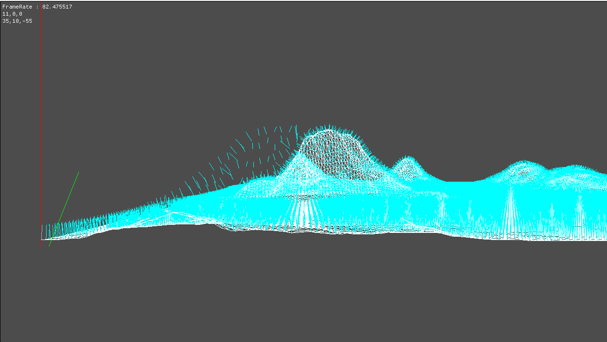

# Debug Log
디버깅을 위해 선을 출력하는 클래스이다. 그것 외엔 딱히 기능은 없지만, 있으면 정말 편한 기능이다.

## Terrain.cpp
```
void Terrain::CreateNormalData()
{
	for (UINT i = 0; i < indexCount / 3; i++)
	{
		UINT index0 = indices[i * 3 + 0];
		UINT index1 = indices[i * 3 + 1];
		UINT index2 = indices[i * 3 + 2];

		TerrainVertex v0 = vertices[index0];
		TerrainVertex v1 = vertices[index1];
		TerrainVertex v2 = vertices[index2];

		Vector3 a = v1.Position - v0.Position;
		Vector3 b = v2.Position - v0.Position;

		Vector3 normal;
		D3DXVec3Cross(&normal, &a, &b);

		vertices[index0].Normal += normal;
		vertices[index1].Normal += normal;
		vertices[index2].Normal += normal;
	}

	for (UINT i = 0; i < vertexCount; i++)
	{
		D3DXVec3Normalize(&vertices[i].Normal, &vertices[i].Normal);
	}
}
```
각 정점의 외적 정규 벡터를 구하는 함수다.

정점마다 외적을 계산하고 평균을 내면 되지만, 그렇게 하면 각 정점마다 몇개의 값이 더해져 몇으로 나눠야 하는지 정확하게 알려면 다른 변수를 넣어 메모리를 더 써야 하지만, 외적을 정규화 시키면 평균과 유사한 값이 나오기 때문에 각 정규화를 더했다.

각 IndexBuffer에 있는 정점으로 구해준다.

## DebugLog.h
```
#pragma once
#define MAX_DEBUG_LINE 150000

class DebugLine
{
public:
	friend class Window;
	static DebugLine* Get();

private:
	static void Create();
	static void Delete();

public:
	void RenderLine(const Vector3& start, const Vector3& end);
	void RenderLine(const Vector3& start, const Vector3& end, float r, float g, float b);
	void RenderLine(const Vector3& start, const Vector3& end, const Color& color);

	void RenderLine(float x, float y, float z, float x2, float y2, float z2);
	void RenderLine(float x, float y, float z, float x2, float y2, float z2, float r, float g, float b);
	void RenderLine(float x, float y, float z, float x2, float y2, float z2, const Color& color);

private:
	void Update();
	void Render();

private:
	DebugLine();
	~DebugLine();

private:
	static DebugLine* instance;

private:
	Shader* shader;
	Matrix world;

	ID3D11Buffer* vertexBuffer;
	VertexColor* vertices;

	UINT drawCount = 0;
};
``` 
싱글톤 클래스로 만들었으며, 자세한건 cpp에서 설명

## DebugLog.cpp
```
void DebugLine::Update()
{

	Matrix world;
	D3DXMatrixIdentity(&world);

	shader->AsMatrix("World")->SetMatrix(world);
	shader->AsMatrix("View")->SetMatrix(Context::Get()->View());
	shader->AsMatrix("Projection")->SetMatrix(Context::Get()->Projection());
}

void DebugLine::Render()
{
	if (drawCount < 1)
	{
		return;
	}

	D3D::GetDC()->UpdateSubresource(vertexBuffer, 0, nullptr, vertices, sizeof(VertexColor) * drawCount, 0);

	UINT stride = sizeof(VertexColor);
	UINT offset = 0;

	D3D::GetDC()->IASetPrimitiveTopology(D3D11_PRIMITIVE_TOPOLOGY_LINELIST);
	D3D::GetDC()->IASetVertexBuffers(0, 1, &vertexBuffer, &stride, &offset);

	shader->Draw(0, 0, drawCount);

	drawCount = 0;
	ZeroMemory(vertices, sizeof(VertexColor) * MAX_DEBUG_LINE);
}
```
업데이트와 렌더링 부분이다.

각 선들은 VertexColor로 되어있기 때문에 모든 사이즌s VertexColor로 크기를 만들어준다.

```
void DebugLine::RenderLine(const Vector3 & start, const Vector3 & end, const Color & color)
{
	// 짝 start
	vertices[drawCount].Color = color;
	vertices[drawCount++].Position = start;

	// 홀 end
	vertices[drawCount].Color = color;
	vertices[drawCount++].Position = end;
}
```
start 에서 end까지 라인을 그어준다.

```
DebugLine::DebugLine()
{
	shader = new Shader(L"20_DebugLine.fx");
	
	vertices = new VertexColor[MAX_DEBUG_LINE];
	ZeroMemory(vertices, sizeof(VertexColor) * MAX_DEBUG_LINE);

	// Create Vertex Buffer
	{
		D3D11_BUFFER_DESC desc;
		ZeroMemory(&desc, sizeof(D3D11_BUFFER_DESC));
		desc.ByteWidth = sizeof(VertexColor) * MAX_DEBUG_LINE;
		desc.BindFlags = D3D11_BIND_VERTEX_BUFFER;

		// GPU 복사 부분
		D3D11_SUBRESOURCE_DATA subResource = { 0 };
		subResource.pSysMem = vertices;

		Check(D3D::GetDevice()->CreateBuffer(&desc, &subResource, &vertexBuffer));
	}

	D3DXMatrixIdentity(&world);
}
```
생성자이다. 

최대 Vertex만큼 크기를 정해준다.

이 상태로 Window 부분에 Render()와 Update() 에 넣어준다.

그리고 이 상태로 싱글톤을 사용해서 그어주면

```
DebugLine::Get()->RenderLine(0, 0, 0, 0, 100, 0, Color(1,0,0,1));
DebugLine::Get()->RenderLine(1, 0, 0, 5, 10, 0, Color(0,1,0,1));
```


// 그림

그러면 VertexCount만큼 그어주면
```
for(UINT i = 0; i < vertexCount; i++)
{
	Vector3 start = vertices[i].Position;
	Vector3 end = vertices[i].Position + vertices[i].Normal * 2;

	DebugLine::Get()->RenderLine(start, end, Color(0, 1, 1, 1));
}
```



굉장히 많은 Vertex와 Line을 렌더링 하기 때문에 프레임이 저하되는것을 볼 수 있다.(모발이 굉장히 많다... 부럽다...)

