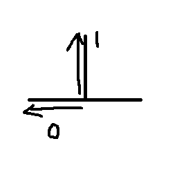
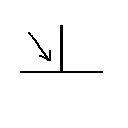
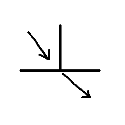
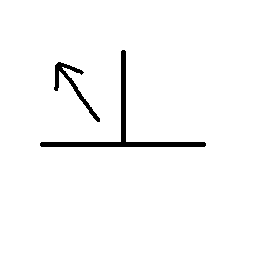

# 음영계산
빛이 들어온 방향에 따라 어둡게 표현할지, 아니면 밝게 표현할지 정한다.

들어오는 방향으로 부터 외적을 계산해서 음영의 세기를 계산한다.


왼쪽으로 뻗은 선이 90도일때 구하는 공식이다.



그렇게 되면 90도 일때는 0이 나오고 0도 일때는 1이 나온다.

또한, 



이런 방향으로 들어올때, 반사되는 각이기 때문에 반대쪽으로 계산을 해야 한다. 만약 반대쪽으로 계산을 안 했을 경우



이런식으로 방향이 계속 되기 때문에 원하는 값을 구하기 힘들다.



그래서 이 방향으로 구해야 한다.

## Terrain.fx
각 Vertex Input, Output에 Normal 값을 넣고
```
VertexOutput VS(VertexInput input)
{
	VertexOutput output;
    output.Position = mul(input.Position, World);
    output.Position = mul(output.Position, View);
    output.Position = mul(output.Position, Projection);
    
    output.Normal = mul(input.Normal, (float3x3)World);
	
	return output;
}
```
Normal을 현재의 World와 곱해준다. 월드의 위치 및 회전에 따라서 Normal도 움직여야 하기 때문이다.

```
float4 PS(VertexOutput input) : SV_Target
{    
    float3 normal = normalize(input.Normal);
    float3 light = -Direction;
    
    return float4(1, 1, 1, 1) * dot(light, normal);
}
```
PixelShader부분에서 현재 들어온 방향의 반대로 light방향을 설정하고, 현재의 빛과 각 정점의 Normal에 따른 값을 반환해준다.

이렇게 쉐이더를 짜고 Terrain에 방향을 정해주면


빛의 방향에 따라 음영이 잘 나타난다.


어떤 방향으로 음영이 나오는지 Line을 그어보자


대충 빛의 방향을 그어봤는데 방향과 완전 방대일 경우에는 하얗게 잘 나오지만, 그렇지 않은 경우에는 조금 어둡게 나왔다.
