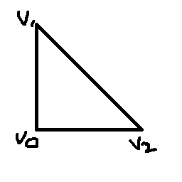
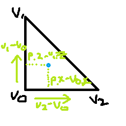
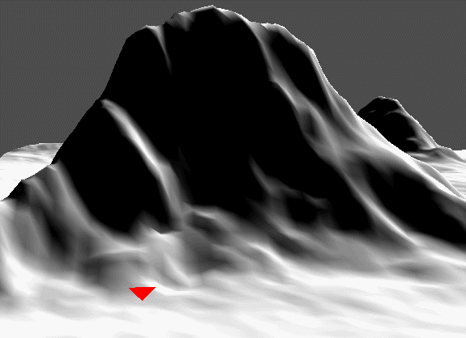

x1 - v0.x 

높이
v0 + (v2-v0) * (x - v0.x) + (v1 - v0) * (z - v0.z); 

# Height
지금까진 울퉁불퉁한 지형을 만들었다. 하지만, 아직까지 높이를 모르기 때문에 움직일때 지형대로 움직일 수는 없다.

그럼 이제 구해보자




여기 삼각형이 있다. 여기서 p(파란점)의 높이를 구해보자

일단 p의 벡터값을 구하려면, v0 에서 v2 까지의 벡터와 v0에서 v1까지의 벡터값에 v0에서 p까지의 거리를 구한다.




그 상태로 둘이 더한뒤 v0만큼 움직이면, p의 위치 벡터값이 나온다.

그럼 이제 소스로 가보자

## Terrain.cpp
```
float Terrain::GetHeight(const Vector3 & position)
{
	UINT x = (UINT)position.x;
	UINT z = (UINT)position.z;

	if (x < 0 || x > width) { return FLT_MIN; }
	if (z < 0 || z > height) { return FLT_MIN; }

	UINT index[4];
	index[0] = width * z + x;
	index[1] = width * (z + 1) + x;
	index[2] = width * z + x + 1;
	index[3] = width * (z + 1) + x + 1;

	Vector3 v[4];
	for (int i = 0; i < 4; i++)
	{
		v[i] = vertices[index[i]].Position;
	}

	float ddx = (position.x - v[0].x) / 1.0f;
	float ddz = (position.z - v[0].z) / 1.0f;

	Vector3 result;
	
	if (ddx + ddz <= 1.0f)
	{
		result = v[0] + (v[2] - v[0]) * ddx + (v[1] - v[0]) * ddz;
	}
	else
	{
		ddx = 1.0f - ddx;
		ddz = 1.0f - ddz;

		result = v[3] + (v[1] - v[3]) * ddx + (v[2] - v[3]) * ddz;
	}
	return result.y;
}
```

위에서 인덱스에 따른 Vertex의 값을 갖고오고 위에서 말한 값을 넣어준다.

하지만, 마지막에 좀 다른 값이 있는데 이유는 삼각형 2개가 붙어 사각형이 만들어 지는데 위에 값은 맡에 삼각형만 값을 갖고오는것이다. 그래서 위에 삼각형도 갖고오기 위해 다른 정점 기준으로 계산한다.

이 상태로
## GetHeightDemo.cpp
```
void GetHeightDemo::Update()
{
	terrain->Update();

	if (Keyboard::Get()->Press(VK_RIGHT))
	{
		position.x += 20.0f * Time::Delta();
	}

	else if (Keyboard::Get()->Press(VK_LEFT))
	{
		position.x -= 20.0f * Time::Delta();
	}

	if (Keyboard::Get()->Press(VK_UP))
	{
		position.z += 20.0f * Time::Delta();
	}

	else if (Keyboard::Get()->Press(VK_DOWN))
	{
		position.z -= 20.0f * Time::Delta();
	}

	position.y = terrain->GetHeight(position) + 1.0f;


	Matrix R, T;
	D3DXMatrixRotationX(&R, Math::ToRadian(180));
	D3DXMatrixTranslation(&T, position.x, position.y, position.z);

	Matrix world = R * T;

	triShader->AsMatrix("World")->SetMatrix(world);
	triShader->AsMatrix("View")->SetMatrix(Context::Get()->View());
	triShader->AsMatrix("Projection")->SetMatrix(Context::Get()->Projection());
}
```
삼각형을 만들어 움직이게 한다.

대신 높이는 위에 식으로 갖고온다.

이렇게 하면



높이에 맞게 잘 움직인다.

하지만 이 방법은 각 삼각형이 같은 크기를 갖고있을 때 할 수 있는 방법이다.