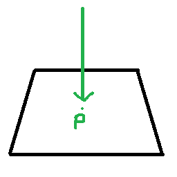
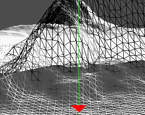

x1 - v0.x 

높이
v0 + (v2-v0) * (x - v0.x) + (v1 - v0) * (z - v0.z); 

# Height
전에는 현재 위치에서 다른 정점들을 사용해서 높이를 구했다. 하지만, 삼각형의 크기가 다르다면 높이를 구하기 힘들어진다.

이러한 단점을 해결하는 방법은 Raycast를 사용하면 된다. 하지만 성능은 전에 말한 방법보다는 더 많은 계산량이 있기 때문에 떨어진다.

## IntersectTri
```
BOOL WINAPI D3DXIntersectTri 
(
    CONST D3DXVECTOR3 *p0,           // Triangle vertex 0 position
    CONST D3DXVECTOR3 *p1,           // Triangle vertex 1 position
    CONST D3DXVECTOR3 *p2,           // Triangle vertex 2 position
    CONST D3DXVECTOR3 *pRayPos,      // Ray origin
    CONST D3DXVECTOR3 *pRayDir,      // Ray direction
    FLOAT *pU,                         // Barycentric Hit Coordinates
    FLOAT *pV,                         // Barycentric Hit Coordinates
    FLOAT *pDist);                     // Ray-Intersection Parameter Distance
```
이 함수를 사용하는데 어떤 방식이냐면



이렇게 위에서 레이저 비슷한걸 쏴 현재 세개의 정점 안에 있는지 아닌지 검사한뒤, uv,distance값을 갖고온다.

## Terrain.cpp
```
float Terrain::GetVerticalRaycast(const Vector3 & position)
{
	UINT x = (UINT)position.x;
	UINT z = (UINT)position.z;

	if (x < 0 || x > width) { return FLT_MIN; }
	if (z < 0 || z > height) { return FLT_MIN; }

	UINT index[4];
	index[0] = width * z + x;
	index[1] = width * (z + 1) + x;
	index[2] = width * z + x + 1;
	index[3] = width * (z + 1) + x + 1;

	Vector3 p[4];
	for (int i = 0; i < 4; i++)
	{
		p[i] = vertices[index[i]].Position;
	}

	Vector3 start(position.x, 50.0f, position.z);
	Vector3 direction(0, -1, 0);

	float u, v, distance;
	Vector3 result(01, FLT_MIN, -1);

	if ((D3DXIntersectTri(&p[0], &p[1], &p[2], &start, &direction, &u, &v, &distance)) == TRUE)
	{
		result = p[0] + (p[1] - p[0]) * u + (p[2] - p[0]) *v;
	}

	if ((D3DXIntersectTri(&p[3], &p[1], &p[2], &start, &direction, &u, &v, &distance)) == TRUE)
	{
		result = p[3] + (p[1] - p[3]) * u + (p[2] - p[3]) *v;
	}

	return result.y;
}
```
전에 말한 방식과 식은 똑같다 하지만, 레이를 쏴서 갖고왔을 경우만 값을 계산해준다.

u,v는 x,y축과 대응되기 때문에 이렇게 구할 수 있다.



위에서 레이가 어떻게 쏘는지까지 그려줬다. 확실히 결과는 같기 때문에 전이랑 큰 차이 없이 결과가 잘 나온다.