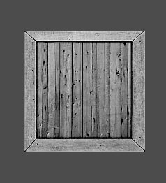

# MeshVertex
```
VertexTextureNormal(float x, float y, float z, float u, float v, float nx, float ny, float nz)
{
	Position = Vector3(x, y, z);
	Uv = Vector2(u, v);
	Normal = Vector3(nx, ny, nz);
}
```
이러한 구조체이다.

# Quad
게임 엔진에서 지형으로 많이 사용하는 물체이다. 한쪽에서만 보이는 물체이다.

## MeshQuad.h
```
#pragma once

class MeshQuad : public Mesh
{
public:
	MeshQuad(Shader* shader);
	~MeshQuad();

private:
	void Create() override;
};
```
간단하다 일단 만드는 부분만 있다.

## MeshQuad.cpp
```
#include "Framework.h"
#include "MeshQuad.h"

MeshQuad::MeshQuad(Shader * shader)
	: Mesh(shader)
{
}

MeshQuad::~MeshQuad()
{

}

void MeshQuad::Create()
{
	float w = 0.5f;
	float h = 0.5f;

	vector<MeshVertex> v(4);
	v[0] = MeshVertex(-w, -h, 0, 0, 1, 0, 0, -1);
	v[1] = MeshVertex(-w, +h, 0, 0, 0, 0, 0, -1);
	v[2] = MeshVertex(+w, -h, 0, 1, 1, 0, 0, -1);
	v[3] = MeshVertex(+w, +h, 0, 1, 0, 0, 0, -1);
	
	vertices = new MeshVertex[v.size()];
	vertexCount = v.size();

	copy(v.begin(), v.end(), stdext::checked_array_iterator<MeshVertex *>(vertices, vertexCount));

	indexCount = 6;
	indices = new UINT[indexCount]{ 0, 1, 2, 2, 1, 3 };
}
```
그냥 간단하다 한쪽 면만 그려주면 된다.



뒷면은 안보인다. 안보여서 찍어봤자 의미 없어서 사진은 없다.

# Cube
큐브이다. 만드는 방법을 생각하면 각 위치에서 보이는 Quad를 6개 만든것이다.

## Cube.h
```
#pragma once

class MeshCube : public Mesh
{
public:
	MeshCube(Shader* shader);
	~MeshCube();

private:
	void Create() override;
};
```
비슷하다.

## Cube.cpp
```
void MeshCube::Create()
{
	float w = 0.5f;
	float h = 0.5f;
	float d = 0.5f;
	vector<MeshVertex> v(24);

	// front
	v[0] = MeshVertex(-w, -h, -d, 0, 1, 0, 0, -1);
	v[1] = MeshVertex(-w, +h, -d, 0, 0, 0, 0, -1);
	v[2] = MeshVertex(+w, +h, -d, 1, 0, 0, 0, -1);
	v[3] = MeshVertex(+w, -h, -d, 1, 1, 0, 0, -1);

	// back
	v[4] = MeshVertex(-w, -h, +d, 1, 1, 0, 0, 1);
	v[5] = MeshVertex(+w, -h, +d, 0, 1, 0, 0, 1);
	v[6] = MeshVertex(+w, +h, +d, 0, 0, 0, 0, 1);
	v[7] = MeshVertex(-w, +h, +d, 1, 0, 0, 0, 1);

	//top
	v[8] = MeshVertex(-w, +h, -d, 0, 1, 0, 1, 0);
	v[9] = MeshVertex(-w, +h, +d, 0, 0, 0, 1, 0);
	v[10] = MeshVertex(+w, +h, +d, 1, 0, 0, 1, 0);
	v[11] = MeshVertex(+w, +h, -d, 1, 1, 0, 1, 0);

	// bottom
	v[12] = MeshVertex(-w, -h, -d, 1, 1, 0, -1, 0);
	v[13] = MeshVertex(+w, -h, -d, 0, 1, 0, -1, 0);
	v[14] = MeshVertex(+w, -h, +d, 0, 0, 0, -1, 0);
	v[15] = MeshVertex(-w, -h, +d, 1, 0, 0, -1, 0);

	// left
	v[16] = MeshVertex(-w, -h, +d, 0, 1, -1, 0, 0);
	v[17] = MeshVertex(-w, +h, +d, 0, 0, -1, 0, 0);
	v[18] = MeshVertex(-w, +h, -d, 1, 0, -1, 0, 0);
	v[19] = MeshVertex(-w, -h, -d, 1, 1, -1, 0, 0);

	// right
	v[20] = MeshVertex(+w, -h, -d, 0, 1, 1, 0, 0);
	v[21] = MeshVertex(+w, +h, -d, 0, 0, 1, 0, 0);
	v[22] = MeshVertex(+w, +h, +d, 1, 0, 1, 0, 0);
	v[23] = MeshVertex(+w, -h, +d, 1, 1, 1, 0, 0);

	vertices = new MeshVertex[v.size()];
	vertexCount = v.size();

	copy(v.begin(), v.end(), stdext::checked_array_iterator<MeshVertex *>(vertices, vertexCount));

	indexCount = 36;
	indices = new UINT[indexCount]
	{
		0, 1, 2, 0, 2, 3,
		4, 5, 6, 4, 6, 7,
		8, 9, 10, 8, 10, 11,
		12, 13, 14, 12, 14, 15,
		16, 17, 18, 16, 18, 19,
		20, 21, 22, 20, 22, 23
	};
}
```
다른부분은 특별히 다른점이 없기 때문에 Create부분만 설명한다.

천천히 살펴보자

* 앞면
	* Quad했던것처럼 두르기 순서로 그리면 된다. 어차피 뒷에서는 뒷면에 가려서 안보일거니까
	* UV도 왼쪽 위를 생각하면서 뒤집어 주면 된다.
	* Normal 앞면이니까 앞으로 향하게 한다.
* 뒷면
	* Y축으로 뒤집에서 그려주자 그러면 왼아, 오아, 오위, 왼위 로 그려진다. 이때 뒤집어서 본다 하면 그려지는 순서는 오아, 오위, 왼위, 왼아 순으로 그려진다.
	* UV도 위에처럼 Y축으로 뒤집어주자
	* Normal 뒷면이니까 뒤로 향하게 해주자
* 윗면
	* z축을 생각해야 한다. 왼쪽 뒤, 왼앞, 오앞, 왼앞 으로 그려준다. 이렇게 그려주고 위를 보면 앞면이랑 같은 순서로 그려준다.
	* UV는 그려주는 순서대로 앞면과 똑같이 해준다.
	* Normal은 위로 향하니까 y축으로 향해주자
* 뒷면
	* 왼쪽 앞, 오앞, 오뒤, 왼뒤 이 방향으로 그려준다. 그리고 밑을 보면 앞면과 같은 순서로 그려준다.
	* UV도 뒷면과 똑같이 해준다.
	* Normal은 밑을 향하니까 y축 반대로 해주자
* 왼쪽면
	* 아뒤, 위뒤, 위앞, 아앞 이 순으로 그려준다.
	* UV도 이거에 맞춰 펴주자
	* Normal은 왼쪽을 향하니까 x축 반대로 해주자
* 오른쪽면
	* 아앞, 위앞, 위뒤, 아뒤 이 순서로 그려준다.
	* UV도 맞춰 펴주자
	* Normal은 오른쪽을 향하니까 x축으로 해주자

IndexBuffer는 각 면이 같으니까 한쪽면의 4만큼 더해서 해주자.

이렇게 하면,


큐브가 잘 나온다.
