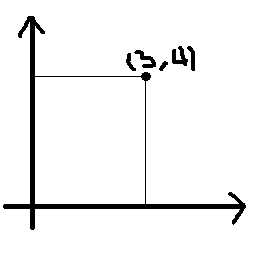
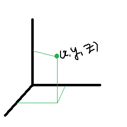
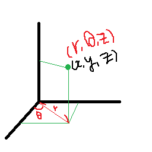

# Sphere
이번엔 구다. 지금까지는 일반적인 xyz 좌표로 점을 찍었지만, 구는 구면 좌표계를 통해 찍어야 한다.

일단 극좌표 부터 이해를 하자.

## 극좌표



이 좌표에서 극좌표는


이렇게 각도와 길이가 주어졌을 때 (5,θ) 로 표현이 가능하다.

그런데 어떻게 저 좌표로 구현이 가능할까?

cosθ = 3/5 이기 때문에 θ = cos^-1(3/5) 이렇게 치환이 가능하다.

따라서 (5,cos^-1(3/5))로 구할 수 있다.

거리가 5인 점들은 많지만, x축을 기준으로 했을때 각도가 θ인 좌표는 저기 뿐이기 때문이다.

## 원주좌표
설명은 Directx의 Y좌표가 Z 좌표로 하고 설명한다.



이 좌표가 흔하게 사용하는 좌표다



이렇게 위에서 배운 극좌표를 이용하면 이런 식으로 좌표를 구할 수 있다.

이렇게 하면 각 점들을 일반 좌표보다 빠른 속도로 구할 수 있다.

## 구면좌표


여기서 중요한 점이 있는데 θ는 상관 없지만, Φ의 경우에는 z축의 양의 방향으로부터의 각도

그러니까 항상 0 <= Φ <= π 이 범위를 갖는다.

z축의 좌표는 e * cos(Φ)

x축의 좌표는 e * sin(Φ) cosθ 가 된다.

y축의 좌표는 r * sin(θ) 이기 때문에 r 은 e * sin(Φ) 그러니
 e * sin(Φ)* sin(θ)가 된다.

e은 직교 좌표계에서 √(x^2 * y^2 * z^2) = e 이기 때문에 e^2 = x^2 * y^2 * z^2 이 된다.

구를 그릴땐 마지막에 구면좌표를 이용해서 그린다.

## MeshSphere.cpp
```
void MeshSphere::Create()
{
	vector<MeshVertex> v;
	v.push_back(MeshVertex(0, radius, 0, 0, 0,0, 1, 0));

	float phiStep = Math::PI / stackCount;
	float thetaStep = Math::PI  * 2.0f / sliceCount;

	for (UINT i = 1; i <= stackCount - 1; i++)
	{
		float phi = i * phiStep;

		for (UINT k = 0; k <= sliceCount; k++)
		{
			float theta = k * thetaStep;

			Vector3 p = Vector3
			(
				(radius * sinf(phi) * cosf(theta)),
				(radius * cosf(phi)),
				(radius * sinf(phi) * sinf(theta))
			);

			Vector3 n;
			D3DXVec3Normalize(&n, &p);

			Vector2 uv = Vector2(theta / (Math::PI * 2), phi / Math::PI);

			v.push_back(MeshVertex(p.x, p.y, p.z, uv.x, uv.y, n.x, n.y, n.z));
		}
	}
	v.push_back(MeshVertex(0, -radius, 0, 0, 0, 0, -1, 0));

	vertices = new MeshVertex[v.size()];
	vertexCount = v.size();

	copy(v.begin(), v.end(), stdext::checked_array_iterator<MeshVertex *>(vertices, vertexCount));

	vector<UINT> i;
	for (UINT k = 1; k <= sliceCount; k++)
	{
		i.push_back(0);
		i.push_back(k + 1);
		i.push_back(k);
	}

	UINT baseIndex = 1;
	UINT ringVertexCount = sliceCount + 1;
	for (UINT k = 0; k < stackCount - 2; k++)
	{
		for (UINT j = 0; j < sliceCount; j++)
		{
			i.push_back(baseIndex + k * ringVertexCount + j);
			i.push_back(baseIndex + k * ringVertexCount + j + 1);
			i.push_back(baseIndex + (k + 1) * ringVertexCount + j);

			i.push_back(baseIndex + (k + 1) * ringVertexCount + j);
			i.push_back(baseIndex + k * ringVertexCount + j + 1);
			i.push_back(baseIndex + (k + 1) * ringVertexCount + j + 1);
		}
	}

	UINT southPoleIndex = v.size() - 1;
	baseIndex = southPoleIndex - ringVertexCount;

	for (UINT k = 0; k < sliceCount; k++)
	{
		i.push_back(southPoleIndex);
		i.push_back(baseIndex + k);
		i.push_back(baseIndex + k + 1);
	}

	indices = new UINT[i.size()];
	indexCount = i.size();

	copy(i.begin(), i.end(), stdext::checked_array_iterator<UINT *>(indices, indexCount));
}
```

굉장히 많다.... 
하나하나 차근차근 보자

맨 위와 아랫점은 반복문이 아니고 따로 설정하고,

한번에 스텝마다 각 축들을 원으로 그리면서 하나하나 찍는다. 한 줄을 다 찍었다면 다음엔 한칸 내려서 또 그린다.

이런 방법으로 쭉 정점을 찍고

IndexBuffer의 경우에는 사각형 찍는 방향과 동일한 방향으로 찍어준다.

이렇게 하면


이렇게 원으로 잘 나온다.

이걸 wireframe으로 보면


이렇게 수많은 삼각형으로 이뤄졌다.