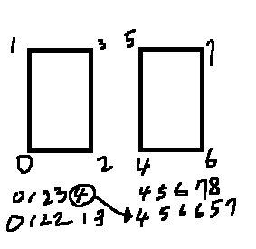

# Model
모델 확장자는 정말 많은 종류가 있다.

하지만 어느 형식이건 Assimp 라이브러리를 사용해서 Assimp형식으로 변환할 수 있다.

하지만, Assimp는 여러가지 데이터들이 있기 때문에 원하는 데이터만 불러서 사용한다. 

## Scene
Assimp로 불러오게 되면 Scene 객체를 반환한다.

* Scene 
	- Materials(색상과 텍스처) 배열
	- Mesh(실제 렌더링 될 데이터) 배열
	- SceneRoot(부모, 자식 관계로 된 트렌스폼)
		- 각 객체
		 	- Transformation
			- Material(참조할 배열의 번호)
			- Mesh(참조할 배열의 번호)

이 객체를 갖고 읽어 올건데 문제가 있다. 이 scene 정보를 킬때마다 읽으면 로딩하는데 시간 걸리지, 키는데 시간걸리지, 필요없는 값이 너무 많지 등등 여러가지 문제가 있다. 그래서 이 읽은 데이터를 저장할거다.

저장하는데 string형으로 text파일로 저장할 수도 있는데 text는 시간이 많이 걸린다. 많이 느리다. 그래서 byte로 저장을 한다.

## Types.h
일단 본과 메쉬 이 둘의 구조체를 만들어서 관리한다.

```
#pragma once
#include "stdafx.h"

struct asBone
{
	int Index;
	string Name;

	int Parent;
	Matrix Transform;
};

struct asMesh
{
	string Name;
	int BoneIndex;

	aiMesh* Mesh;

	string MaterialName;

	vector<Model::ModelVertex> Vertices;
	vector<UINT> Indices;
};
```
본에는 참조할 배열의 인덱스와 Transform 부모, 이름이 있고, 메쉬에는 참조할 배열의 인덱스와 메쉬데이터 그리고 vertex, index 메테리얼이 있다.

## Converter.h
```
#pragma once

class Converter
{
public:
	Converter();
	~Converter();

	void ReadFile(wstring file);

public:
	void ExportMesh(wstring savePath);

private:
	void ReadBoneData(aiNode* node, int intdex, int parent);
	void ReadMeshData(aiNode* node, int bone);
	void WriteMeshData(wstring savePath);

private:
	wstring file;

	Assimp::Importer* importer;
	const aiScene* scene;

	vector<struct asBone *> bones;
	vector<struct asMesh *> meshes;
};
```
Assimp를 사용해서 읽고 쓴다.

## Converter.cpp
```
void Converter::ReadFile(wstring file)
{
	this->file = L"../../_Assets/" + file;

	scene = importer->ReadFile
	(
		String::ToString(this->file),
		aiProcess_ConvertToLeftHanded
		| aiProcess_Triangulate
		| aiProcess_GenUVCoords
		| aiProcess_GenNormals
		| aiProcess_CalcTangentSpace
	);
	assert(scene != NULL);
}
```
파일을 읽어오는 함수이다.

일단 값을 string으로 불러오고 모델링을 하는 프로그램들은 오른손 좌표계를 사용하기 때문에 왼손 좌표계로 변형시켜준다.

그리고 면들을 삼각형으로 불러오고

UV좌표까지 변환하고 Normal좌표도 변경하고 애니메이션을 위해 TeangentSpace까지 불러온다.

```
void Converter::ExportMesh(wstring savePath)
{
	savePath = L"../../_Models/" + savePath + L".mesh";

	ReadBoneData(scene->mRootNode, -1, -1);
	WriteMeshData(savePath);
}
```
읽어오고 쓴다.
```
void Converter::ReadBoneData(aiNode * node, int index, int parent)
{
	asBone* bone = new asBone();
	bone->Index = index;
	bone->Parent = parent;
	bone->Name = node->mName.C_Str();

	// 열우선 -> 행우선
	Matrix transform(node->mTransformation[0]);
	D3DXMatrixTranspose(&bone->Transform, &transform);

	Matrix matParent;
	if (parent < 0)
	{
		D3DXMatrixIdentity(&matParent);
	}
	else
	{
		matParent = bones[parent]->Transform;
	}

	bone->Transform = bone->Transform * matParent;
	bones.push_back(bone);

	ReadMeshData(node, index);

	for (UINT i = 0; i < node->mNumChildren; i++)
	{
		ReadBoneData(node->mChildren[i], bones.size(), index);
	}
}
```
본을 불러오는데 재귀 함수로 자식에 부모 인덱스까지 알아야 하기 때문에 편하게 DFS로 불러온다.

bone에 있는 index, parent, name, Transoform을 넣어준다. 지금 현재 부모의 이동겂까지 곱해서 넣어줘야 나중에 움직일때 문제가 없다.

```
void Converter::ReadMeshData(aiNode * node, int bone)
{
	if (node->mNumMeshes < 1) { return; }

	asMesh* mesh = new asMesh();
	mesh->Name = node->mName.C_Str();
	mesh->BoneIndex = bone;

	for (UINT i = 0; i < node->mNumMeshes; i++)
	{
		UINT index = node->mMeshes[i];
		aiMesh* srcMesh = scene->mMeshes[index];

		aiMaterial* material = scene->mMaterials[srcMesh->mMaterialIndex];
		mesh->MaterialName = material->GetName().C_Str();

		UINT startVertex = mesh->Vertices.size();
		for (UINT v = 0; v < srcMesh->mNumVertices; v++)
		{
			Model::ModelVertex vertex;
			memcpy(&vertex.Position, &srcMesh->mVertices[v], sizeof(Vector3));

			if (srcMesh->HasTextureCoords(0))
			{
				memcpy(&vertex.Uv, &srcMesh->mTextureCoords[0][v], sizeof(Vector2));
			}

			if (srcMesh->HasNormals())
			{
				memcpy(&vertex.Normal, &srcMesh->mNormals[v], sizeof(Vector3));
			}

			mesh->Vertices.push_back(vertex);
		}

		for (UINT f = 0; f < srcMesh->mNumFaces; f++)
		{
			aiFace& face = srcMesh->mFaces[f];

			for (UINT k = 0; k < face.mNumIndices; k++)
			{
				mesh->Indices.push_back(face.mIndices[k] + startVertex);
			}
		}

		meshes.push_back(mesh);
	}
}
```
이번엔 메쉬 데이터를 넣어준다.

각 메쉬마다 scene에 있는 요소를 넣어준다.

그리고 좌표들은 모드 memcpy로 넣어 속도를 높혀주고 index의 경우에는 현재의 Vertex의 시작 인덱스까지 넣어준다.

왜?



이 그림처럼 버텍스 시작 부분이 인덱스 시작 부분과 동일해지기 떄문이다.

```
void Converter::WriteMeshData(wstring savePath)
{
	Path::CreateFolders(Path::GetDirectoryName(savePath));

	BinaryWriter* w = new BinaryWriter();
	w->Open(savePath);
	
	w->UInt(bones.size());
	for (asBone* bone : bones)
	{
		w->Int(bone->Index);
		w->String(bone->Name);
		w->Int(bone->Parent);
		w->Matrix(bone->Transform);

		SafeDelete(bone);
	}

	w->UInt(meshes.size());
	for (asMesh* meshData : meshes)
	{
		w->String(meshData->Name);
		w->Int(meshData->BoneIndex);

		w->String(meshData->MaterialName);

		w->UInt(meshData->Vertices.size());
		w->Byte(&meshData->Vertices[0], sizeof(Model::ModelVertex) * meshData->Vertices.size());

		w->UInt(meshData->Indices.size());
		w->Byte(&meshData->Indices[0], sizeof(UINT) * meshData->Indices.size());

		SafeDelete(meshData);
	}
	w->Close();
	SafeDelete(w);
}
```
데이터를 쓰는 부분이다. 이미 있는 프레임 워크를 사용해서 넣어준다. (추후 설명)

대신 본과 메쉬 둘다 나눠서 넣어준다.

이제 이것을 사용해서 데이터를 뽑아주면 된다.