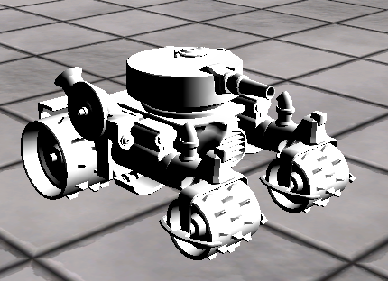
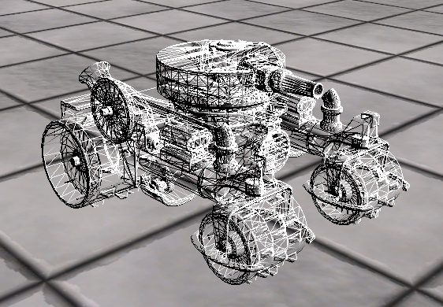

# Model
이 전에 모델 데이터를 Mesh데이터로 변환하는것 까지 했다. 그러면 이것들을 활용해서 모델을 렌더링 해보자!!!!!(아 개힘들다 넘모 많다 ㅠㅠ)

## ModelRedner.h
```
#pragma once

class ModelRender
{
public:
	ModelRender(Shader* shader);	
	~ModelRender();

	void Update();
	void Render();

public:
	void ReadMesh(wstring file);
	Transform* GetTransform() { return transform; }
	Model* GetModel() { return model; }

	void Pass(UINT pass);

	void UpdateTransform(ModelBone* bone = NULL, Matrix& matrix = Matrix());

private:
	void UpdateBones(ModelBone* bone, Matrix& matrix);

private:
	bool bRead = false;

	Shader* shader = NULL;
	Model* model = NULL;
	Transform* transform = NULL;

	Matrix transforms[MAX_MODLE_TRANSFORMS];
};
```
지금까지 만든 Model을 들고있는 클래스이다. 그리고 각각 Mesh마다 Transform을 갖고있는 행렬도 갖고있는다.

## ModelRender.cpp
```
#include "Framework.h"
#include "ModelRender.h"

ModelRender::ModelRender(Shader * shader)
	: shader(shader)
{
	model = new Model();
	transform = new Transform(shader);
}

ModelRender::~ModelRender()
{
	SafeDelete(model);
	SafeDelete(transform);
}

void ModelRender::Update()
{
	if (bRead == true)
	{
		bRead = false;

		for (ModelMesh* mesh : model->Meshes())
		{
			mesh->SetShader(shader);
		}

		UpdateTransform();
	}

	for (ModelMesh* mesh : model->Meshes())
	{
		mesh->Update();
	}
}

void ModelRender::Render()
{
	for (ModelMesh* mesh : model->Meshes())
	{
		mesh->SetTransform(transform);
		mesh->Render();
	}
}

void ModelRender::ReadMesh(wstring file)
{
	model->ReadMesh(file);

	bRead = true;
}

void ModelRender::Pass(UINT pass)
{
	for (ModelMesh* mesh : model->Meshes())
	{
		mesh->Pass(pass);
	}
}

void ModelRender::UpdateTransform(ModelBone * bone, Matrix & matrix)
{
	if (bone != NULL)
	{
		UpdateBones(bone, matrix);
	}

	for (UINT i = 0; i < model->BoneCount(); i++)
	{
		ModelBone* bone = model->BoneByIndex(i);
		transforms[i] = bone->Transform();
	}

	for (ModelMesh* mesh : model->Meshes())
	{
		mesh->Transforms(transforms);
	}
}

void ModelRender::UpdateBones(ModelBone * bone, Matrix & matrix)
{
}
```
UpdateBones 이 함수는 나중에

이번에는 많진 않다. 이 전에 이미 다 만들어 놓았던걸 갖고온다.

## 38_Model.fx
```
#include "00_Global.fx"

float3 Direction = float3(-1, -1, +1);

struct VertexModel
{
    float4 Position : Position;
    float2 Uv : Uv;
    float3 Normal : Normal;
    float3 Tangent : Tangent;
    float4 BlendIndices : BlendIndices;
    float4 BlendWeights : BlendWeights;
};

#define MAX_MODEL_TRANSFORMS 250

cbuffer CB_Bone
{
    matrix BoneTransforms[MAX_MODEL_TRANSFORMS];
    
    uint BoneIndex;
};

struct VertexOutput
{
    float4 Position : SV_Position;
    float3 Normal : Normal;
    float2 Uv : Uv;
};

VertexOutput VS(VertexModel input)
{
	VertexOutput output;
    
    World = mul(BoneTransforms[BoneIndex], World);    

    output.Position = WorldPosition(input.Position);
    output.Position = ViewProjection(output.Position);    
	
    output.Normal = WorldNormal(input.Normal);
    
    output.Uv = input.Uv;
    
	return output;
}

float4 PS(VertexOutput input) : SV_Target
{
    float NdotL = dot(normalize(input.Normal), -Direction);
    // DiffuseMap.Sample(LinearSampler, input.Uv)
    return float4(1, 1, 1, 1) * NdotL;
}

technique11 T0
{
    P_VP(P0, VS, PS)
    P_RS_VP(P1, FillMode_WireFrame, VS,PS)
}
``` 
쉐이더다.
애니메이션을 갖고올수 있는 변수들도 미리 받아높고 VertexOutput에 현재 자식의 본들의 위치까지 한번에 업데이트 해준다.

이러고 렌더링을 하면





잘 나온다.