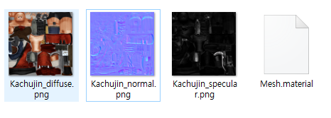
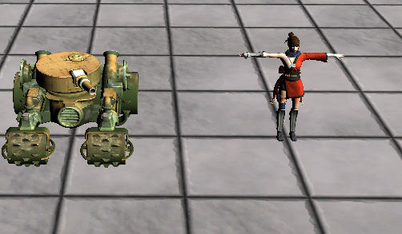

# Material
이제 이 배테리얼을 적용시켜보자

## Material.h
```
#pragma once

class Material
{
public:
	Material();
	Material(Shader* shader);
	~Material();

	Shader* GetShader() { return shader; }
	void SetShader(Shader* shader);

	void CopyFrom(Material* material);


	void Name(wstring val) { name = val; }
	wstring Name() { return name; }

	Color& Ambient() { return colorDesc.Ambient; }
	void Ambient(Color& color);
	void Ambient(float r, float g, float b, float a = 1.0f);

	Color& Diffuse() { return colorDesc.Diffuse; }
	void Diffuse(Color& color);
	void Diffuse(float r, float g, float b, float a = 1.0f);

	Color& Specular() { return colorDesc.Specular; }
	void Specular(Color& color);
	void Specular(float r, float g, float b, float a = 1.0f);

	Color& Emissive() { return colorDesc.Emissive; }
	void Emissive(Color& color);
	void Emissive(float r, float g, float b, float a = 1.0f);


	Texture* DiffuseMap() { return diffuseMap; }
	void DiffuseMap(string file);
	void DiffuseMap(wstring file);

	Texture* SpecularMap() { return specularMap; }
	void SpecularMap(string file);
	void SpecularMap(wstring file);

	Texture* NormalMap() { return normalMap; }
	void NormalMap(string file);
	void NormalMap(wstring file);

	void Render();

private:
	void Initialize();

private:
	struct ColorDesc
	{
		Color Ambient = Color(0, 0, 0, 1);
		Color Diffuse = Color(1, 1, 1, 1);
		Color Specular = Color(0, 0, 0, 1);
		Color Emissive = Color(0, 0, 0, 1);
	} colorDesc;

private:
	Shader* shader = NULL;

	wstring name;

	Texture* diffuseMap;
	Texture* specularMap;
	Texture* normalMap;

	ConstantBuffer* buffer;
	ID3DX11EffectConstantBuffer* sBuffer;

	ID3DX11EffectShaderResourceVariable* sDiffuseMap;
	ID3DX11EffectShaderResourceVariable* sSpecularMap;
	ID3DX11EffectShaderResourceVariable* sNormalMap;
};
```
지금까지 적용한 방법대로 이 값들도 적용하는걸로 만들면 된다.

자세한 설명은 생략한다.

## Model.cpp
그리고 이 클래스를 Model에 넣어주고
```
void Model::ReadMaterial(wstring file)
{
	file = L"../../_Textures/" + file + L".material";

	Xml::XMLDocument* document = new Xml::XMLDocument();
	Xml::XMLError error = document->LoadFile(String::ToString(file).c_str());
	assert(error == Xml::XML_SUCCESS);

	Xml::XMLElement* root = document->FirstChildElement();
	Xml::XMLElement* materialNode = root->FirstChildElement();

	do
	{
		Material* material = new Material();


		Xml::XMLElement* node = NULL;

		node = materialNode->FirstChildElement();
		material->Name(String::ToWString(node->GetText()));

		wstring directory = Path::GetDirectoryName(file);
		String::Replace(&directory, L"../../_Textures", L"");


		wstring texture = L"";

		node = node->NextSiblingElement();
		texture = String::ToWString(node->GetText());
		if (texture.length() > 0)
			material->DiffuseMap(directory + texture);

		node = node->NextSiblingElement();
		texture = String::ToWString(node->GetText());
		if (texture.length() > 0)
			material->SpecularMap(directory + texture);

		node = node->NextSiblingElement();
		texture = String::ToWString(node->GetText());
		if (texture.length() > 0)
			material->NormalMap(directory + texture);


		Color color;

		node = node->NextSiblingElement();
		color.r = node->FloatAttribute("R");
		color.g = node->FloatAttribute("G");
		color.b = node->FloatAttribute("B");
		color.a = node->FloatAttribute("A");
		material->Ambient(color);

		node = node->NextSiblingElement();
		color.r = node->FloatAttribute("R");
		color.g = node->FloatAttribute("G");
		color.b = node->FloatAttribute("B");
		color.a = node->FloatAttribute("A");
		material->Diffuse(color);

		node = node->NextSiblingElement();
		color.r = node->FloatAttribute("R");
		color.g = node->FloatAttribute("G");
		color.b = node->FloatAttribute("B");
		color.a = node->FloatAttribute("A");
		material->Specular(color);

		node = node->NextSiblingElement();
		color.r = node->FloatAttribute("R");
		color.g = node->FloatAttribute("G");
		color.b = node->FloatAttribute("B");
		color.a = node->FloatAttribute("A");
		material->Emissive(color);

		materials.push_back(material);

		materialNode = materialNode->NextSiblingElement();
	} while (materialNode != NULL);

	BindMesh();
}
``` 
읽어오는 함수를 작성하고

렌더링 하는 클래스에 이 매테리얼들을 읽고 렌더링 해주자

## 주의
하지만 이렇게 해도 XML파일에 모든 값들이 안들어오는 경우가 있다. 이럴 경우에는 각 부분에 맞는 텍스처 파일들을 찾아서 넣어주자

이렇게 하면



파일들이 잘 생긴다.

이 상태로 랜더링 하면



와 드디어 우리가 흔히 보던 모델이 나왔다!!!! 와!!!!!

이제 모델링 부분은 끝이다(넘모 힘들었다 ㅠㅠ) 다시 정리하고 다음에 애니메이션이다.