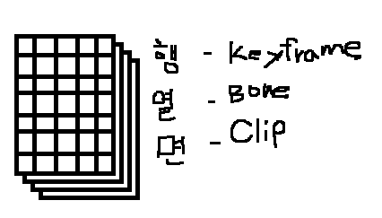

# ModelAnimator
지금까지 애니메이션 파일에 있는 정보들을 읽었다. 이 정보를 갖고 클립들을 저장하는 변수를 만들자



이런 식으로 구조가 짜져있다. 그런데 이 구조를 갖고 GPU에 그대로 보내게 되면 보낼수 없다. cbuffer에 한번에 보낼 수 있는 용량은 4996바이트이기 때문이다. 그래서 이 구조를 갖고 텍스처로 만들어 보낸다.

텍스처는 몇개 보내든 상관없기 때문이다.

## ModelAnimator
```
#pragma once

class ModelAnimator
{
public:
	ModelAnimator(Shader* shader);
	~ModelAnimator();

	void Update();
	void Render();

public:
	void ReadMesh(wstring file);
	void ReadMaterial(wstring file);
	void ReadClip(wstring file);

	Transform* GetTransform() { return transform; }
	Model* GetModel() { return model; }

	void Pass(UINT pass);

private:
	void CreateTexture();
	void CreateClipTransform(UINT index);

private:
	struct ClipTransforms
	{
		Matrix** Transform;

		ClipTransforms()
		{
			Transform = new Matrix*[MAX_MODEL_KEYFRAMES];

			for (UINT i = 0; i < MAX_MODEL_KEYFRAMES; i++)
			{
				Transform[i] = new Matrix[MAX_MODLE_TRANSFORMS];
			}
		}

		~ClipTransforms()
		{
			for (UINT i = 0; i < MAX_MODEL_KEYFRAMES; i++)
			{
				SafeDeleteArray(Transform[i]);
			}

			SafeDeleteArray(Transform);
		}
	};
	ClipTransforms* clipTransforms = NULL;

	ID3D11Texture2D* texture = NULL;
	ID3D11ShaderResourceView* srv = NULL;

private:
	Shader* shader = NULL;
	Model* model = NULL;
	Transform* transform = NULL;
};
```
ModelRender와 비슷한 형태를 갖고있다.

이 클래스에서 가장 중요한 함수먼저 보자
```
void ModelAnimator::CreateClipTransform(UINT index)
{
	Matrix* bones = new Matrix[MAX_MODLE_TRANSFORMS];

	ModelClip* clip = model->ClipByIndex(index);
	for (UINT f = 0; f < clip->FrameCount; f++)
	{
		for (UINT b = 0; b < model->BoneCount(); b++)
		{
			ModelBone* bone = model->BoneByIndex(b);

			Matrix parent;
			Matrix invGlobal = bone->Transform();
			D3DXMatrixInverse(&invGlobal, NULL, &invGlobal);

			int parentIndex = bone->ParentIndex();
			if (parentIndex < 0)
			{
				D3DXMatrixIdentity(&parent);
			}
			else
			{
				parent = bones[parentIndex];
			}

			Matrix animation;
			ModelKeyframe* frame = clip->Keyframe(bone->Name());

			if (frame != NULL)
			{
				ModelKeyframeData& data = frame->Transforms[f];

				Matrix S, R, T;
				D3DXMatrixScaling(&S, data.Scale.x, data.Scale.y, data.Scale.z);
				D3DXMatrixRotationQuaternion(&R, &data.Rotation);
				D3DXMatrixTranslation(&T, data.Translation.x, data.Translation.y, data.Translation.z);

				animation = S * R * T;
			}

			else
			{
				D3DXMatrixIdentity(&animation);
			}

			bones[b] = animation * parent;
			clipTransforms[index].Transform[f][b] = invGlobal * bones[b];
		}// for(b)
	}// for(f)
}
```
간단한데 조금 복잡하다.

이 애니메이션을 갖고올 때, Local좌표에 부모의 좌표(World)를 곱해 현재 본의 위치를 World좌표로 갖고왔었다. 그럼 이제 적용할때는 다시 이것을 활용해야 한다. 

본의 위치를 갖고올때 다시 animation과 parent의 행렬을 곱해 world행렬을 갖고온다. 그리고 난 뒤, 클립의 Transform을 저장할 때, World행렬로 저장하면 원하는 값보다 더 많은 값이 나오게 된다. 그러니 이 전에 현재 Bone의 위치를 뒤집은 좌표를 구한 뒤 곱하면 원하는 정확한 좌표가 나온다.

부모의 위치가 30이고 본의 로컬 위치가 20일경우 본의 월드 위치는 50이다. 

하지만 그 밑에 있는 ClipTransform을 구할 땐, 현재 Bone의 위치는 World이기 때문에 이 상태로 넣고 작동을 시키면 World의 World가 들어가 원하는 값이 안나온다. 그러니 저장할 때는 역행렬을 곱해 Local로 만들어 넣어준다.