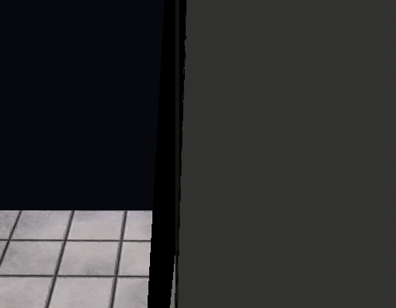

# Animation Shader
이 전에 4개로 쪼개서 받았던 텍스처를 받아와서 적용 시켜야 한다.

## Shader
```
struct AnimationFrame
{
    int Clip;

    uint CurrFrame;
    uint NextFrame;

    float Time;
    float Running;

    float3 Padding;
};

void SetAniamtionWorld(inout matrix world, VertexModel input)
{
    float indices[4] = { input.BlendIndices.x, input.BlendIndices.y, input.BlendIndices.z, input.BlendIndices.w };
    float weights[4] = { input.BlendWeights.x, input.BlendWeights.y, input.BlendWeights.z, input.BlendWeights.w };
    
    int clip;
    int currFrame;
    int nextFrame;
    float time;

    clip = Keyframes.Clip;
    currFrame = Keyframes.CurrFrame;
    nextFrame = Keyframes.NextFrame;
    time = Keyframes.Time;
    
    float4 c0, c1, c2, c3;
    
    matrix curr = 0;
    matrix transform = 0;
    
    [unroll(4)]
    for (int i = 0; i < 4; i++)
    {
        c0 = TransformsMap.Load(int4(indices[i] * 4 + 0, currFrame, clip, 0));
        c1 = TransformsMap.Load(int4(indices[i] * 4 + 1, currFrame, clip, 0));
        c2 = TransformsMap.Load(int4(indices[i] * 4 + 2, currFrame, clip, 0));
        c3 = TransformsMap.Load(int4(indices[i] * 4 + 3, currFrame, clip, 0));
        curr = matrix(c0, c1, c2, c3);
        
        transform += mul(weights[i], curr);
    }
    
    world = mul(transform, world);
}
```
Indices, Weight를 각각 받아오고 현재 프레임과 다음 프레임을 받아온다.

그리고 각각 부분을 반복문으로 받아오고 현재 행열을 받아온 4개로 만들어 주고, 위치를 계속해서 축척해준다.

그리고
```
cbuffer CB_AnimationFrame
{
    AnimationFrame Keyframes;
};
```
cbuffer에 이것을 추가했는데 일단 빼자...



아앜 내눈!!!

// 아니다 찾았다 중간에 원하는 프레임을 받으려고 만들어놓은 프레임 제어 하는 gui를 설정하다가 에러났다 저거때문이 아니다.

빼고 실행시키면


드디어 잘 나온다 ㅠㅠㅠㅠㅠㅠㅠ 너무 힘들었지만... 저거 고쳐야지...(강의에서도 에러났었다 ㅋㅋ)