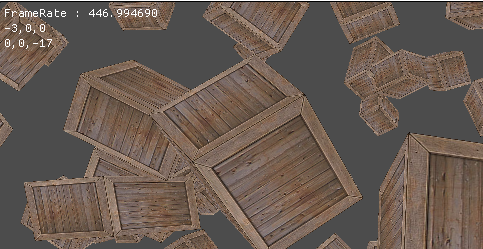
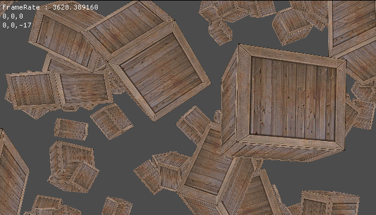

# DrawObj
오브젝트를 그릴때 각각 오브젝트마다 IA - VS - RS - PS - OM 단계를 거쳐서 그려준다.

만약 오브젝트가 매우 많을 경우는?? 아쉽게도 매우 많은만큼 파이프라인 단계를 꾸준히 지켜주면서 그려준다...(역시 컴퓨터는 우직히다.)

한번 1000개의 상자를 그려보자



음.... 300~400 프레임 정도 나온다. 간단한 큐브 1000개를 그렸는데 저런 프레임이면 만약 좀 복잡한 물체들을 그리게 되면 더 심하게 떨어질게 분명하다. 그래서 Instance라는 기법을 사용한다.

# Instance
Instance는 배열로 데이터를 보내는데 각 배열마다 월드값이 있다.

각 오브젝트의 Transform 의 World를 보내면 파이프라인을 한번 실행하는 것으로 배열에 있는 값들을 전부 그릴 수 있다.

## InstancingDemo
```
for (UINT i = 0; i < 1000; i++)
{
	transforms[i] = new Transform();

	transforms[i]->Position(Math::RandomVec3(-30, 30));
	transforms[i]->Scale(Math::RandomVec3(1.0f, 2.5f));
	transforms[i]->RotationDegree(Math::RandomVec3(-180, 180));
	worlds[i] = transforms[i]->World();
}

CreateMesh();

instanceBuffer = new VertexBuffer(worlds, 1000, sizeof(Matrix), 1);
```
생성자 부분에서 World를 저장하고 InstanceBuffer에 저장을 해준다.

```
void InstancingDemo::Render()
{
	perFrame->Render();

	material->Render();

	vertexBuffer->Render();
	instanceBuffer->Render();

	indexBuffer->Render();

	D3D::GetDC()->IASetPrimitiveTopology(D3D11_PRIMITIVE_TOPOLOGY_TRIANGLELIST);

	shader->DrawIndexedInstanced(0, 0, indices.size(), 1000);
}
```
그런 뒤 InstanceBuffer를 렌더링 해주면 



이 전과 비교했을때 정말 많이 늘어났다.