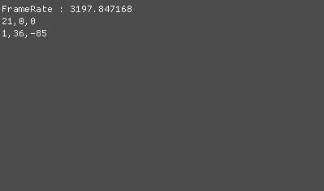

# Instanceing - Mesh
이 전에 했던 인스턴스 기법을 활용해서 지금 사용하고 있는 Mesh를 모두 Instance를 사용하는 방법으로 변경하자

## Shader
```
struct VertexMesh
{
    float4 Position : Position;
    float2 Uv : Uv;
    float3 Normal : Normal;
    
    matrix Transform : InstTransform;    
};

///////////////////////////////////////////////////////////////////////

#define VS_GENERATE \
output.oPosition = input.Position.xyz; \
\
output.Position = WorldPosition(input.Position); \
output.Position = ViewProjection(output.Position); \
\
output.Normal = WorldNormal(input.Normal); \
\
output.Uv = input.Uv; \

///////////////////////////////////////////////////////////////////////

void SetMeshWorld(inout matrix world, VertexMesh input)
{
    world = input.Transform;
}

MeshOutput VS_Mesh(VertexMesh input)
{
    MeshOutput output;
    
    SetMeshWorld(World, input);
    VS_GENERATE
    
    return output;
}
```
이제 사용할 함수들을 먼저 담고있는 Render 쉐이더이다.

VS함수 대신 VE_Mesh로 변경하고  딱히 특별한것은 없다.

```
#include "00_Global.fx"
#include "00_Render.fx"

float3 Direction = float3(-1, -1, +1);

float4 PS(MeshOutput input) : SV_Target
{
    float3 normal = normalize(input.Normal);
    float3 light = -Direction;
    
    return DiffuseMap.Sample(LinearSampler, input.Uv) * dot(light, normal);
}

technique11 T0
{
    P_VP(P0, VS_Mesh, PS)
}
```
IntancingMesh를 사용할 쉐이더이다.

## Mesh
```
#pragma once

class Mesh
{
public:
	typedef VertexTextureNormal MeshVertex;

public:
	Mesh();
	virtual ~Mesh();

	void SetShader(Shader* shader);
	void Pass(UINT  val) { pass = val; }

	void Update();
	void Mesh::Render(UINT drawCount);

protected:
	virtual void Create() = 0;

protected:
	Shader* shader;
	UINT pass = 0;

	PerFrame* perFrame = NULL;

	VertexBuffer* vertexBuffer = NULL;
	IndexBuffer* indexBuffer = NULL;

	MeshVertex* vertices;
	UINT* indices;

	UINT vertexCount, indexCount;
};
```
이 전에는 Renderer라는 클래스를 상속받고 만들었지만, Intance를 사용해야 하기 때문에 단독으로 만든다.

Render부분에는 
```
void Mesh::Render(UINT drawCount)
{
	if (vertexBuffer == NULL || indexBuffer == NULL)
	{
		Create();

		vertexBuffer = new VertexBuffer(vertices, vertexCount, sizeof(MeshVertex));
		indexBuffer = new IndexBuffer(indices, indexCount);
	}

	perFrame->Render();
	vertexBuffer->Render();
	indexBuffer->Render();

	D3D::GetDC()->IASetPrimitiveTopology(D3D11_PRIMITIVE_TOPOLOGY_TRIANGLELIST);
	shader->DrawIndexedInstanced(0, pass, indexCount, drawCount);
}
```
이렇게 드로우할 갯수를 받아서 마지막에 Instance를 사용해서 그려준다.

그리고 현재까지 Mesh를 상속받고 있던 모든 클래스에서 Render의 생성자를 호출한 부분을 수정해주자

## MeshRender
```
#pragma once

#define MAX_MESH_INSTANCE 500

class MeshRender
{
public:
	MeshRender(Shader* shader, Mesh* mesh);
	~MeshRender();

	Mesh* GetMesh() { return mesh; }

	void Update();
	void Render();

	void Pass(UINT val) { mesh->Pass(val); }

	Transform* AddTransform();
	Transform* GetTransform(UINT index) { return transforms[index]; }
	void UpdateTransforms();

private:
	Mesh* mesh;

	vector<Transform*> transforms;
	Matrix worlds[MAX_MESH_INSTANCE];

	VertexBuffer* instanceBuffer;
};
```
그리고 이제 이 MeshRender로 렌더링을 해준다.

```
#include "Framework.h"
#include "MeshRender.h"

MeshRender::MeshRender(Shader * shader, Mesh * mesh)
	: mesh(mesh)
{
	Pass(0);
	mesh->SetShader(shader);

	for (UINT i = 0; i < MAX_MESH_INSTANCE; i++)
	{
		D3DXMatrixIdentity(&worlds[i]);
	}

	instanceBuffer = new VertexBuffer(worlds, MAX_MESH_INSTANCE, sizeof(Matrix), 1, true);
}

MeshRender::~MeshRender()
{
	for (Transform* transform : transforms)
		SafeDelete(transform);

	SafeDelete(instanceBuffer);
	SafeDelete(mesh);
}

void MeshRender::Update()
{
	mesh->Update();
}

void MeshRender::Render()
{
	instanceBuffer->Render();

	mesh->Render(transforms.size());
}

Transform * MeshRender::AddTransform()
{
	Transform* transform = new Transform();

	transforms.push_back(transform);

	return transform;
}

void MeshRender::UpdateTransforms()
{
	for (UINT i = 0; i < transforms.size(); i++)
	{
		memcpy(worlds[i], transforms[i]->World(), sizeof(Matrix));

		D3D11_MAPPED_SUBRESOURCE subResource;
		D3D::GetDC()->Map(instanceBuffer->Buffer(), 0, D3D11_MAP_WRITE_DISCARD, 0, &subResource);	
		{
			memcpy(subResource.pData, worlds, sizeof(Matrix) * MAX_MESH_INSTANCE);
		}
		D3D::GetDC()->Unmap(instanceBuffer->Buffer(), 0);
	}
}
```
이렇게 생성할 때 마다 Transform을 받아와서 그려준다.

```
cube = new MeshRender(shader, new MeshCube());

for (float x = -50; x <= 50; x += 2.5f)
{
	Transform * transform = cube->AddTransform();
	transform->Scale(0.25f, 0.25f, 0.25f);
	transform->Position(Vector3(x,0.25f * 0.5f, 0.0f));
	transform->RotationDegree(0, Math::Random(-180.0f, 180.0f), 0);
}
cube->UpdateTransforms();
```
이런 식으로 그리게 되면



100개의 오브젝트에 Mesh를 넣어 그렸는데도 프레임 저하가 거어어어어어의 없다.