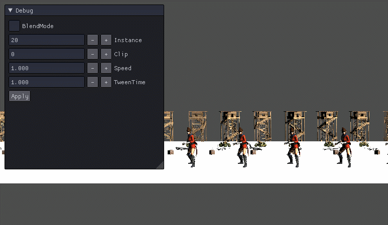

저번엔 버그때매 짜증났는데 이번엔 인텔리센스가 작동을 안한다 헣헣...

# Instance Animation
지금까지 했던것 처럼 Animation을 인스턴싱 하는데

각 모델들이 다른 애니메이션을 취해야 자연스럽기 때문에 그렇게 한다.

## MoadelAnimator.h
```
Transform* GetTransform(UINT index) { return transforms[index]; }

void PlayTweenMode(UINT index, UINT clip, float speed = 1.0f, float takeTime = 1.0f);
void PlayBlendMode(UINT index, UINT clip, UINT clip1, UINT clip2);
void SetBlendAlpha(UINT index, float alpha);

tweenDesc[MAX_MODEL_INSTANCE];
blendDesc[MAX_MODEL_INSTANCE];
```
인스턴스를 위해 배열로 받고 각 index마다 업데이트 해주기 위해 매개변수를 받아온다.
## ModelAnimator.cpp
딱히 달라진것은 없다. 다만, 위에 수정한 함수에 따라 원하는 인덱스를 변경 해준다.

## Shader
이 전에 Aniamtion에서 사용한 것들을 갖고오고, Tween과 Blend에서 사용한 것들은 전부 input.InstanceID를 사용한 것으로 변경해준다.

```
MeshOutput VS_Animation(VertexModel input)
{
    MeshOutput output;
    
    if (BlendFrames[input.InstanceID].Mode == 0)
    {
        SetTweenWorld(World, input);
    }
    else
    {
        SetBlendWorld(World, input);
    }
        
    VS_GENERATE
    
    return output;
}
```
그리고 VertexOuput을 MeshOutput으로 변경해준다.

그리고 변경된 내용으로 실행하면,

