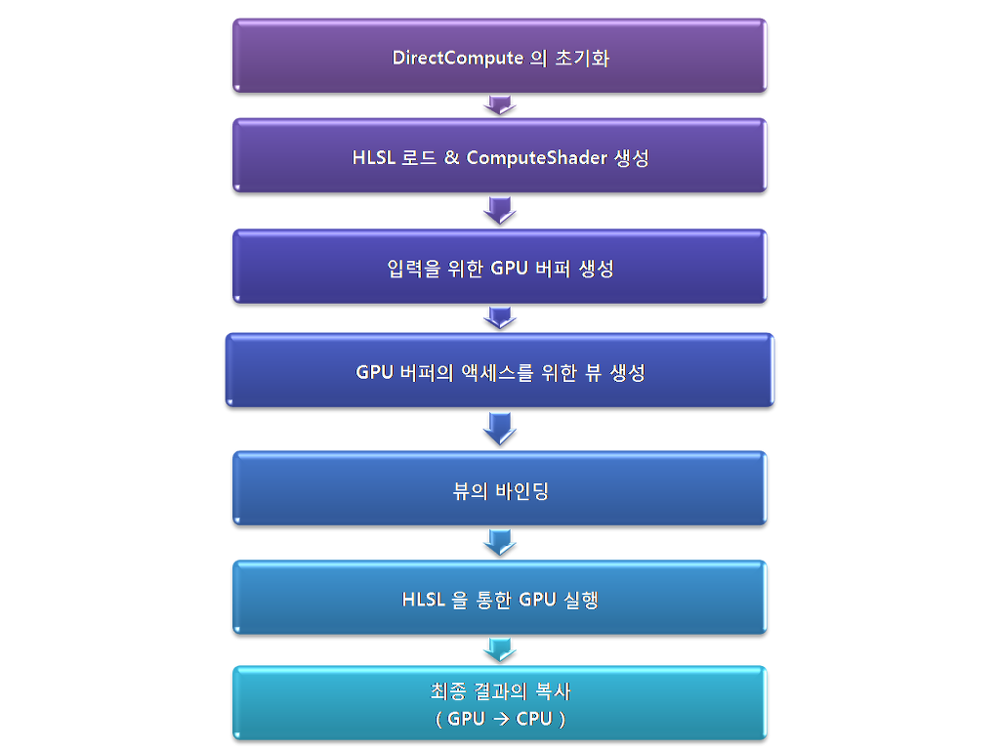

드디어 스레드다 스레드~~

# Multi Threaded Programming
이 멀티 스레드를 하다보면 나오는 문제는 [MultiThread](https://aszd0708.github.io/tags/#Multi%20Thread){:target="_blank"} 여기 가면 어떤 문제가 있는지 문제를 해결하는 방법에 관해 잘 정리해 뒀다.

# DirectCompute
그래픽 처리만 했던 지금까지와 달리 GPU를 CPU처럼 연산을 할 수 있게 해주는 방법이다. OpenCL이나 Cuda, 그리고 블록체인 채굴(제발 채굴좀 그만해라 ㅡㅡ)에 사용하는 병렬 처리 방식이다.



[출처](https://vsts2010.tistory.com/267){:target="_blank"}

이러한 방식으로 처리 된다.

GPU에서 연산을 한 뒤, CPU에 값을 복사해온다.

이 GPU에게 주는 버퍼는 Raw Buffer(raw 바이트 단위로 순차적으로 쌓여있는 순수한 데이터)로 넘겨준다.

## CsResource
주고 받는 리소스를 만들어주는 클래스이다.

```
class CsResource
{
public:
	CsResource();
	virtual ~CsResource();

protected:
	virtual void CreateInput() {}
	virtual void CreateSRV() {}

	virtual void CreateOutput() {}
	virtual void CreateUAV() {}

	virtual void CreateResult() {}

	void CreateBuffer();

protected:
	ID3D11Resource* input = NULL;
	ID3D11ShaderResourceView* srv = NULL; // input

	ID3D11Resource* output = NULL;
	ID3D11UnorderedAccessView* uav = NULL; // output 

	ID3D11Resource* result = NULL;
};
```
주고 받는 리소스를 갖고있으며 받을때는 GPU에서 주는 데이터의 순서를 모르기 때문에 Unordered로 해서 받아온다. 그런 뒤 프로그래머가 나눠준다.

## RawBuffer
```
class RawBuffer : public CsResource
{
public:
	RawBuffer(void* inputData, UINT inputByte, UINT outputByte);
	~RawBuffer();

private:
	void CreateInput()	 override;
	void CreateSRV()	 override;

	void CreateOutput()	 override;
	void CreateUAV()	 override;

	void CreateResult()	 override;

public:
	void CopyToInput(void* data);
	void CopyFromOutput(void* data);

private:
	void* inputData;
	UINT inputByte;
	UINT outputByte;
};
```

```
void RawBuffer::CreateInput()
{
	if (inputByte < 1) { return; }

	ID3D11Buffer* buffer = NULL;

	D3D11_BUFFER_DESC desc;
	ZeroMemory(&desc, sizeof(D3D11_BUFFER_DESC));
	desc.ByteWidth = inputByte;
	desc.BindFlags = D3D11_BIND_SHADER_RESOURCE;
	desc.MiscFlags = D3D11_RESOURCE_MISC_BUFFER_ALLOW_RAW_VIEWS;
	desc.Usage = D3D11_USAGE_DYNAMIC;
	desc.CPUAccessFlags = D3D11_CPU_ACCESS_WRITE;

	D3D11_SUBRESOURCE_DATA subResource = { 0 };
	subResource.pSysMem = inputData;

	Check(D3D::GetDevice()->CreateBuffer(&desc, inputData != NULL ? &subResource : NULL, &buffer));
	
	input = (ID3D11Resource *)buffer;
}
```
GPU에 넣어주는 버퍼를 만들어준다.
```
void RawBuffer::CreateSRV()
{
	if (inputByte < 1) { return; }

	ID3D11Buffer* buffer = (ID3D11Buffer*)input;

	D3D11_BUFFER_DESC desc;
	buffer->GetDesc(&desc);

	D3D11_SHADER_RESOURCE_VIEW_DESC srvDesc;
	ZeroMemory(&srvDesc, sizeof(D3D11_SHADER_RESOURCE_VIEW_DESC));
	srvDesc.Format = DXGI_FORMAT_R32_TYPELESS;
	srvDesc.ViewDimension = D3D11_SRV_DIMENSION_BUFFEREX;
	srvDesc.BufferEx.Flags = D3D11_BUFFEREX_SRV_FLAG_RAW;
	srvDesc.BufferEx.NumElements = desc.ByteWidth / 4;

	Check(D3D::GetDevice()->CreateShaderResourceView(buffer, &srvDesc, &srv));
}
```
GPU에 ResourceView를 만들어 보내는데 갖고올때 현재 buffer를 갖고와서 넘겨준다.
```
void RawBuffer::CreateOutput()
{
	ID3D11Buffer* buffer = NULL;

	D3D11_BUFFER_DESC desc;
	ZeroMemory(&desc, sizeof(D3D11_BUFFER_DESC));

	desc.ByteWidth = outputByte;
	desc.BindFlags = D3D11_BIND_UNORDERED_ACCESS;
	desc.MiscFlags = D3D11_RESOURCE_MISC_BUFFER_ALLOW_RAW_VIEWS;

	Check(D3D::GetDevice()->CreateBuffer(&desc, NULL, &buffer));

	output = (ID3D11Resource *)buffer;
}
```
GPU에서 쓴 버퍼를 갖고온다.
```
void RawBuffer::CreateUAV()
{
	ID3D11Buffer* buffer = (ID3D11Buffer *)output;

	D3D11_BUFFER_DESC desc;
	buffer->GetDesc(&desc);


	D3D11_UNORDERED_ACCESS_VIEW_DESC uavDesc;
	ZeroMemory(&uavDesc, sizeof(D3D11_UNORDERED_ACCESS_VIEW_DESC));
	uavDesc.Format = DXGI_FORMAT_R32_TYPELESS;
	uavDesc.ViewDimension = D3D11_UAV_DIMENSION_BUFFER;
	uavDesc.Buffer.Flags = D3D11_BUFFER_UAV_FLAG_RAW;
	uavDesc.Buffer.NumElements = desc.ByteWidth / 4;

	Check(D3D::GetDevice()->CreateUnorderedAccessView(buffer, &uavDesc, &uav));
}
```
CreateUnorderedAccessView 를 사용해서 갖고온다.
```
void RawBuffer::CreateResult()
{
	ID3D11Buffer* buffer;

	D3D11_BUFFER_DESC desc;
	((ID3D11Buffer*)output)->GetDesc(&desc);
	desc.Usage = D3D11_USAGE_STAGING;
	desc.CPUAccessFlags = D3D11_CPU_ACCESS_READ;

	// unordered access view에 연결하기 위해 0
	// 0 == D3D11_USAGE_DEFULAT
	desc.BindFlags = 0;
	desc.MiscFlags = 0;

	Check(D3D::GetDevice()->CreateBuffer(&desc, NULL, &buffer));

	result = (ID3D11Resource*)buffer;
}
```
현재 GPU에 써놓은 버퍼를 갖고온다.
```
void RawBuffer::CopyToInput(void * data)
{
	D3D11_MAPPED_SUBRESOURCE subResource;
	D3D::GetDC()->Map(input, 0, D3D11_MAP_WRITE_DISCARD, 0, &subResource);
	{
		memcpy(subResource.pData, data, inputByte);
	}
	D3D::GetDC()->Unmap(input, 0);
}
```
```
void RawBuffer::CopyFromOutput(void * data)
{
	D3D11_MAPPED_SUBRESOURCE subResource;
	D3D::GetDC()->Map(output, 0, D3D11_MAP_READ, 0, &subResource);
	{
		memcpy(subResource.pData, data, outputByte);
	}
	D3D::GetDC()->Unmap(output, 0);
}
```

값을 복사해온다.
