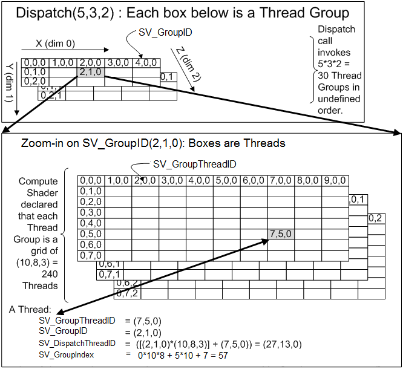

# ThreadGroup
이 전에는 스레드 그룹이 1개로 진행했다 이젠 이 스레드 그룹을 2개 이상으로 만들어보자 그리고 Input 값도 받아오자

## RawBufferDemo
```
void RawBufferDemo::Initialize()
{
	Shader* shader = new Shader(L"60_RawBuffer.fx");

	// 스레드 그룹 내에서 운영할 스레드 갯수
	UINT count = 2 * 10 * 8 * 3;

	struct Output
	{
		UINT GroupID[3];
		UINT GroupThreadID[3];
		UINT DispatchThreadID[3];
		UINT GroupIndex;

		float RetValue;
	};
	//RawBuffer* rawBuffer = new RawBuffer(NULL, 0, sizeof(Output) * count);

	struct Input
	{
		float value = 0.0f;
	};
	Input* input = new Input[count];

	for (UINT i = 0; i < count; i++)
	{
		input[i].value = Math::Random(0.0f, 10000.0f);
	}
	RawBuffer* rawBuffer = new RawBuffer(input, sizeof(Input) * count, sizeof(Output) * count);

	shader->AsSRV("Input")->SetResource(rawBuffer->SRV());
	shader->AsUAV("Output")->SetUnorderedAccessView(rawBuffer->UAV());
	shader->Dispatch(0, 0, 2, 1, 1);

	Output* output = new Output[count];
	rawBuffer->CopyFromOutput(output);

	FILE* file;
	fopen_s(&file, "../Raw.csv", "w");

	for (UINT i = 0; i < count; i++)
	{
		Output temp = output[i];

		fprintf
		(
			file,
			"%d,%d,%d,%d,%d,%d,%d,%d,%d,%d,%d,%f\n",
			i,
			temp.GroupID[0], temp.GroupID[1], temp.GroupID[2],
			temp.GroupThreadID[0], temp.GroupThreadID[1], temp.GroupThreadID[2],
			temp.DispatchThreadID[0], temp.DispatchThreadID[1], temp.DispatchThreadID[2],
			temp.GroupIndex, temp.RetValue
		);
	}
	fclose(file);
}
```
이번에는 Input도 받아오고 그룹을 하나 더 만들어야 하기 때문에
```
shader->Dispatch(0, 0, 2, 1, 1); 
```
에서 그룹 하나를 늘려준다.

## Shader
```
ByteAddressBuffer Input; // SRV
RWByteAddressBuffer Output; // UAV

struct Group
{
    uint3 GroupID;
    uint3 GroupThreadID;
    uint3 DispatchThreadID;
    uint GroupIndex;
    
    float RetValue;
};
```
Input의 주석을 삭제하고 Input을 받아올 변수를 하나 만든다.

```
[numthreads(10, 8, 3)]
void CS(ComputeInput input)
{
    Group group;
    group.GroupID = asuint(input.GroupID);
    group.GroupThreadID = asuint(input.GroupThreadID);
    group.DispatchThreadID = asuint(input.DispatchThreadID);
    group.GroupIndex = asuint(input.GroupIndex);
    
    uint index = input.GroupID.x * 10 * 8 * 3 + input.GroupIndex;
    
    // 4바이트인 uint 가 3개, 3개, 3개, 1개 그래서 10 * 4
    uint outAddress = index * 11 * 4;
    
    uint inAddress = index * 4;
    float temp = asfloat(Input.Load(inAddress));
    group.RetValue = temp;
    
    Output.Store3(outAddress + 0, asuint(group.GroupID)); // 12 바이트
    Output.Store3(outAddress + 12, asuint(group.GroupThreadID)); // 24
    Output.Store3(outAddress + 24, asuint(group.DispatchThreadID)); // 36
    Output.Store(outAddress + 36, asuint(group.GroupIndex)); // 40
    Output.Store(outAddress + 40, asuint(group.RetValue));
}
```
그룹에 따라 index값을 변경해주고 값을 받아온다. 그리고 outAddress의 10을 그룹이 하나 늘었기 때문에 11로 하나 증가시켜준다.

이러면
```
0,0,0,0,0,0,0,0,0,0,0,12.512589
1,0,0,0,1,0,0,1,0,0,1,5635.853516
2,0,0,0,2,0,0,2,0,0,2,1933.042358
3,0,0,0,3,0,0,3,0,0,3,8087.404785
4,0,0,0,4,0,0,4,0,0,4,5850.093262
5,0,0,0,5,0,0,5,0,0,5,4798.730469
6,0,0,0,6,0,0,6,0,0,6,3502.914551
7,0,0,0,7,0,0,7,0,0,7,8959.624023
8,0,0,0,8,0,0,8,0,0,8,8228.400391
9,0,0,0,9,0,0,9,0,0,9,7466.047852
10,0,0,0,0,1,0,0,1,0,10,1741.081055
11,0,0,0,1,1,0,1,1,0,11,8589.434570
12,0,0,0,2,1,0,2,1,0,12,7105.014160
.
.
.
```
이게 왜 이렇게 계산이 되냐하면



[출처](https://docs.microsoft.com/ko-kr/windows/win32/direct3dhlsl/sv-groupid){:target="_blank"}

GroupID는 현재 그룹 GroupThreadID는 현재 그룹의 스레드의 ID 그리고 DspatchThreadID는 작동하고 있는 스레드의 아이디 그리고 GroupIndex는 몇번째 인덱스인지이다. 계산식을 보면 이해가 좀 더 빠르다.