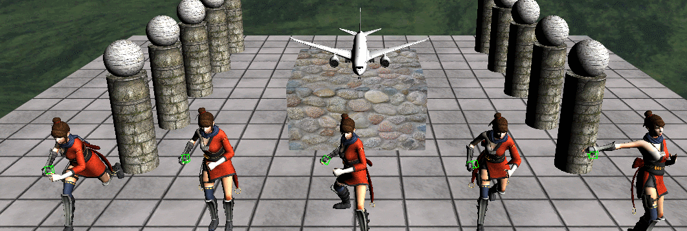

# AnimationBuffer
이제 지금까지 배운 ComputeShader를 갖고 애니메이션에 적용해보자

그 전에 ComputeShader를 넘겨주고 받을 때, 구조체를 넘겨서 받을 수 있는 StructBuffer를 만들고 사용하자

## StructuredBuffer
```
void* inputData;

UINT inputStride;
UINT inputCount;

UINT outputStride;
UINT outputCount;
```

Input과 Output을 담당하는 변수들이다 각각 Stride는 구조체의 크기, Count는 넘길 갯수다.

나머진 RawBuffer만들때나 TextrueBuffer를 만들때와 같은 방법이다.

## ModelAnimator
```
private:
	struct CS_InputDesc
	{
		Matrix Bone;
	};

	struct CS_OutputDesc
	{
		Matrix Result;
	};

	struct AttachDesc
	{
		UINT BoneIndex = 0;
		float Padding[3];
	}attachDesc;

private:
	Shader* computeShader;
	StructuredBuffer* computeBuffer = NULL;

	CS_InputDesc* csInput = NULL;
	CS_OutputDesc* csOutput = NULL;

	ID3DX11EffectShaderResourceVariable* sInputSRV;
	ID3DX11EffectUnorderedAccessViewVariable* sOutputUAV;

	ConstantBuffer* computeAttachBuffer = NULL;

	ID3DX11EffectConstantBuffer* sComputeAttachBuffer;
	ID3DX11EffectConstantBuffer* sComputeTweenBuffer;
	ID3DX11EffectConstantBuffer* sComputeBlendBuffer;
```
받아올 값에 관한 버퍼들이다.

```
ModelAnimator::ModelAnimator(Shader * shader)
	: shader(shader)
{
	model = new Model();

	tweenBuffer = new ConstantBuffer(&tweenDesc, sizeof(TweenDesc) * MAX_MODEL_INSTANCE);
	sTweenBuffer = shader->AsConstantBuffer("CB_TweenFrame");
	
	blendBuffer = new ConstantBuffer(&blendDesc, sizeof(BlendDesc) * MAX_MODEL_INSTANCE);
	sBlendBuffer = shader->AsConstantBuffer("CB_BlendFrame");

	instanceBuffer = new VertexBuffer(worlds, MAX_MODEL_INSTANCE, sizeof(Matrix), 1, true);

	computeShader = new Shader(L"63_GetAnimationBone.fx");
	computeAttachBuffer = new ConstantBuffer(&attachDesc, sizeof(AttachDesc));

	sInputSRV = computeShader->AsSRV("Input");
	sOutputUAV = computeShader->AsUAV("Output");

	sComputeAttachBuffer = computeShader->AsConstantBuffer("CB_AttachBone");
	sComputeTweenBuffer = computeShader->AsConstantBuffer("CB_TweenFrame");
	sComputeBlendBuffer = computeShader->AsConstantBuffer("CB_BlendFrame");
}
```
생성자 부분을 기존의 것이 아닌 ConstantBuffer를 사용해서 GPU계산을 사용해서 값을 받아온다.

```
void ModelAnimator::CreateComputeBuffer()
{
	UINT clipCount = model->ClipCount();
	UINT inSize = clipCount * MAX_MODEL_KEYFRAMES * MAX_MODEL_TRANSFORMS;
	UINT outSize = MAX_MODEL_INSTANCE;

	csInput = new CS_InputDesc[inSize];

	UINT count = 0;
	for (UINT clipIndex = 0; clipIndex < clipCount; clipIndex++)
	{
		for (UINT frameIndex = 0; frameIndex < MAX_MODEL_KEYFRAMES; frameIndex++)
		{
			for (UINT boneIndex = 0; boneIndex < MAX_MODEL_TRANSFORMS; boneIndex++)
			{
				csInput[count].Bone = clipTransforms[clipIndex].Transform[frameIndex][boneIndex];

				count++;
			}
		}//for(frameIndex)
	}//for(clipIndex);

	computeBuffer = new StructuredBuffer(csInput, sizeof(CS_InputDesc), inSize, sizeof(CS_OutputDesc), outSize);

	csOutput = new CS_OutputDesc[outSize];

	for (UINT i = 0; i < outSize; i++)
	{
		D3DXMatrixIdentity(&csOutput[i].Result);
	}
}
```
그리고 현재 있는 본 값을 받아서 버퍼를 만들어 준다.

각 clip, frame, bone에 맞춰서 값을 갖고오고 버퍼를 생성해준다.

```
// Update
	if (computeBuffer != NULL)
	{
	computeAttachBuffer->Render();
	sComputeAttachBuffer->SetConstantBuffer(computeAttachBuffer->Buffer());
	sComputeTweenBuffer->SetConstantBuffer(tweenBuffer->Buffer());
	sComputeBlendBuffer->SetConstantBuffer(blendBuffer->Buffer());

	sInputSRV->SetResource(computeBuffer->SRV());
	sOutputUAV->SetUnorderedAccessView(computeBuffer->UAV());

	// 인스턴스에서 하나의 본을 갖고옴
	computeShader->Dispatch(0, 0, 1, 1, 1);
	computeBuffer->CopyFromOutput(csOutput);
}
```
업데이트 마다 인스턴스에서 하나의 본을 계속해서 갖고온다.

```
void ModelAnimator::GetAttachTransform(UINT instance, Matrix * outResult)
{
	if (csOutput == NULL)
	{
		D3DXMatrixIdentity(outResult);
		return;
	}

	Matrix transform = model->BoneByIndex(attachDesc.BoneIndex)->Transform(); // 기준 본 행렬
	Matrix result = csOutput[instance].Result; // 애니메이션 행렬
	Matrix world = GetTransform(instance)->World();

	*outResult = transform * result * world;
}
```
그리고 값을 갖고올때 GPU에서 갖고온 데이터를 갖고 넘겨준다.


잘 나온다.

이제 애니메이션에 맞는 본을 잘 갖고왔는지 확인을 해보자

사각형을 각 손에 붙여서 업데이트 해보자



생각한대로 잘 나온다.