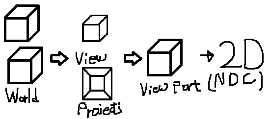
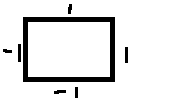

# Projection
Projection은 n차원의 공간을 n-1차원으로 표현하는것이다.



여기서 보이는 Projection을 하면 보이는 모양이다.

Z축을 활용해야 입체감이 있기 때문에 Z를 시야로부터 거리로 삼아 정점의 X,Y좌표를 거리에 비례하여, 수정하는 작업을 거친다.

이러한 투영을 활용해서 오브젝트 위에 텍스트를 띄어보자

## Viewport
현재 사용하고 있는 Viewport에 현재 Projection좌표를 갖고오는 시글 만들자

```
void Viewport::Project(Vector3* pOut, Vector3 & source, Matrix& W, Matrix& V, Matrix& P)
{
	Vector3 position = source;

	Matrix wvp = W * V * P;
	D3DXVec3TransformCoord(pOut, &position, &wvp);

	pOut->x = ((pOut->x + 1.0f) * 0.5f) * width + x;
	pOut->y = ((-pOut->y + 1.0f) * 0.5f) * height + y;
	pOut->z = (pOut->z * (maxDepth - minDepth)) + minDepth;
}
```


현재 화면



NDC좌표

현재 화면에서 NDC로 변환할 때, 0 에서 가로 세로까지의 좌표를 -1~1로 정규화를 시켜 넘겨줘야 현재 화면의 좌표를 얻을 수 있다.

그래서 x, y인 경우에는 간단하게 계산 사능하고 z축은 깊이에 따라 정규화를 시키면 된다.

이 좌표를 갖고 화면에 ImGui로 띄어보자

## ProjectionDemo

```
Vector3 position;
airplane->GetTransform(0)->Position(&position);

Vector3 position2D;

Matrix W, V, P;
D3DXMatrixIdentity(&W);
V = Context::Get()->View();
P = Context::Get()->Projection();
Context::Get()->GetViewport()->Project(&position2D, position, W, V, P);

Gui::Get()->RenderText(position2D.x, position2D.y, 1, 0, 0, "Airplane");
```

Update부분에 추가하자

현재 비행기의 위치를 갖고오고 그 위치를 단위 행렬인 World와 뷰 행렬 투영행렬로 계산하여 위치를 갖고온다.

이 위치에 텍스트를 띄어보면


그러면 현재 만든 사람 모델의 손 위치에 텍스트를 만들어보자

```
for (UINT i = 0; i < kachujin->GetTransformCount(); i++)
{
	Matrix attach;
	kachujin->GetAttachTransform(i, &attach);

	position = Vector3(0, 0, 0);

	Context::Get()->GetViewport()->Project(&position2D, position, attach, V, P);

	Gui::Get()->RenderText(position2D.x, position2D.y, 1, 1, 0, "Hand");

	colliders[i]->Collider->GetTransform()->World(attach);
	colliders[i]->Collider->Update();
}
```

일단 비행기에 텍스트를 올릴때는 world를 단위행렬로 만들었지만, 현재 손마다 각각 위치가 Vector값이 아닌 행렬 값으로 갖고온다. 그래서 이 행렬을 world로 사용해서 0으로 초기화된 vector에 값을 갖고오면 현재 위치가 나오게 된다.

이렇게 각각 위치를 갖고 그 위치에 텍스트를 띄우면


잘 나온다.