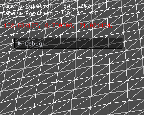

# Unprojection
이 전에는 원하는 좌표를 투영 행렬로 변환하였다. 이번에는 그 반대로 적용해보자

그런데 왜 하는걸까??

게임 엔진을 활용해서 게임을 만들 때, 마우스로 클릭하거나, 아니면 핸드폰 터치를 사용해서 오브젝트를 선택하거나 좌표를 선택한다. 이때 필요한게 원하는 좌표를 투영행렬로 변환해야 한다.

## Viewport

```
void Viewport::Unproject(Vector3* pOut, Vector3 & source, Matrix& W, Matrix& V, Matrix& P)
{
	// Vp -> P -> V -> W

	Vector3 position = source;

	pOut->x = ((position.x - x) / width) * 2.0f - 1.0f;
	pOut->y = (((position.y - y) / height) * 2.0f - 1.0f) * -1.0f;
	pOut->z = ((position.z - minDepth) / (maxDepth - minDepth));

	Matrix wvp = W * V * P;

	D3DXMatrixInverse(&wvp, NULL, &wvp);

	D3DXVec3TransformCoord(pOut, pOut, &wvp);
}
```
Unprojection 좌표를 구하는 함수이다.

저번에 Projection좌표를 구하는 것과 반대로 Unprojection좌표를 구한다.

우선 NDC좌표를 구한느것과 반대의 과정으로 좌표를 구하고 현재 화면에 있는 행렬을 반대로 뒤집고 구한다.

## Terrain
```
Vector3 Terrain::GetRaycastPosition()
{
	Matrix V = Context::Get()->View();
	Matrix P = Context::Get()->Projection();
	Viewport* Vp = Context::Get()->GetViewport();

	Vector3 mouse = Mouse::Get()->GetPosition();

	Vector3 n, f;
	mouse.z = 0.0f;
	Vp->Unproject(&n, mouse, world, V, P);

	mouse.z = 1.0f;
	Vp->Unproject(&f, mouse, world, V, P);

	Vector3 start = n;
	Vector3 direction = f - n;

	for (UINT z = 0; z < height - 1; z++)
	{
		for (UINT x = 0; x < width - 1; x++)
		{
			UINT index[4];
			index[0] = width * z + x;
			index[1] = width * (z + 1) + x;
			index[2] = width * z + x + 1;
			index[3] = width * (z + 1) + x + 1;

			Vector3 p[4];
			for (int i = 0; i < 4; i++)
			{
				p[i] = vertices[index[i]].Position;
			}

			float u, v, distance;

			if (D3DXIntersectTri(&p[0], &p[1], &p[2], &start, &direction, &u, &v, &distance) == TRUE)
				return p[0] + (p[1] - p[0]) * u + (p[2] - p[0]) * v;

			if (D3DXIntersectTri(&p[3], &p[1], &p[2], &start, &direction, &u, &v, &distance) == TRUE)
				return p[3] + (p[1] - p[3]) * u + (p[2] - p[3]) * v;
		}
	}

	return Vector3(-1, FLT_MIN, -1);
}
```
이 전에 사용했던 지형에 넣어준다.

현재 마우스 좌표를 얻고 그 좌표에 위치한 삼각형을 탐색해서 갖고온다.
(이 방법은 모든 삼각형을 탐색하기 때문에 성능이 낮다. 다른 방법으로는 스크린 raycast를 사용한다.)

이렇게 하면



모든 삼각형을 탐색하기 때문에 현재 좌표가 나오긴 하는데 단점이 있다. 쵠쪽 아래로 갈수록 프레임이 잘 나오고 반대로 가면 갈수록 프레임이 떨어진다 ㅠㅠ