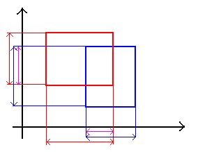
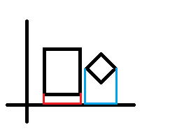

# AABB OBB

## AABB
AABB는 Axis Aligned Bounding Box의 준말로 축방향으로 정렬된 경계 상자 라는 말이다. 따라서 모든 AABB들은 같은 방향으로 되어있다. 이는 경계를 설정하기 편하게 해주고, 충돌을 검출하는 데에도 편하게 해준다.

하지만, 대부분의 경우 상자와 물체와의 형태에 차이가 심해 정확한 충돌을 하기 힘들다. 그리고 물체가 회전할때 마다 다시 경계를 설정해주어야 한다는 단점이 있다.



[출처](https://blog.naver.com/36513535/10024329388)

[ AABB경계의 충돌을 2차원에서 본 것 - 보라색 화살표는 축으로 투영한 범위가 서로 겹치는 부분을 나타낸다 ]

## OBB
OBB는 Orientedx Bounding Box의 준말이다. 방향성 있는 경계상자 라는 뜻이다. AABB와 다르게 축에 정렬된 방향으로 고정되어 있지 않고 방향이 물체에 따라 바뀌는 상자이다. 따라서 물체가 회전을 하면 같이 회전을 한다. AABB에 비해 좀더 경계가 세밀한 충돌을 할 수 있다.

하지만, AABB보다 좀 더 많은 연산을 필요로 한다.





방식은 각 정점에서 방향으로 가는 긴 선을 긋는다. 여기서 각 선이 서로 교차했으면 충돌이 있고 그렇지 않은 경우 충돌이 없는것으로 판단한다.

따라서 이 방법을 이용해 마우스로 클릭한 곳의 오브젝트를 갖고와보자

## Collider
```
bool Collider::Intersection(Ray & ray, float * outDistance)
{
	*outDistance = 0.0f;

	Vector3 dest[8];

	Transform temp;
	temp.World(transform->World());

	if (init != NULL)
		temp.World(init->World() * transform->World());

	Matrix world = temp.World();

	Vector3 minPosition, maxPosition;
	D3DXVec3TransformCoord(&minPosition, &lines[0], &world);
	D3DXVec3TransformCoord(&maxPosition, &lines[7], &world);

	if (fabsf(ray.Direction.x) == 0.0f) ray.Direction.x = 1e-6f;
	if (fabsf(ray.Direction.y) == 0.0f) ray.Direction.y = 1e-6f;
	if (fabsf(ray.Direction.z) == 0.0f) ray.Direction.z = 1e-6f;


	float minValue = 0.0f, maxValue = FLT_MAX;

	//Check X
	if (fabsf(ray.Direction.x) >= 1e-6f)
	{
		float value = 1.0f / ray.Direction.x;
		float minX = (minPosition.x - ray.Position.x) * value;
		float maxX = (maxPosition.x - ray.Position.x) * value;

		if (minX > maxX)
		{
			float temp = minX;
			minX = maxX;
			maxX = temp;
		}

		minValue = max(minX, minValue);
		maxValue = min(maxX, maxValue);

		if (minValue > maxValue)
			return false;
	}
	else if (ray.Position.x < minPosition.x || ray.Position.x > maxPosition.x)
		return false;

	//Check Y
	if (fabsf(ray.Direction.y) >= 1e-6f)
	{
		float value = 1.0f / ray.Direction.y;
		float minY = (minPosition.y - ray.Position.y) * value;
		float maxY = (maxPosition.y - ray.Position.y) * value;

		if (minY > maxY)
		{
			float temp = minY;
			minY = maxY;
			maxY = temp;
		}

		minValue = max(minY, minValue);
		maxValue = min(maxY, maxValue);

		if (minValue > maxValue)
			return false;
	}
	else if (ray.Position.y < minPosition.y || ray.Position.y > maxPosition.y)
		return false;


	//Check Z
	if (fabsf(ray.Direction.z) >= 1e-6f)
	{
		float value = 1.0f / ray.Direction.z;
		float minZ = (minPosition.z - ray.Position.z) * value;
		float maxZ = (maxPosition.z - ray.Position.z) * value;

		if (minZ > maxZ)
		{
			float temp = minZ;
			minZ = maxZ;
			maxZ = temp;
		}

		minValue = max(minZ, minValue);
		maxValue = min(maxZ, maxValue);

		if (minValue > maxValue)
			return false;
	}
	else if (ray.Position.z < minPosition.z || ray.Position.z > maxPosition.z)
		return false;

	*outDistance = minValue;
	return true;
}
```
위에서 말한 개념을 갖고왔다. 0이면 나눌 수 없기 때문에 가장 작은 수로 대체하였다.

## ObbRaycastDemo
```
void ObbRaycastDemo::CheckIntersection()
{
	if (Mouse::Get()->Down(0) == false) { return; }

	Matrix V = Context::Get()->View();
	Matrix P = Context::Get()->Projection();
	Viewport* Vp = Context::Get()->GetViewport();

	Vector3 mouse = Mouse::Get()->GetPosition();


	Matrix world;
	D3DXMatrixIdentity(&world);

	Vector3 n, f;
	mouse.z = 0.0f;
	Vp->Unproject(&n, mouse, world, V, P);

	mouse.z = 1.0f;
	Vp->Unproject(&f, mouse, world, V, P);

	Ray ray;
	ray.Position = n;
	ray.Direction = f - n;

	float distance = 0.0f;
	UINT count = kachujin->GetTransformCount();

	bool check = false;
	for (UINT i = 0; i < count; i++)
	{
		if (colliders[i]->Collider->Intersection(ray, &distance))
		{
			collisionIndex = (int)i;
			check = true;

			break;
		}
	}

	if (check == false)
	{
		collisionIndex = -1;
	}
}
```
클릭한 곳의 오브젝트를 체크해서 갑고온다.


