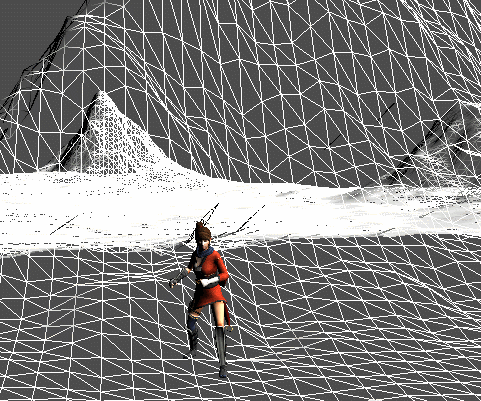

# TerrainMove
이번에는 강좌가 아니고 그냥 해보고싶어서 해봤다.

전에 만들었던 Terrain에 좌표를 얻는과정까지 했다 그럼 여기에 오브젝트를 넣고 움직일 수 있을까??

## MoveObject
우선 움직이는 오브젝트를 만드는데 전에 사용하던 Animation Model을 상속받아 만들었다.
```
#pragma once

class MoveObject : public ModelAnimator
{
public:
	MoveObject(Shader* shader, Terrain* terrain, float speed = 10);
	~MoveObject();

	void Update() override;

	void MoveToPose(UINT index);

	void SetSpeed(float speed) { this->speed = speed; }

	void SetMovePose(Vector3 movePose) { this->movePose = movePose; }

private:
	Vector3 movePose = Vector3(0,0,0);
	float speed;

	float accelate = 0;

	Terrain* terrain = NULL;
};
```
```
#include "stdafx.h"
#include "MoveObject.h"

MoveObject::MoveObject(Shader* shader, Terrain* terrain, float speed)
	: ModelAnimator(shader), terrain(terrain),speed(speed)
{

}

MoveObject::~MoveObject()
{
}

void MoveObject::Update()
{
	Super::Update();

	for (UINT i = 0; i < GetTransformCount(); i++)
	{
		MoveToPose(i);
	}
}

void MoveObject::MoveToPose(UINT index)
{
	Vector3 currentPose = GetTransform(index)->GetPosition();
	currentPose.y = terrain->GetHeight(currentPose);
	Vector3 dest = movePose - currentPose;
	D3DXVec3Normalize(&dest, &dest);

	GetTransform(index)->Position(currentPose + dest * speed * Time::Delta());

	if (Math::Distance(currentPose, movePose) < 0.1f)
	{
		PlayTweenMode(index, 0);
	}
	else
	{
		PlayTweenMode(index, 1);
	}

	string str = to_string(Math::Distance(currentPose, movePose));
	Gui::Get()->RenderText(Vector2(10, 75), Color(1, 0, 0, 1), str);

	UpdateTransforms();
}
```
진짜 별거 없다. 그냥 movePose로 계속해서 움직이게 만들었다.(회전은 좀 더 공부해야 할것 같다.)

그리고 이 전에 만들었던 Terrain에서 좌표를 구하는 함수들을 활용했다.


## Math

그리고 현재 위치하고 목적지하고 거리 차이를 알고 그에 맞는 애니메이션을 구하기 위해 거리를 구할 수 있는 함수를 만들었다.

```
float Math::Distance(const D3DXVECTOR3& v1, const D3DXVECTOR3& v2)
{
	float sum = 0;
	
	sum += std::powf(v1.x - v2.x, 2);
	sum += std::powf(v1.y - v2.y, 2);
	sum += std::powf(v1.z - v2.z, 2);
	
	sum = sqrtf(sum);

	return abs(sum);
}
```
그리고 거리에 따라 애니메이션을 바꿔준다.(Blend써도 괜찮지만 이번엔 안썼다.)

