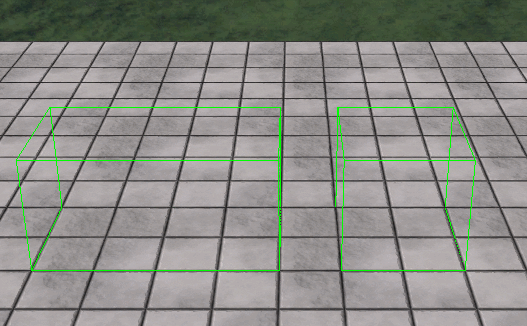

# ObbCollision
저번에 했던 [OBB 이론](https://aszd0708.github.io/D3DX11_30_3/)을 기반으로 해서 이젠 점이 아닌 물체의 충돌을 체크해보자

## Collider
```
struct Bounding
{
	Vector3 Position;

	Vector3 AxisX;
	Vector3 AxisY;
	Vector3 AxisZ;

	Vector3 HalfSize;
}bounding;
```
Colider클래스에 이 구조체를 만들어주자

저번에 말했던 바닥면에 닫는 축이다.

```
bool Collider::SeperatingPlane(Vector3 & position, Vector3 & direction, Bounding & box1, Bounding & box2)
{
	float val = fabsf(D3DXVec3Dot(&position, &direction));

	float val2 = 0.0f;
	val2 += fabsf(D3DXVec3Dot(&(box1.AxisX * box1.HalfSize.x), &direction));
	val2 += fabsf(D3DXVec3Dot(&(box1.AxisY * box1.HalfSize.y), &direction));
	val2 += fabsf(D3DXVec3Dot(&(box1.AxisZ * box1.HalfSize.z), &direction));
	val2 += fabsf(D3DXVec3Dot(&(box2.AxisX * box2.HalfSize.x), &direction));
	val2 += fabsf(D3DXVec3Dot(&(box2.AxisY * box2.HalfSize.y), &direction));
	val2 += fabsf(D3DXVec3Dot(&(box2.AxisZ * box2.HalfSize.z), &direction));

	return val > val2;
}
```
두개의 구조체를 통해 닿았는지 안닿았는지 구한다.

```
bool Collider::Collision(Bounding & box1, Bounding & box2)
{
	Vector3 position = box2.Position - box1.Position;

	if (SeperatingPlane(position, box1.AxisX, box1, box2) == true) return false;
	if (SeperatingPlane(position, box1.AxisY, box1, box2) == true) return false;
	if (SeperatingPlane(position, box1.AxisZ, box1, box2) == true) return false;

	if (SeperatingPlane(position, box2.AxisX, box1, box2) == true) return false;
	if (SeperatingPlane(position, box2.AxisY, box1, box2) == true) return false;
	if (SeperatingPlane(position, box2.AxisZ, box1, box2) == true) return false;

	if (SeperatingPlane(position, Cross(box1.AxisX, box2.AxisX), box1, box2) == true) return false;
	if (SeperatingPlane(position, Cross(box1.AxisX, box2.AxisY), box1, box2) == true) return false;
	if (SeperatingPlane(position, Cross(box1.AxisX, box2.AxisZ), box1, box2) == true) return false;

	if (SeperatingPlane(position, Cross(box1.AxisY, box2.AxisX), box1, box2) == true) return false;
	if (SeperatingPlane(position, Cross(box1.AxisY, box2.AxisY), box1, box2) == true) return false;
	if (SeperatingPlane(position, Cross(box1.AxisY, box2.AxisZ), box1, box2) == true) return false;

	if (SeperatingPlane(position, Cross(box1.AxisZ, box2.AxisX), box1, box2) == true) return false;
	if (SeperatingPlane(position, Cross(box1.AxisZ, box2.AxisY), box1, box2) == true) return false;
	if (SeperatingPlane(position, Cross(box1.AxisZ, box2.AxisZ), box1, box2) == true) return false;

	return true;
}
```
만약 닿았으면 충돌했다고 표시
아닐경우 그냥 넘어간다.

이제 두 Collider를 통해 잘 작동하는지, 구해보자




회전 했을때, 안했을때 둘다 잘 작동한다.