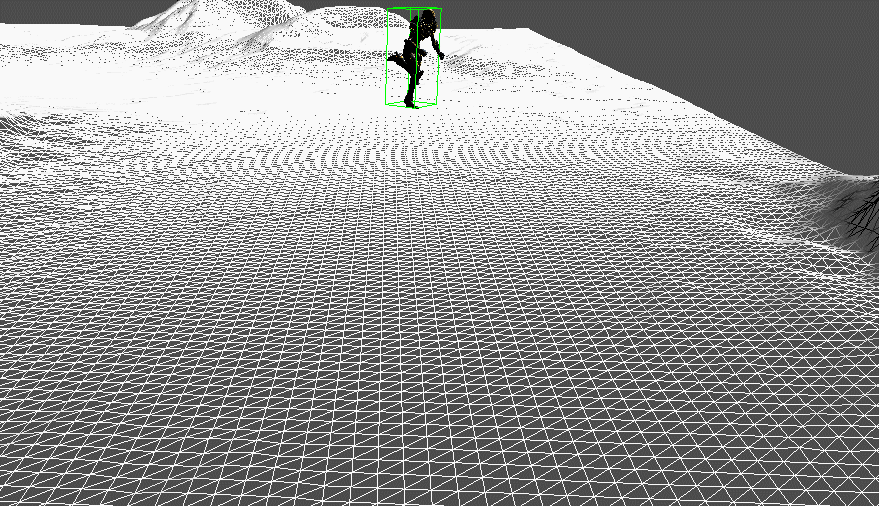
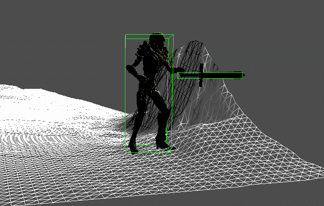

# Combat
지금까지 했던 내용을 토대로 전투하는 데모를 만들었다.

하지만 적 애니메이션에서 문제가 있어서 재생하는데 문제가 있다. ㅠㅠ

클릭을 했을때 클릭한 곳으로 이동한다

무기가 없을때 공격을 할시 주먹으로 공격한다.

검을 클릭하면 장착하고 공격 모션이 바뀐다.

적은 공격하는데 애니메이션 오류가 있다.... ㅠㅠ

약 5일간 급하게 만들긴 했는데 역시 초라하다....