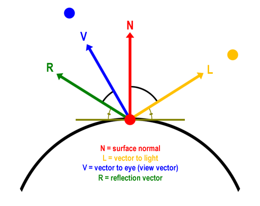

# Light
빛을 표현하는것은 여러가지가 있다


- Ambient Light
    - 광원의 위치와 무관한게 똑같은 양으로 모든 점에 반사되는 색
    - 다른 표면에 반사되어 전반적인 장면을 밝게 하는 빛
    - 모든 Ambient Light는 물체를 균일하게 비춘다.
    - 간접 조명을 흉내 내기 위함

- Diffuse Light
    - 
    - 자기 자신의 색
    - 특정한 방향으로 진행하며 표면에 닿으면 모든 방향으로 동일하게 반사.
    - 모든 방향으로 동일하게 반사되므로 위치와는 관계없이 관찰자의 눈에 빛이 도달하고 관찰자의 위치를 고려할 필요가 없다.

- Specular Light
   - 
    - 매끈한 물체의 표면에 빛을 비추면 물체의 표면과는 상관없이 반짝이는 현상을 표현
    - 특정한 방향으로 진행, 표면에 닿으면 한 방향으로 강하게 반사하여 특정한 각도에서만 관찰 가능
    - 한 뱡향으로만 반사하기 때문에 Specular Light는 빛의 방향과 표면의 형태, 그리고 관찰자의 시점을 모두 고려해야 함.

- Emissive Light
    - 다른 메시에 영향을 주지 않는다.
    - 어두운 곳에서 어두운 색의 Mesh가 있다면 색이 묻히는데 그 외각선을 따서 묻히지 않게 해줌

이 각각의 빛들을 활용해서 현실에서 보이는것 처럼 빛을 표현한다.

이 중에 Diffuse는
* Diffuse Color * Texture * HdotL 이 공식을 활용해서 표현해주고

Specular는
* Specular Color * Texture를 활용한다.

이 전까지는 World Position을 활용 안했지만, 이제부터는 World Position을 활용해야 빛을 표현 할 수 있다.

## Shader
```
struct MeshOutput
{
    float4 Position : SV_Position0; //Rasterizing Position
    float3 oPosition : Position1; //Original Position
    float3 wPosition : Position2; //World Position
    
    float4 Color : Color;
    float3 Normal : Normal;
    float2 Uv : Uv;
};
```
WorldPosition을 갖고올 수 있도록 MeshOutput 구조체를 변경해주고, 

```
#define VS_GENERATE \
output.oPosition = input.Position.xyz; \
\
output.Position = WorldPosition(input.Position); \
output.Position = output.Position.xyz; \
output.Position = ViewProjection(output.Position); \
\
output.Normal = WorldNormal(input.Normal); \
\
output.Uv = input.Uv; \
output.Color = input.Color;
```

이에 맞게 VS_GENERATE도 변경해주자

Light부분에서는

```
MaterialDesc MakeMateril()
{
    MaterialDesc output;
    output.Diffuse = float4(0, 0, 0, 0);
    output.Diffuse = float4(0, 0, 0, 0);
    output.Specular = float4(0, 0, 0, 0);
    output.Emissive = float4(0, 0, 0, 0);

    return output;
}
```
```
void ComputeLight(out MaterialDesc output, float3 normal, float3 wPosition)
{
    output = MakeMateril(); 

    float3 direction = -GlobalLight.Direction;
    float NdotL = dot(direction, normalize(normal));
    
    output.Ambient = GlobalLight.Ambient * Material.Ambient;
    
    [flatten]
    if (NdotL > 0.0f)
    {
        output.Diffuse = Material.Diffuse * NdotL;
    }
}
```
빛을 계산해주는 함수를 만들어준다.